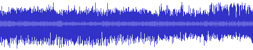
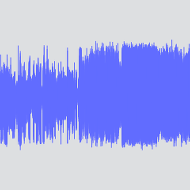
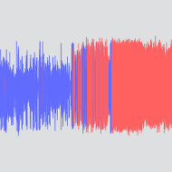
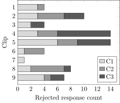
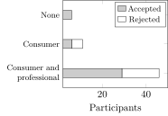
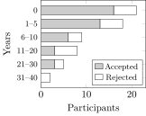

\pagestyle{plain}
\frontmatter
\begin{titlepage}
  \vspace*{\fill}
  \begin{center}
    {\Huge Semantic Audio Tools\\for Radio Production\par\vspace{1.5cm}}
    {\Large Christopher M. Baume}\\[1cm]
    {\large Submitted for the degree of}\\
    {\Large Doctor of Philosophy}\\[1cm]
    {\Large 2018}\\[1cm]
    \begin{center}
      \includegraphics[width=6cm]{figs/surrey-logo.png}\\[1cm]
    \end{center}
    Centre for Vision, Speech and Signal Processing\\
      Faculty of Engineering and Physical Sciences\\
      University of Surrey%\\Guildford, Surrey, United Kingdom.
  \end{center}
  \vspace*{\fill}
\end{titlepage}
\setcounter{page}{0}
\cleardoublepage
Abstract {#abstract .unnumbered .unnumbered}
========

Radio production is a creative pursuit that uses sound to inform,
educate and entertain an audience. Radio producers use audio editing
tools to visually select, re-arrange and assemble sound recordings into
programmes. However, current tools represent audio using waveform
visualizations that display limited information about the sound.

Semantic audio analysis can be used to extract useful information from
audio recordings, including when people are speaking and what they are
saying. This thesis investigates how such information can be applied to
create semantic audio tools that improve the radio production process.

An initial ethnographic study of radio production at the BBC reveals
that producers use textual representations and paper transcripts to
interact with audio, and waveforms to edit programmes. Based on these
findings, three methods for improving radio production are developed and
evaluated, which form the primary contribution of this thesis.

Audio visualizations can be enhanced by mapping semantic audio features
to colour, but this approach had not been formally tested. We show that
with an enhanced audio waveform, a typical radio production task can be
completed faster, with less effort and with greater accuracy than a
normal waveform.

Speech recordings can be represented and edited using transcripts, but
this approach had not been formally evaluated for radio production. By
developing and testing a semantic speech editor, we show that
automatically-generated transcripts can be used to semantically edit
speech in a professional radio production context, and identify
requirements for annotation, collaboration, portability and listening.

Finally, we present a novel approach for editing audio on paper that
combines semantic speech editing with a digital pen interface. Through a
user study with radio producers, we compare the relative benefits of
semantic speech editing using paper and screen interfaces. We find that
paper is better for simple edits of familiar audio with accurate
transcripts.

Statement of originality {#statement-of-originality .unnumbered .unnumbered}
========================

This thesis and the work to which it refers are the results of my own
efforts. Any ideas, data, images or text resulting from the work of
others (whether published or unpublished) are fully identified as such
within the work and attributed to their originator in the text,
bibliography or in footnotes. This thesis has not been submitted in
whole or in part for any other academic degree or professional
qualification. I agree that the University has the right to submit my
work to the plagiarism detection service TurnitinUK for originality
checks. Whether or not drafts have been so-assessed, the University
reserves the right to require an electronic version of the final
document (as submitted) for assessment as above.

\vspace{1cm}
\hfill
\begin{flushright}
Christopher M. Baume\\
30\textsuperscript{th} January 2018
\end{flushright}
Acknowledgements {#acknowledgements .unnumbered .unnumbered}
================

My foremost thanks go to my supervisor, Prof. Mark Plumbley, for his
enthusiasm, encouragement, wisdom and guidance over the years. Huge
thanks also to my co-supervisors: Dr. Nick Bryan-Kinns, Dr. Janko Ćalić
and Prof. David Frohlich, for their invaluable suggestions, feedback and
advice, and for helping me navigate an unfamiliar field of research.

I have been extremely privileged to have been able to undertake this
research as part of my employment at the BBC. My heartfelt thanks go out
to Prof. Graham Thomas, Dr. Frank Melchior, Chris Pike and Samantha
Chadwick for giving me this rare opportunity, and for their steadfast
support throughout the process. Many thanks to my colleagues in the BBC
R&D Audio Team for their patience, support and help with proofreading,
but also for being brilliant people to work with.

This work was only made possible through the involvement of colleagues
from BBC Radio, who volunteered their time despite their demanding
workload. My sincere thanks go to all of the radio producers who took
the time to participate in the user studies and contribute to the design
of the interfaces. Thanks also to Deborah Cohen, Hugh Levinson and John
Goudie for allowing me access to their teams, and to Jonathan Glover his
advocacy and encouragement.

Thanks to Liam Bowes, Carl Garner and Richard Sargeant from Anoto for
their support in the development of the digital pen interface, and to
Matt Haynes and Matt Shotton from BBC R&D, whose software formed part of
the semantic speech editor.

Finally, I'd personally like to thank my wife, Nancy, for her love,
encouragement, patience and belief in me throughout this process. I
couldn't have done it without you.

\vfill
\noindent The work in this thesis was fully funded by the British
Broadcasting Corporation as part of the BBC Audio Research Partnership.

Licence {#licence .unnumbered .unnumbered}
=======

This work is copyright \textcopyright 2018 Chris Baume, and is licensed
under the Creative Commons Attribution 4.0 International Licence. To
view a copy of this licence, visit
<http://creativecommons.org/licenses/by/4.0/> or send a letter to
Creative Commons, PO Box 1866, Mountain View, CA 94042, USA.

\vspace{1cm}
{width="1.5cm"} {width="1.5cm"}

\tableofcontents
[]: spacer
\listoffigures
[]: spacer
\listoftables
[]: spacer

List of abbreviations {#list-of-abbreviations .unnumbered .unnumbered}
=====================

  ------- ---------------------------------------------
  ANOVA   Analysis of Variance
  AP      Associated Press
  ASR     Automatic Speech Recognition
  BBC     British Broadcasting Corporation
  DAW     Digital Audio Workstation
  EDL     Edit Decision List
  ENPS    Electronic News Production System
  HSD     Honest Significant Difference
  HSV     Hue Saturation Value
  IP      Internet Protocol
  ISDN    Integrated Services Digital Network
  LER     Low Energy Ratio
  LSD     Least Significant Difference
  MFCC    Mel-Frequency Cepstral Coefficient
  MOS     Media Object Server
  NPR     National Public Radio
  RDC     Radio Drama Company
  RGB     Red Green Blue
  RMS     Root Mean Square
  ROT     Recording of Transmission
  RQDA    R package for Qualitative Data Analysis
  SM      Studio Manager
  SMD     Speech Music Discrimination
  SPSS    Statistical Package for the Social Sciences
  SUS     Software Usability Scale
  TLX     Task Load Index
  WAV     Waveform Audio File Format
  WER     Word Error Rate
  ZCR     Zero Crossing Rate
  ------- ---------------------------------------------

Ethics {#ethics .unnumbered .unnumbered}
======

-   Chapter [-@sec:ethno] received ethics approval from the Queen Mary
    University of London Ethics of Research Committee, under the
    reference `QMERC1386b`.

-   Chapter [-@sec:colourised] received ethics approval from the Queen
    Mary University of London Ethics of Research Committee, under the
    reference `QMREC1348d`.

-   Chapter [-@sec:screen] received a favourable ethical opinion from
    the University of Surrey Ethics Committee, under the reference
    `UEC/2015/054/FEPS`.

-   Chapter [-@sec:paper] received a favourable ethical opinion from
    the University of Surrey Ethics Committee, under the reference
    `UEC/2015/116/FEPS`.

A note on writing style {#a-note-on-writing-style .unnumbered .unnumbered}
=======================

Throughout this thesis, the term "we" is used to refer to the author's
own work. This acknowledges that that the work has been influenced by
discussions with supervisors and colleagues, and follows recent trends
in academic writing style. At times when a statement represents the sole
opinion of the author, or when reader is invited to think alongside, or
perhaps disagree with, the author, phrases such as "the author believes"
are deliberately used.

\pagestyle{fancy}
\mainmatter
\cleardoublepage
Introduction {#sec:intro}
============

Radio broadcasting is the use of radio waves to transmit sound to a
large audience. The first regular radio broadcasts in the UK began in
1922 when a consortium of radio manufacturers formed the BBC [@BBC2015].
Almost a century later, radio is still one of the mass media, with 90%
of the UK adult population listening to the radio each week for an
average of 21 hours [@RAJAR2017a]. In the UK alone, there are 50
national, 329 local and 251 community radio stations [@Ofcom2017 pp. 6,
127].

Traditionally, radio has been consumed over the airwaves, but the
Internet has changed the way audio content is distributed and consumed.
On-demand radio allows the audience to listen to a radio programme
whenever they like, and podcasting allows audio content to be downloaded
as a digital file. Over 200,000 podcasts are available through iTunes
[@Morgan2015] and approximately 10% of the UK adult population regularly
listen to podcasts [@RAJAR2017]. The distinction between radio content
and podcasts is beginning to blur as broadcasters are repurposing some
of their speech-based radio output as podcasts [@Ofcom2017 p. 98].

The British Broadcasting Corporation (BBC) has the largest share of
radio listening, and is the most popular source of podcasts, in the UK
[@Ofcom2017 p. 107]. The research presented in this thesis was funded by
the BBC and conducted during, and as part of, the author's employment at
BBC Research and Development. BBC R&D promotes technological innovation
that supports the BBC's mission to enrich people's lives with programmes
and services that inform, educate and entertain [@BBCCharter2016 art.
15]. This is achieved through the research and development of broadcast
technology, including for the production and distribution of audio
content.

Motivation {#sec:intro-motivation}
----------

One of the distinguishing characteristics of radio is that it is based
exclusively on sound. Although listeners have no visual reference, sound
stimulates the imagination and creates pictures in the mind's eye. Radio
is not limited by the size of the screen in the way that television is.
Sound design and music can be used to produce scenes for virtually any
scenario, which may otherwise be impossible or too expensive to put on
screen. As the old adage goes "the pictures are so much better on the
radio".

Humans use sound to communicate through language and music, which can
richly convey complex ideas and elicit powerful emotion. Despite this,
sound is simply the result of vibration in a medium such as air. As
sound is based on vibration, it cannot be "frozen" --- it can only exist
over a period of time. The temporal nature of sound gives it unique
properties that make it both a fascinating and challenging medium to
work with.

Unlike pictures, which can be viewed and searched at a glance, sound
recordings must be perceived through listening. The time needed to
naturally listen to a sound recording is the same as the length of the
recording. Reviewing long recordings can therefore take a large amount
of time. Sound is also a linear medium that must be played in sequence,
which can make it challenging to navigate sound recordings non-linearly.

Radio production is a process of recording, selecting and re-arranging
audio content, so it is desirable to be able to efficiently interact
with audio. Modern radio production is performed on a computer screen
using a *digital audio workstation* (DAW). DAWs visualize audio by
plotting the amplitude of the audio signal over time, known as an *audio
waveform*. Waveforms allow users to interact with the audio spatially
rather than temporally, which is thought to be a faster and easier way
to navigate audio recordings. Waveforms display some useful information,
but are limited in the information they can convey. For example, when
viewing a waveform at the right scale, it is often possible for an
experienced user to distinguish between speech and music, but it is not
usually possible to determine the style of the music, or what is being
said.

Semantic audio analysis is the task of deriving meaning from audio. This
is achieved by extracting audio features that describe the sound, and
mapping these to a human-readable representation, such as categories or
words. This research was partly inspired by a conference presentation
from @Loviscach2013, who demonstrated several prototypes that used
semantic audio analysis to assist the editing of recorded speech. These
included visualizing vowels using colour, detecting and highlighting
"umm"s, and identifying repetition. These prototypes were developed to
assist the navigation and editing of lecture recordings using custom
video editing software [@Loviscach2011a].

Applying semantic audio analysis or better visualisation techniques to
radio production tasks may allow us to produce richer user interfaces
that make it easier and faster for producers to create their programmes.
We are interested in discovering whether this approach could be used to
improve the radio production process, and which techniques work best. As
part of this research, we want to understand how these techniques can be
applied to the production of radio to make the process more efficient,
such as by reducing the time or effort that is needed to produce the
programme.

Making radio production more efficient may free up resources that could
be spent on producing higher quality content, or used to making
financial savings. The BBC spent £471M on radio production
in 2016/17 [@Ofcom2017 p. 111], so even minor improvements to production
workflows could result in large savings. We are also interested in
making radio production a more enjoyable and creative experience, where
producers spend less time on boring, menial tasks and more time on
activities that contribute to the quality of the programme output.

Radio production has not been subject to much previous academic
research. The author's position within the BBC gives us extraordinary
access to production staff and working environments that would otherwise
be inaccessible to most researchers. We view this as a rare opportunity
to conduct research that directly involves professional radio producers
and takes place within a genuine work environment.

Aim and scope {#sec:aim}
-------------

The aim of this work is to improve radio production by developing and
evaluating methods for interacting with, and manipulating, recorded
audio. Our ambition is to apply these methods to make radio production
more efficient or to open up new creative possibilities. In Sections
[-@sec:background-questions] and [-@sec:ethno-strategy], we
formulate the specific research questions that are answered in this
thesis.

Most radio is broadcast live, where the audio production happens in
real-time, but in these cases there is little opportunity to make the
audio production more efficient. For this reason, we have chose to focus
only on the production of recorded audio.

Although most radio listeners in the UK tune in to music-based stations,
38% of the population listen to speech-based radio [@Ofcom2017 pp. 97,
105] and 10% listen to podcasts [@RAJAR2017], which are normally
speech-based. Most original radio content is speech-based, so we will
focus our research on the production of speech content.

We want to make the most of our access to professional radio producers
and work environments. To do this, we will adopt radio producers as our
target user group, by involving them in the development and evaluation
of our work, and conduct evaluations in the workplace.

Finally, the intention behind this research is to facilitate creative
expression, rather than replace it through automation. Our ambition is
to find ways for machines and humans to work to each of their strengths,
where simple or menial tasks are automated, but there is always a "human
in the loop" that makes the decisions. Our hope is that, in addition to
making production activities more efficient, this may unlock
opportunities for greater creative expression.

Thesis structure {#sec:intro-structure}
----------------

**Chapter [-@sec:background]** introduces previous work that we will build upon in this thesis. We
start by giving a general overview of audio editing and semantic audio
analysis to provide context to our research. We then survey related
techniques and previous systems that have attempted to assist the
navigation and editing of audio. These are categorised into audio
visualization, semantic speech interfaces and audio playback interfaces.
We then reflect upon the literature and our research aim to formulate
our research questions.

**Chapter [-@sec:ethno]** investigates existing audio editing workflows in radio production. Our
goal is to help inform the direction of our research by gaining a better
understanding of the roles, environment, tools, tasks and challenges
involved in real-life radio production. We achieve this by conducting
three ethnographic case studies of news, drama and documentary
production at the BBC, the results of which present three avenues of
research. We conclude by reflecting on the results and previous work to
form an intervention strategy for answering our research questions.

**Chapter [-@sec:colourised]** evaluates the effect of audio visualization on radio production.
Semantic audio analysis techniques have previously been used to enhance
visualizations to assist the navigation of audio recordings. However,
the effect of this approach on user performance has not been tested. We
conduct a user study that quantitatively measures the performance of
three audio visualization techniques for a typical radio production
task.

**Chapter [-@sec:screen]** investigates semantic speech editing in the context of real-life radio
production. We design and develop *Dialogger* --- a semantic speech
editor that integrates with the BBC's radio production systems. We then
describe the results of our qualitative user study of BBC radio
producers, who used our editor in the workplace to produce radio
programmes for broadcast. We directly compare semantic editing to the
current production workflow, and gain insights into the benefits and
limitations of this approach.

**Chapter [-@sec:paper]** investigates the role of paper as a medium for semantic speech editing.
Our findings in Chapters [-@sec:ethno] and [-@sec:screen] led us to
to develop *PaperClip* --- a novel system for editing speech recordings
on paper, using a digital pen interface. We describe how we worked with
radio producers to refine our prototype, then evaluate our system
through a qualitative study of BBC radio producers in the workplace. We
directly compare PaperClip and Dialogger to explore the relative
benefits of paper and screen interfaces for semantic speech editing.

**Chapter [-@sec:conclusions]** concludes the thesis and considers prospects for further research.

Contributions {#sec:intro-contributions}
-------------

The principal contributions of this thesis are:

-   **Chapter [-@sec:ethno]**: The first formal observational study of
    radio production workflows. A set of novel theoretical models of
    audio editing workflows that contribute to the academic
    understanding of professional radio production.

-   **Chapter [-@sec:colourised]**: The first formal study on the
    effect of audio waveforms and semantic audio visualization on user
    performance.

-   **Chapter [-@sec:screen]**: The first application of semantic
    speech editing to professional radio production. The first formal
    user study of semantic speech editing for audio production. Insights
    into the performance, challenges and limitations of semantic speech
    editing in the context of radio production.

-   **Chapter [-@sec:paper]**: A novel approach to editing speech
    recordings on paper through the combination of semantic speech
    editing and a digital pen interface, and the first evaluation of
    this approach. Insights into the relative benefits of paper and
    screen interfaces for semantic speech editing.

Associated publications {#sec:intro-publications}
-----------------------

Portions of the work detailed in this thesis have been presented in the
following publications:

-   **Chapter [-@sec:ethno]**: Chris Baume, Mark D. Plumbley, and
    Janko Ćalić (2015). "Use of audio editors in radio production". In
    *Proceedings of the 138th Audio Engineering Society Convention*.

-   **Chapter [-@sec:screen]**: Chris Baume, Mark D. Plumbley, Janko
    Ćalić, and David Frohlich (2018). "A Contextual Study of Semantic
    Speech Editing in Radio Production". In *International Journal of
    Human-Computer Studies* 115, pp. 67--80.

-   **Chapter [-@sec:paper]**: Chris Baume, Mark D. Plumbley, David
    Frohlich, and Janko Ćalić (2018). "PaperClip: A Digital Pen
    Interface for Semantic Speech Editing in Radio Production". In
    *Journal of the Audio Engineering Society*, 66.4.

### Software {#software .unnumbered .unnumbered}

As part of this research, we have also developed and released the
following systems as open-source software:

-   **Dialogger**: A semantic speech editing interface (see
    Appendix [-@sec:dialogger]).

-   **Vampeyer**: A plugin framework for generating semantic audio
    visualizations (see Appendix [-@sec:vampeyer]).

-   **BeatMap**: A user interface component for navigating audio in web
    browsers using audio visualization bitmaps (see
    Appendix [-@sec:beatmap]).

\cleardoublepage
Background {#sec:background}
==========

The focus of this thesis is on the production of audio content for radio
broadcast. Radio production is both a technical and creative endeavour
that combines complex audio technology with artistic taste and judgement
[@Barbour2004]. The aim of radio production is to "manipulate sound to
create an effect or deliver a message", which is achieved by combining
various sources of sound into a programme [@Hausman2012 pp. 12, 20]. In
this chapter, we review methods, systems and technologies that are
related to the production of radio, and to the development of the
semantic audio production tools in this thesis.

In Section [-@sec:background-editing], we start by giving a brief
overview of the methods and tools of audio editing, which is used to
create radio programmes. We show how current editing tools use visual
representations to interact with audio, and discuss the limitations of
these visualizations. In Section [-@sec:background-semantic], we show
how semantic audio analysis can be used to extract information from
audio content to describe the sound. We then consider previous research
that has used this semantic data to improve the navigation and editing
of audio through the use of audio visualization
(Section [-@sec:background-visualization]), transcripts of speech
(Section [-@sec:background-transcripts]), and audio playback
interfaces (Section [-@sec:background-playback]). Finally, in
Section [-@sec:background-questions], we reflect upon the literature
and our research aim to formulate the research questions that we will
attempt to answer in this thesis.

Audio editing {#sec:background-editing}
-------------

The focus of this thesis is on the production of radio programmes using
recorded audio. Recording sound ahead of broadcast brings with it a
number of benefits [@Hausman2012 p. 133]. Programmes can be much more
complex, as many more sound elements can be brought together than would
be possible in a live scenario. The producer is able to record re-takes
of the same material until they are satisfied, which allows them greater
freedom to experiment and fix any mistakes that occurred. The ability to
re-record material can lead to better quality content and open up
opportunities for a wider range of programme genres, such as drama and
documentaries. Pre-recording has a number of practical benefits too. The
time of production is not constrained by the broadcast schedule, and
content for multiple programmes can also be recorded in one session.

Recorded audio is refined through editing. *Audio editing* is the
process of selecting, re-arranging, correcting and assembling audio
content into a finished product [@Hausman2012 p. 112]. According to
@McLeish2015 [p. 44] and @Hausman2012 [p. 116], the three primary
reasons for editing are to:

\singlespacing
1.  Re-arrange recorded material into a more logical sequence.

2.  Remove uninteresting, unwanted, repetitive or technically
    unacceptable sound.

3.  Reduce the running time.

Underlying these practical aims of audio editing is an important
creative process. @Hausman2012 [p. 116] state that editing is "somewhat
like an art form", and @McLeish2015 [p. 44] suggest that editing can be
used as a "creative effect to produce juxtapositions of speech, music,
sound and silence".

### Digital audio workstations {#sec:background-daw}

For more than fifty years, audio was recorded on magnetic tape.
Combining sound sources required the use of a large mixing console which
was used to control the sound with faders, knobs and buttons that had to
be triggered at the right time. Editing was performed by cutting the
magnetic tape with a razor blade and sticking it back together again
[@Barbour2004].

The development of fast processors and high quality audio interfaces has
since allowed audio to be stored and manipulated digitally using
computer software. The primary tool for editing digital audio is the
*digital audio workstation*, or *DAW*. A DAW is software that provides
recording, mixing and editing capabilities for digital audio. DAWs were
first introduced in the 1980s [@Ingebretsen1982], and have since evolved
into powerful tools that are accessible to anybody with a computer.
Examples of popular commercial DAWs include *Pro Tools* by Avid, *Logic
Pro* by Apple and *Cubase* by Steinberg
[@AskAudio2015; @ProducerSpot2015].

DAWs provide a feature-rich toolset for manipulating audio signals. They
can be used to navigate and edit audio with very fine control over
timing, even down to individual samples. Automation means that changes
made to the audio are remembered and repeated each time the audio is
played. Automatic cross-fading between clips can be used to create
inaudible edits.

\centering
\centering
{#fig:sadie-example}

The introduction of DAWs has transformed radio broadcasting by allowing
fast random access, high storage densities, improved portability, and
greater cost-effectiveness than analogue systems [@Pizzi1989]. The
powerful features of a DAW can replace most of the activities that would
traditionally have to be performed using a radio studio. The
accessibility of digital audio production has allowed audio editing to
be performed by producers without requiring specialist knowledge of
sound engineering [@Peus2011]. @McLeish2015 [p. 44] suggested that the
improved usability of DAWs has created a "high level of personal job
satisfaction" [@McLeish2015 p. 44]. However, the deskilling of audio
editing has also caused a reduction in the number of people required to
produce radio programmes [@Dunaway2000].

As the audio is being stored and manipulated digitally, DAWs can be used
to edit audio without any loss in sound quality. However, when the
edited audio is saved, there are two approaches that can be taken ---
destructive and non-destructive [@McLeish2015 p. 45]. *Destructive
editing* occurs when a change is made that alters the structure of the
sound file. This prevents the edits from being easily undone.
*Non-destructive editing* occurs when the original audio components are
retained and can be re-used to make a change to the edit. DAWs can
perform non-destructive editing by saving an *edit decision list*, or
*EDL*, which records the positions of the edits, but does change any
audio files. With EDLs, audio edits can be moved or undone
retrospectively. Only when the final edit is ready does the audio get
destructively "rendered" or "bounced" to an audio file.

### Visual representation {#sec:background-daw-visual}

Digital audio editing is performed using a visual representation on a
computer screen [@Derry2002; @Hausman2012]. @Barbour2004 found through
observation and interviews with radio producers that "visualization of
audio on a screen has become the dominant focus in a radio production
studio", and that visual representations are used to assemble, modify
and balance the audio for radio programmes.

Using visual means to interact with audio has a number of benefits. It
allows users to manipulate the audio using a mouse and screen, which are
commonly used in computing. Mapping audio to an image allows the
temporal information of the sound to be displayed spatially, which means
it can be searched and skimmed quickly and randomly. However,
visualizing audio is difficult, and there are limitations to what audio
visualizations can tell us about the audio.

@Bouamrane2007 argue that "visually representing audio in a meaningful
manner is a particularly difficult task as there is no obvious or
intuitive way of doing so". Currently visual representations cannot
fully represent the sound, so producers must listen to comprehend the
audio. @McLeish2015 [p. 45] argue that "while it is tempting to edit
visually using the waveform on the screen, it is essential to listen
carefully to the sound, \[such as to\] distinguish between an
end-of-sentence breath and a mid-sentence breath". Visual
representations may also serve as a distraction to the producer.
@Barbour2004 found that to concentrate on listening, radio producers
disengaged their visual senses by shutting or de-focusing their eyes, or
looking away.

Although we could not find any studies that surveyed the use of
visualizations in DAWs, we looked at the five most popular DAWs
[@AskAudio2015] and found that all of them visualized the audio using a
"waveform".

#### Waveforms {#sec:background-waveforms}

An *audio waveform* is a common graphical representation of an audio
signal that is produced by plotting the amplitude of an audio signal
over time. Audio signals are periodic, as sound is produced through
compression and rarefaction. This can be seen from the repeating curved
lines of the waveform. Lines that are closer together represent higher
pitch sounds and lines that are farther apart represent a lower pitch.
The height of a waveform corresponds to the amplitude, or "volume", of
the audio.

Waveforms have been used to visually represent audio content since the
first digital audio workstations started to appear [@Ingebretsen1982].
Today, they are the default audio visualization used in the DAWs we
surveyed. The simplicity of the waveform makes it conceptually easy for
users to understand and interpret the audio. Waveforms are relatively
compact, so can be arranged vertically on top of each other to view
multiple audio tracks simultaneously. They are also computationally
efficient to generate, as they are plotted in the time domain.

{#fig:waveform-zoomin}

{#fig:waveform-zoomout}

Example audio waveforms of speech, demonstrating the effect of zoom on the visibility of frequency information.

Despite their widespread use, waveforms display relatively little
information about the audio. Figure [-@fig:waveform-zoomin] shows a
waveform that has been zoomed-in. At this scale, we can see the
individual cycles of the audio signal, and the mix of frequencies that
make up the sound. However, when we zoom out, these curves are
compressed to the point where they are no longer visible.
Figure [-@fig:waveform-zoomout] shows a waveform at a zoom level
typical in audio production. At this scale, it is impossible to
determine which frequencies are present. What remains is an "amplitude
envelope" that indicates the volume of the sound over time.

Without frequency content, there is a limit to the amount of information
waveforms can convey. The amplitude envelope can be used to identify
silences, peaks and the relative volume of different parts of the audio.
With experience, it is possible to use the amplitude envelope to
distinguish different types of sounds. For example, the frequent short
periods of silence in Figure [-@fig:waveform-zoomout] indicate that
this may be speech, because unlike music, speech is broken up into
words.

In order to be able to infer this information, users must learn what the
amplitude envelope of different sounds look like. This would be a
problem for novice producers, but not for professionals who work with
audio on a daily basis. However, the level of information that can be
inferred is limited [@Hausman2012 p. 114]. For example, it is very
difficult to use a waveform to distinguish editorially relevant
features, such as individual people's voices, or different styles of
music.

We are interested in learning how audio waveforms affect the performance
of audio editing tasks. However, despite the widespread use of waveforms
to visualize audio, we could not find any studies that have attempted to
evaluate their performance as a method of interacting with audio.

#### Spectrograms {#sec:background-spectrograms}

A *spectrogram* is a plot of the intensity of the Short-Time Fourier
Transform [@Smith2007], which visually represents of the spectrum of
frequencies in an audio signal over time. Higher frequencies are
displayed at the top of a spectrogram, and the intensity of the signal
is mapped to the brightness (or sometimes colour) of the image.
Figure [-@fig:spectrogram-example] shows an example spectrogram of a
speech recording.

Spectrograms clearly display the frequencies that make up the sound, and
in what proportions. With spectrograms, time and frequency can be scaled
independently. Unlike waveforms, when a spectrogram is viewed at
different zoom levels, the frequency information is still visible.
Spectrograms are based on frequency analysis, so they are more
computationally expensive to generate than waveforms, but this is rarely
an issue with modern processors.

Like waveforms, spectrograms are general-purpose, so can be used for a
variety of tasks and applications. Spectrograms display a much higher
density of information than waveforms, which can be used to infer more
information. For example, @Zue1979 [@Zue1986] found that expert users
were able to use spectrograms to read individual phonemes of speech, but
inexperienced users were unable to achieve this. Although spectrograms
present the data clearly, users must still learn how to read the
information.

Reading spectrograms requires users to have a theoretical understand of
audio frequencies and how they behave, such as how a single pitch can be
composed of many harmonics. Although spectrograms display the intensity
of the signal in each frequency band, it is not apparent what the
overall volume of the audio is at a given time. Additionally,
spectrograms have a wide range of parameters that control how they are
displayed, including FFT window size and shape, linear/non-linear
frequency and intensity scaling, min/max values and colour mapping. This
creates inconsistencies between different spectrograms, which can make
it difficult for users to move between software. Waveforms don't have as
many parameters, so are much more consistent.

In Section [-@sec:background-visualization], we will show how
waveforms and spectrograms can be enhanced using semantic audio
features, but first we will introduce the relevant methods and
applications of semantic audio analysis.

\centering
\centering
{#fig:spectrogram-example}

\clearpage
Semantic audio analysis {#sec:background-semantic}
-----------------------

Semantic audio analysis is the extraction of descriptive and perceptual
attributes from an audio signal, which can be used to describe sound in
human-readable terms. Semantic audio can make sound recordings less
"opaque" by allowing users to understand what is contained in the audio
without having to listen to it first. This approach can be applied to
the improvement of audio production interfaces. For example,
@Fazekas2007 enhanced a DAW to assist music producers in navigating and
editing their content by automatically segmenting music into verses and
choruses. We are interested in how semantic audio analysis can be
applied to user interfaces for the purpose of assisting the production
of radio.

In this section, we will provide an overview of methods and applications
of semantic audio analysis. Semantic audio brings together a wide
variety of disciplines, including speech recognition, information
retrieval, audio analysis, signal processing, psychoacoustics, and
machine learning [@Foote1999]. As such, we will only aim to provide a
brief overview of selected methods and applications that are relevant to
the technology used and the systems developed in this thesis. As the
focus of our research is on the pre-production of speech programmes, we
will only cover methods and applications related to speech content,
which notably excludes the active field of music information retrieval
[@Downie2008].

### Semantic audio features {#sec:features}

Semantic audio analysis is conducted by processing the audio using an
algorithm to extract one or more semantically relevant "features". This
process known as *feature extraction*. Audio features are numerical
representations of certain properties of the audio, which are often
categorised into low-level and high-level features [@Fazekas2012 p. 31].
Low-level features include physical and perceptual properties, such as
the energy and spectral content of the sound. High-level audio features
correspond to more meaningful concepts, such as words and people, or
structural segments, such as programmes or topics. Many semantic audio
algorithms use classification or machine learning to map low-level
features into high-level features. For example, in speech recognition, a
language model is used to map individual phonemes of speech into words
and sentences [@Junqua1995].

There are many different types of audio features that can be extracted.
With music, rhythmic features are used to extract the beats and tempo,
and harmonic features are used to determine the notes and chords. Speech
is in some ways a more complex signal to analyse, so more generic
features are often used. In this section, we will describe selected
audio features that are touched upon later in this thesis, to help
illuminate the reader's understanding of their origin. Below we have
outlined three types: energy, temporal and spectral features.

#### Energy features

Energy features are based on the energy of the audio signal, and how it
changes over time. Similarly to audio waveforms, energy features can be
used to infer certain properties of the sound, such as whether it is
likely to be music or speech. Calculating energy features is often
computationally efficient, which makes them attractive for use in
real-time applications, or on large data sets.

A simple and popular low-level energy feature is *root mean square*
(RMS), which is calculated as the square root of the mean square of the
audio signal (see Equation [-@eq:background-rms]). RMS is commonly
used in scientific work as a measurement of a signal's power. The
statistics of an audio signal's RMS value can be used as an effective
classifier of music and speech, as demonstrated by @Ericsson2009 and
@Panagiotakis2005.

$$\begin{aligned}
  x_{rms} &= \sqrt{\frac{1}{N} \displaystyle\sum\limits_{i=0}^{N} x_i^2} \end{aligned}$$ {#eq:background-rms}

where $x_i$ are the audio samples and $N$ is the frame size.

RMS is also used as the basis for other features. *Low energy ratio*
(also known as "silent interval frequency", "silence ratio" or "energy
contour dip") is a measure of the number of RMS values in a moving
window that fall below a threshold [@Liang2005]. It is used for
speech/music discrimination (SMD), and works by exploiting the fact that
speech has frequent silent gaps between words, whereas music does not.
The threshold can be set as a fixed value [@Liang2005], a function of a
moving average [@Ericsson2009] or moving peak value [@Saunders1996].

#### Temporal features {#sec:background-temporal}

Temporal features are based on statistics of the audio samples. These
statistics are calculated in the time domain, so like energy features,
temporal features are computationally efficient. A popular temporal
feature is *zero-crossing rate* (ZCR), which is the rate at which a
signal crosses the time axis [@Zhang2001 p. 37]. ZCR can be used as a
crude measure of pitch, or distribution of spectral energy.

Early work in SMD [@Saunders1996] identified that "speech signals
produce a marked rise in the ZCR during periods of fricativity occurring
at the beginning and end of words", whereas music does not. This causes
a bimodality in the distribution of the ZCR, which can be detected by
measuring its "skewness". @Panagiotakis2005 also found that "RMS and ZCR
are somewhat correlated for speech signals, while essentially
independent for music", and so the product of RMS and ZCR can also be
used as a SMD classifier.

#### Spectral features {#sec:background-spectral}

Spectral features decompose the audio signal into individual frequency
bands to analyse the frequencies that are present in the signal, and in
what proportion. This is commonly performed using a fast Fourier
transform [@Smith2007].

*Spectral centroid* [@Smaragdis2009] is a measure of the "centre of
mass" of the spectrum, calculated as the mean of the audio frequencies,
weighted by the magnitude of each frequency bin (see
Equation [-@eq:background-centroid]). Audio that has more higher
frequencies than lower frequencies has a higher spectral centroid value,
and vice-versa. Spectral centroid is a good predictor of the perceived
"brightness" of the audio, which can be used to distinguish sounds of
different timbre [@Schubert2004].

$$\begin{aligned}
  s_{centroid} &= \frac{
  \sum_{n=0}^{N-1}
    f(n)
    x(n)
} {
  \sum_{n=0}^{N-1}
    x(n)
  } \end{aligned}$$ {#eq:background-centroid}

where $x(n)$ is the magnitude and $f(n)$ is the centre frequency of bin
$n$.

The *cepstrum* of a signal is the power spectrum of the log of its power
spectrum [@Noll1967]. The cepstrum is a compact representation of how
the frequencies in a signal change over time. The Mel-frequency cepstrum
is calculated by spacing the frequency bands using the Mel scale
[@Stevens1937], which gives a better approximation to the human hearing
system. The audio features produced through this process are called
*Mel-frequency Cepstral Coefficients*, or *MFCCs* [@Imai1983]. MFCCs are
commonly used as a speech analysis tool, and have been successfully
applied to SMD
[@Liang2005; @Pikrakis2008; @Pikrakis2006a; @Sell2014; @Wieser2014] and
speaker segmentation [@AngueraMiro2012; @Friedland2009], as well as many
other problems.

Now that we have a general understanding of some common semantic audio
features, we will see how they have been used for applications related
to radio production.

### Applications

Semantic audio analysis allows us to gain insights into the content of
audio recordings without having to listen to them. The semantic audio
features we described have already been used to tackle a variety of
problems [@Foote1999]. In this section, we outline the aim, methods and
performance of three applications of semantic audio analysis that are
used later in this thesis: speech/music discrimination, speaker
diarization and automatic speech recognition.

#### Speech/music discrimination

*Speech/music discrimination* (SMD) is the task of segmenting and
labelling audio content into sections of either music or speech. Many
SMD systems have been specifically developed for use with radio
broadcasts
[@Saunders1996; @Pikrakis2006; @Pikrakis2008; @Ericsson2009; @Wieser2014]
and television broadcasts [@Seyerlehner2007; @Sell2014]. SMD systems
have been successfully implemented using a variety of different
features, including low energy ratio [@Ericsson2009], ZCR skewness
[@Saunders1996], spectral entropy [@Pikrakis2006], continuous frequency
activation [@Seyerlehner2007; @Wieser2014], chromagrams [@Sell2014] and
MFCCs [@Pikrakis2008]. @Carey1999 compares the performance of some
common SMD audio features.

Most SMD systems report high accuracy figures of 96% and above, which
shows that automatic SMD is likely to be useful in real-life
applications. However, as @Pikrakis2008 argues, each system is evaluated
using different data sets that are inconsistent in content and length,
which makes it difficult to compare them.

@Wieser2014 showed that by including a "human in the loop", the accuracy
of their SMD increased from 96.6% to 100%. They achieved this by adding
a user-adjustable slider to their interface that controlled the
detection threshold. When the user adjusted the slider, they could see
the effect on the segmentation directly to help them find the correct
setting.

#### Speaker diarization {#sec:background-diarization}

*Speaker diarization* is the task of segmenting an audio recording into
labelled segments that identify "who spoke when" [@AngueraMiro2012].
With this task, the location of any speech content and number of
speakers is usually unknown. Speaker diarization has clear applications
to the production of radio, where there are often multiple people
speaking in a single recording, and it is desirable to know where they
are speaking without having to listen.

Review papers from @Tranter2006 and @AngueraMiro2012 show that the vast
majority of speaker diarization systems are based on clustering of
MFCCs, and that current research is focused on the improvement of
clustering algorithms and pre-processing stages, rather than audio
features. They also show that most of the recent research has focused on
recordings of meetings, rather than broadcast content.

@AngueraMiro2012 found that the average error rate for speaker
diarization systems was 11.6% and 17.7% for two standard data sets
[@NIST2016]. However, these data sets are based on microphone recordings
of meetings, rather than broadcast content. @Bell2015 conducted an
evaluation of speaker diarization systems on television recordings of
multiple genres. These results showed that the error rate was 47.5%,
which is considerably higher. However, rather than just trying to match
speakers within individual recordings, their evaluation was conducted
across multiple recordings, which made matching speakers between them
all more difficult. A breakdown of the results showed that most of the
errors were misidentification of speakers, and that misidentification of
speech accounted for less than 8% of the error rate.

Speaker diarization systems assign a unique identity to each speaker,
but they do not attempt to identify who the speaker is. *Speaker
recognition* is the task of identifying a person based on the sound of
their voice [@Doddington1985; @Lee1999a]. Extracting metadata such as
participant names and genders from radio content could be used to enable
automated information searching and indexing [@Kinnunen2010]. Speaker
recognition relies on access to a database of trained speaker models,
which represent people's voices. In radio, many of the contributors are
from a small pool of presenters, so it may be feasible to use speaker
recognition techniques to detect their voices with sufficient accuracy.

@Raimond2014 introduced the *BBC World Service Archive prototype*, which
was an interface that used automatic keyword tagging and crowd-sourcing
to support the search and discovery of a large radio archive. The
interface used speaker diarization and speaker recognition to help users
navigate within individual radio programmes.
Figure [-@fig:bg-world-service-archive] shows an example of a radio
programme that has been segmented into five named speakers.

\centering
{#fig:bg-world-service-archive}

#### Automatic speech recognition {#sec:asr}

*Automatic speech recognition* (ASR) can be used to automatically
convert speech to text. The ability to convert audio signals to text
opens up many possibilities in radio production, such as being able to
navigate audio recordings through searching and skimming. These
opportunities are discussed in greater detail in
Section [-@sec:background-transcripts].

Modern ASR systems can be broken down into two main stages
[@Junqua1995]. The first stage uses an acoustic model to map the audio
to a set of *phonemes*, which are the individual noises that make up the
speech. In the second stage, a language model converts the sequence of
phonemes into words and sentences. Both the acoustic and language models
are developed using machine learning techniques to train the system
based on recordings and transcripts of speech. As such, the success of
an ASR system depends on the quality and fitness of the data that it is
trained on.

Despite advances in the field [@Lee1999a], ASR produces erroneous
transcripts. @Bell2015 conducted an evaluation of ASR systems on
television programmes of various genres. Each system was judged by the
proportion of incorrect words, known as the "word error rate" (WER). The
mean average WER of the systems tested was 23.7%, however the variance
across programme genres was high, with the WER varying from 10 -- 41%
across the 16 genres tested.

Figure [-@lst:asr-example] shows an example of a transcript generated
by an ASR system with a WER of approximately 16%. ASR transcripts don't
include letter capitalisation or punctuation, but this can be estimated
and added using post-processing [@Gravano2009].

\centering
\setlength
\fboxsep{5pt}
~~~
    [Speaker 1] the manchurian candidate both \low{seems} to play up these fears and to be in a way \low{in} she comes
    to \low{sudden he can have} a critique of the idea of the moral panic around brainwashing i wondered where pavlov
    fits into that story and how seriously \low{are} his \low{ideas} taken in the literature of the nineteen fifties
    around brainwashing
    
    [Speaker 2] \low{we'll} have \low{a viz} is everywhere in in the discussion of the american p.o.w.s \low{they're}
    sometimes referred to \low{in} magazine articles and in popular commentary at the \low{time as} as prisoners of
    pavlov so there was a larger of \low{of of our} popular discussion about pavlov often not very well informed
    \low{but only rouge to} his experiments with the conditioned reflex \low{and} his famous salivating dogs and
    \low{ringing bow and} so on \low{that} was was everywhere so certainly many americans would have at associated some
    kind of pavlovian conditioning with what had been done to the p.o.w.s but but it wasn't generally carried very far
    into in terms of actually trying to \low{him} better understand how pavlovian principles or psychology might might
    actually have been at work in the p.o.w. camps
  
~~~
\clearpage
Audio visualization {#sec:background-visualization}
-------------------

In the last section, we explored how semantic audio analysis can be used
to extract information from audio, but did not discuss how such
information is presented to the user. As we shall see in this section,
semantic information can be used to support interaction with audio
recordings by using it to enhance audio visualizations.

Audio visualization is the task of mapping an audio signal to an image.
The human visual system is capable of viewing an entire image at once,
and is adept at searching and skimming images [@Wolfe2004]. On the other
hand, sound must be consumed serially and over a period of time. Mapping
sound to vision allows temporal information to be displayed spatially,
which can overcome some of the limitations of a time-based medium like
sound.

We saw in Section [-@sec:background-daw] that audio visualization is
already used by DAWs to help users navigate and edit audio content.
However, we also saw that current audio visualizations are limited in
what they can display. For example, waveforms only display amplitude
information, much of which cannot be seen at typical zoom levels. To
effectively navigate audio waveforms, users must read the shape of the
visualization.

In this section, we will see how previous research has proposed a number
of enhancements to current audio visualizations that aim to improve
their performance. We start by looking at the relationship between sound
and vision, and considering the perceptual mappings between the two that
already exist. We then review techniques that have previously been used
to process or enhance waveforms and spectrograms to make it easier for
users to navigate and edit audio recordings.

### Crossmodality {#sec:crossmodality}

To be able to represent audio visually, we must map auditory properties
to visual properties. When attempting to link sound and vision, it is
desirable to create a mapping that is coherent and makes sense to the
user. By creating an audio visualisation that "looks likes it sounds",
it might be possible for users to comprehend the sound without having to
listen to it.

*Crossmodal perception* is a term used to describe interaction between
the different senses [@Spence2011]. Previous work has shown that there
are perceptual mappings between auditory and visual stimuli that are
experienced by most of the population. These could be exploited to aid
the navigation and editing of audio recordings.

The "bouba/kiki effect" is a demonstration of crossmodal mapping between
speech sounds and the visual shape of objects, originally discovered in
an experiment by @Koehler1929. Participants were shown two abstract
shapes, shown in Figure [-@fig:boubakiki], and asked which shape was
called "bouba" and which was called "kiki"[^1]. @Ramachandran2001 found
that 95--98% of the population gave the same answer[^2]. This is an
example of just one audio-visual mapping that is common amongst the
population.

\centering
\centering
{#fig:boubakiki}

@Spence2011 presented a review of psychology experiments that attempted
to find crossmodal links in the human brain, including audio-visual
mapping. He found that there was strong evidence for five audio-visual
mappings, shown in Table [-@tbl:crossmodal]. These findings were
supported by @Tsiros2014, who attempted to generate images to match
different sounds, and measured their success through a user study. In
addition to confirming the strong links between loudness/size and
pitch/elevation, he found weaker links for pitch/colour,
dissonance/granularity, and dissonance/colour complexity.

\centering
Link                      Direction
------------------------- -----------------
Loudness/brightness       louder=brighter
Pitch/elevation           higher=higher
Pitch/size                higher=smaller
Loudness/size             louder=bigger
Pitch/spatial frequency   higher=higher

: Audio-visual mappings supported by strong evidence, from
@Spence2011. {#tbl:crossmodal}

Current audio visualizations exploit some of these crossmodal mappings.
For example, waveforms map loudness to size, and spectrograms map
loudness to brightness, and pitch to elevation. However, this previous
work shows that there are many more links between sound and vision that
could be further exploited by audio visualizations.

### Waveforms {#sec:background-waveforms-related}

As we discussed in Section [-@sec:background-waveforms], the audio
waveform is commonly used by DAWs as a visualization of an audio signal
[@Derry2002]. As such, many users are familiar with navigating audio
content using waveforms, and have learned how to read the shapes of the
waveform. Enhancing a waveform, either by processing it or adding
additional information to it, could allow users to navigate and edit
audio content more efficiently whilst retaining this familiarity, and
using the skills they have developed. Our survey of the literature found
that two main approaches have been used to enhance waveforms --- scaling
and colour.

#### Scaling

When an audio waveform is zoomed out, the curves of the waveform are
compressed which can make it difficult to read. This affects both
horizontal zoom (on the time axis) and vertical zoom. One very simple
technique for improving waveform readability is to automatically scale
the vertical zoom to match what is visible on the horizontal timeline.
However, if the scale of the waveform constantly shifts, there is no
reference level by which to compare the amplitude of the audio. The
solution proposed by @Goudeseune2012 [p. 39] was to overlaying a dimmed
version of the scaled waveform on top of the normal waveform. This
allowed users to simultaneously judge the overall amplitude whilst being
able to see the detail of the amplitude envelope.

Frequency information is useful for understanding the timbre of an audio
signal. When viewed at the right scale, this information is visible in a
waveform, but at typical zoom levels, this information is lost.
@Loviscach2011 proposed a novel solution to this problem called the
*quintessence waveform*. This approach used extreme pitch shifting so
that the individual cycles of the audio waveform are visible, even at
different scales. This works well for repeating monoaural sounds --- for
example, a sine wave would be identifiable as a sine wave at every zoom
level. However, typical real-life applications use complex polyphonic
audio, which would not benefit from quintessence waveforms as there is
no repeating signal to display.

\centering
{#fig:Gohlke2010}

@Gohlke2010 proposed five novel ideas on how to improve multi-track DAW
displays, including techniques for saving screen space by overlaying and
stacking waveforms. One of these proposals was for a lens-like view,
shown in Figure [-@fig:Gohlke2010], which magnified the area of the
waveform around the current playhead position. This allowed users to
simultaneously view the waveform at two different scales --- an overview
of the audio waveform and a detailed local view. This technique has the
potential to display frequency information in regions of interest, and
help make more precise audio edits without having to adjust the overall
zoom level.

#### Colour

The use of colour is a simple and effective way of adding additional
information to a waveform. However, many DAWs only use waveform colour
to allow users to label audio clips, and most others have monochromatic
waveforms. Previous research has experimented with mapping semantic
audio features to colour, using either pseudocolour or false colour.

*Pseudocolour* is a method of mapping a scalar value to a colour
gradient [@Moreland2009], an example of which can be seen on thermal
imaging cameras. Colour gradients are composed of at least two colours
(e.g. blue to red) or a spectrum of colours (e.g. a rainbow).
Pseudocolour allows values to be mapped to colours that might be
perceptually relevant (e.g. green/red for good/bad). It can emphasise
small variations between values by using a full spectrum, pick out
high/low values using non-linear gradients, or categorise values using
stepped gradients. However, as pseudocolour can only represent one
dimension, it does not make full use of the available colour space.

*False colour* exploits the tristimulus theory of vision to map three
values to the dimensions of a colour space [@Moreland2009]. Commonly,
values are mapped to red/green/blue (RGB) colour space. Other colour
spaces can be used, such as hue, saturation, value (HSV), which better
matches human perception of colour [@Smith1978]. *Hue* can be described
as "the colour on a rainbow", *saturation* represents lack of greyness,
and *value* means brightness. The advantage of false colour is that it
can make full use of the available colours. On the other hand, it can be
challenging to select three values and map them to colour in a way that
is perceptually relevant and understandable.

@Rice2005 presented *Comparisonics* --- a patented [@Rice2001a] method
of using pseudocolour to map the frequency content of an audio signal to
a colour spectrum. Comparisonics was designed for identifying timbrally
distinct sounds and he claims that, with training, it can be used to
identify certain sound effects. His technique maps frequency to colour
using an unpublished algorithm, where low frequencies are blue and high
frequencies are red. Comparisonics has since been integrated into the
*Scratch LIVE* DJ software from Serato Audio Research, where it is used
to distinguish between different drum noises, such as bass kicks, snares
and high-hats. However, the author could not find any formal evaluation
of Comparisonics.

\centering
{#fig:pseudocolour-example}

@Akkermans2011 implemented a similar system in the audio clip sharing
website *Freesound* to help users quickly find and compare sound effects
and music clips. They used pseudocolour to map the spectral centroid of
the audio (see Section [-@sec:background-spectral]) to a rainbow
colour gradient. This colours lower frequency sounds blue and higher
frequency sounds red, matching the effect seen in @Rice2005. An example
of this approach is shown in Figure [-@fig:pseudocolour-example].
@Loviscach2011a used pseudocolour to enhance the navigation of speech in
a video editor by distinguishing different phonemes of speech. This was
achieved by mapping the zero-crossing rate of the audio (see
Section [-@sec:background-temporal]) to a rainbow colour spectrum. The
author could not find any studies that attempted to evaluate these
approaches.

@Tzanetakis2000 used false colour to design a visualisation technique
known as *Timbregrams*. Their aim was to "use colour perception and the
pattern recognition capabilities of the human visual system to depict
timbral and temporal information". Their implementation extracted a
large vector of common audio features, then used principal component
analysis to reduce the size of the vector. They mapped the first three
principal components, which contained 80% of the variance in their data,
to RGB or HSV colour space. They found that the RGB colour space was
more uniform and aesthetically pleasing, but that the HSV colour space
had better contrast at segmentation boundaries. When using RGB, speech,
classical music and rock could easily be distinguished as they appeared
as light green, dark blue and dark green, respectively. Tibregrams were
later used to colour a waveform in a basic audio editor [@Tzanetakis2001
p. 253], but the author could not find any formal evaluation of
Timbregrams.

@Mason2007 used false colour to assist radio listeners in navigating
recently-broadcast material. They mapped three empirically-chosen audio
features to RGB colour space. The authors reported that the system was
successful at indicating the location of music within speech content,
and highlighting low-bandwidth material such as phone calls. However,
this was not formally evaluated. The authors proposed that the system
could be also be applied to other applications such as segmentation of
radio programmes for re-editing into podcasts.
Figure [-@fig:Mason2007] shows an example of this approach for a BBC
radio programme that contains five segments. Although the segments are
not visible in the waveform, the false colour visualization displays the
voice of the female presenter in a lighter colour, which makes the
segments visible.

{#fig:Mason2007-waveform}

{#fig:Mason2007-false}

False colour audio visualization of an episode of the BBC radio programme "From Our Own
Correspondent", from [@Mason2007].  The location of the five segments of the programme can be seen in the
false colour visualization, but not the waveform. Republished with permission.

{#fig:Lin2013}

### Spectrograms {#spectrograms}

As we discussed in Section [-@sec:background-spectrograms],
spectrograms are an information-rich representation of the spectrum of
frequencies in an audio signal over time, but they can be difficult for
novice users to read. @Lin2012 introduced a method of filtering
spectrograms to visually emphasise non-speech events in long audio
recordings. The filtering was done using an "image saliency algorithm"
that detected differences in the intensity and orientation of the
spectrogram. This *saliency-maximised spectrogram* was integrated into
an audio navigation interface called *Timeliner* [@Goudeseune2012],
which displayed the spectrogram alongside a waveform. @Lin2013 describes
an evaluation in which 12 novice participants used Timeliner to find
sound effects hidden in meeting room recordings using both
saliency-maximised and normal spectrograms. The results show that
saliency-maximised spectrograms significantly outperformed normal
spectrograms. Filtering spectrograms shows promise as a way of detecting
unusual events, however it is unclear how useful this sort of
application would be in the context of radio production.

\clearpage
Semantic speech interfaces {#sec:background-transcripts}
--------------------------

Speech recordings can be converted to text in a process known as
"transcription". Transcripts can be used to record exactly what somebody
said, and the transcript text can be read, copied, shared, skimmed and
searched using a variety of tools, such as word processors, or on paper.
@Hausman2012 [p. 133] notes that radio producers currently "cut, paste
and copy sound files much the same way we use a word processor to
manipulate words, sentences and paragraphs". In this section, we will
see how transcripts can be used as an interface to aid the navigation
and editing of speech recordings.

### Transcript generation {#sec:transcript-generation}

Transcripts can be written manually, either using pen and paper or a
word processor, but this is a slow and tedious process. Transcription
can be completed faster by only transcribing the most salient words, but
this makes the transcript much less readable, particularly to others who
haven't heard the original recording. Alternatively, a third-party can
be used to transcribe the speech, but this slow and expensive. For
example, transcribing speech using `rev.com` currently costs US\$1 per
minute and takes 12 hours[^3].

As we saw in Section [-@sec:asr], ASR can be used to convert speech to
text automatically. ASR is quicker and cheaper than manual
transcription. ASR also produces accurate timestamps for each word,
which can be used to precisely navigate and edit the audio, but
word-level timestamps can also be added to manually-written transcripts
using speech alignment [@Griggs2007; @Bohac2013].

Erroneous transcripts reduce listener comprehension
[@Stark2000; @Vemuri2004] and increase the time it takes to search audio
content [@Ranjan2006] and correct errors [@Burke2006]. However, despite
the errors in ASR transcripts, they provide a highly effective tool for
browsing audio content as users can visually scan the text to focus on
regions of interest, known as "strategic fixation" [@Whittaker2007].

### Transcript navigation

Transcripts have previously been used by several systems as an interface
for improving the navigation of speech-based content, such as news
reports and voicemail messages. One of the first such systems was
*NewsTime* from @Horner1993, which used transcripts to aid the
navigation of audio news stories. For television news, subtitles were
aligned the audio to provide an accurate transcript with word timings.
NewsTime included several additional features including searching by
keyword, segmenting the transcript by story and speaker, jumping to the
next or previous speaker/story, and categorising stories into one of
seven common topics. There were no reported user studies of NewsTime.

*SCAN* [@Whittaker1999] was an interface designed to support retrieval
from speech archives. It used ASR transcripts to allow users to search
for keywords and visually search the recording by reading the
transcript. In a user study of 12 participants, the transcript was found
to support navigation by reducing the listening time needed to complete
information retrieval tasks. Participants rated the tasks as being
easier, and the browser as being more useful, with the transcript than
without. SCAN was further developed into *SCANMail* [@Whittaker2002], an
interface designed for interacting with voicemail messages. It added a
number of features including paragraph segmentation, and the ability to
seek to a point in the audio recording by clicking on a word in the
transcript. @Whittaker2002 evaluated SCANMail through a study of eight
experienced users, which found that the transcript display enabled them
to visually scan the content of recordings to quickly extract
information, and to judge which parts were relevant, without having to
play the audio.

### Semantic speech editing {#sec:background-semantic-editing}

In addition to supporting the navigation of speech recordings,
transcripts have also been used as a method of editing speech content,
known as *semantic speech editing*. The first of these was the "Large
Interactive Display System Wave Speech Editor", catchily shortened as
*LIDSWSEdit*, from @Apperley2002, which used ASR transcripts to allow
users to navigate and edit lecture recordings. Any edits made to the
transcript were correspondingly applied to the underlying audio
recording. Users could re-arrange sentences and words by selecting the
text, and using a drag-and-drop action. Alternatively, speech could be
removed by selecting text then clicking a button to either delete the
selected text, or everything except the selected text. LIDSWSEdit was
further developed into the "TRanscription-based Audio EDitor", or
*TRAED* [@Masoodian2006]. TRAED used the same editing actions as
LIDSWSEdit, but rather than displaying the text and audio waveform
separately, it displayed the waveform in-line with the text. Individual
words were delineated by drawing boxes around the waveform/word pair.
The boundary between each pair could be adjusted by dragging the
boundary edge. The author could not find any user studies of LIDSWSEdit
or TRAED.

@Whittaker2004 created an interface for editing voicemail messages using
ASR transcripts. Users could cut-and-paste parts that they wanted, or
delete parts they didn't. They evaluated their system in a formal study
of 16 voicemail users, which found that semantic editing was faster and
as accurate as editing with a waveform. Crucially, they found that this
was true even though the transcripts had an average word error rate of
28%. This suggests that semantic editing is beneficial even when using
erroneous transcripts.

@Rubin2013 [@Rubin2015] presented a novel interface for creating "audio
stories" that combine speech and music, which is similar to radio
production. The interface, shown in Figure [-@fig:Rubin2013], used an
editable transcript with two columns, one for each of a pair of
speakers. It allowed the user to cut, copy, paste and delete the audio
using the text, and highlighted repeated words and similar sentences.
The transcripts were generated using an online service that produced
100% accurate, or "verbatim", transcripts. As they were
manually-generated, the transcripts also included "umm"s, breaths and
pauses, which were displayed and labelled in the interface. However, the
manual transcripts did not include timestamps, so speech alignment
software was used to recover the timestamps for each word. The system
also included additional functionality for finding and adding music
tracks, and for varying the length of music using automatic looping. The
system was evaluated through a short informal study of four participants
where the editing capabilities received positive feedback. The author
could not find any follow-up studies.

\centering
\centering
{#fig:Rubin2013}

@Sivaraman2016 created a semantic editing system for asynchronous
voice-based discussions, where users could quickly edit their speech
recording before sending it to the recipient. Their system used
near-live ASR and detected pauses in the speech. Their interface allowed
users to delete selected words/pauses, insert additional pauses and fix
incorrect words. In a formal qualitative study of their system with nine
users, they found that text-based editing was considered good enough to
replace waveform editing, and to be more accessible. They observed that
most users only used the system to make fine-grained edits, instead of
editing large chunks. Users said that the transcript also allowed them
to quickly review all the points that were made, and that the errors in
the transcript weren't a heavy distraction.

@Yoon2014 created a collaborative tablet-based document annotation
system called *RichReview*, which offered users three modalities in
which to annotate documents --- free-form inking, voice recording and
deictic gestures (i.e. pointing to areas of interest). The voice
recordings were displayed using a waveform, overlaid with an ASR
transcript of the speech. Users could trim or tidy the voice recordings
by drawing a line through words or pauses to remove them. The system was
evaluated using a qualitative study of 12 students which found that the
editing features were considered easy to use and efficient for removing
"umm"s and long pauses. However many participants reported that the
transcripts were not accurate enough to use without having to listen to
the audio. @Yoon2016 describes two deployment studies that used a
similar system called RichReview^++^, but they did not report there
being any semantic editing functionality.

### Video editing

Semantic speech editing has also been used to support video editing.
*SILVER* [@Casares2002; @Long2003] was a video editor that aligned words
from subtitles to the video, and displayed them in a transcript window.
Gaps, errors and edits were displayed in the transcript using special
characters, such as "\|\|'' for clip boundaries, "---'' for gaps, and
"\*'' for noise or recognition errors. The video could be edited by
deleting text in the transcript. SILVER was evaluated in an informal
study with seven students, but the study did not report any results
about the transcript-based editing feature.

Hyperaudio Pad is an open-source audio and video editor, first proposed
by @Boas2011, and now available online as a free service
[@Hyperaudio2016]. This web-based interface, shown in
Figure [-@fig:Boas2011], allows users to navigate and edit online
media using transcripts, which are generated from subtitles. Editing is
performed by selecting a part of the transcript and dragging it into a
window on the right to create a "clip". Clips can be re-ordered, split
using a "trim" tool, and fade effects can be added between clips. Clips
from different recordings can be mixed together, and the final edited
version can be played and shared with others. No user studies of this
system could be found.

\centering
\centering
{#fig:Boas2011}

When editing a video interview, it is desirable to avoid making a cut
while the person speaking is in shot, because it causes the image to
jump unnaturally. @Berthouzoz2012 used image processing algorithms to
create a video editor that can help the user hide these edit points. The
system had an editable transcript window that displayed suitable edit
points and allowed the user to edit the video by selecting and deleting
text. The transcripts were generated manually using an online
crowd-sourcing service, and word timings were added using speech
alignment software. The system also allowed users to easily remove
"umm"s or repeated words as they were explicitly marked in the manual
transcript. No user study was reported, however the system received
positive feedback from nine professionals who were given a
demonstration.

\clearpage
### Pre-written scripts

The systems so far have only considered transcripts that have been
generated from the speech itself. Sometimes speech is recorded based on
a pre-written script, or from notes. Avid Technology released a feature
for their Media Composer video editing software in 2007 called
*ScriptSync* [@Avid2011]. This feature aligns a user-supplied transcript
to a video recording by placing a marker in the video for each line of
the transcript [@Griggs2007]. This allows users to jump to a particular
line, or see which line in the transcript corresponds to the current
point in the video. A second version of ScriptSync was launched in
February 2017 [@Avid2017] which added script correction and
collaborative note-taking.

@Shin2016 created a system called *Voice Script* that supports an
integrated workflow for writing scripts, and recording/editing audio. An
informal study with four amateur participants found that it could
support various workflows including multiple iterations. It included a
"master script" layout to bring together different recordings, which was
found to work well. A second study of four amateur participants directly
compared the system to that of @Rubin2013, which found that participants
were able to complete an audio production task 25% faster using the
Voice Script system. This study demonstrates that for workflows that
involve pre-written scripts, there is potential to improve the audio
editing by using an integrated writing and editing system.

*QuickCut* from @Truong2016 was an interface designed to help producers
edit a narrated video from a pre-written script, voiceover audio and raw
video footage. Producers could label their video footage using their
voice, which was manually transcribed using a crowd-sourced online
service in combination with speech alignment. Selecting text in the
script also selected the corresponding segment in the voiceover audio,
and displayed video clips labelled with similar words. After selecting
an appropriate clip, it could be associated with a position in the
script by using drag-and-drop to add it to the timeline. The completed
timeline could then be exported as an EDL for use in professional video
editing software. QuickCut was evaluated by the researchers themselves
and one professional filmmaker, who were able to use the system to
produce a minute of video in 8--31 minutes, rather than the 2--5 hours
professional filmmakers suggest they require. Voice-based logging makes
sense for logging video footage as it is easy to watch and talk at the
same time. However, for speech content it would be difficult to talk and
listen simultaneously. The ability to export edits to professional
software allows for a smooth continuation of the production workflow.

### Transcript correction

@Whittaker2004 found that users of their semantic speech editing system
"wanted to be able to correct errors they found in the transcript". ASR
errors reduce listener comprehension [@Stark2000; @Vemuri2004] and
increase the time it takes to search audio content [@Ranjan2006] and
correct errors [@Burke2006].

Four of the ASR transcript interfaces mentioned above included
correction functionality, with each using a different method to edit the
text. SILVER [@Casares2002] required the user to both type the
replacement word and select the start and end time of the word in the
video timeline. TRAED [@Masoodian2006] allowed users to correct a word
by selecting it and typing the replacement. Typing a space created a new
word by dividing the time of the original word in half. @Sivaraman2016
initially planned to have two editing modes --- one for audio editing
and the other for text editing. However, in pilot testing they found
that having two modes confused users, so they developed a pop-up box
that indicated to the user when they are editing the text, rather than
the audio. SCANMail did not initially include transcript correction, but
this was later added and evaluated by @Burke2006. These changes allowed
users to either replace an individual word by selecting a replacement
from a drop-down menu, or replace multiple words by selecting them and
typing the replacement. A user study of 16 participants who corrected
voicemail messages found that compared to typing, selecting the
replacement word required the user to listen to less of the audio.

The correction process can be made more efficient by correlating the
user's input with contextual information [@Suhm2001]. In particular, the
words immediately before and after the incorrect word can be used to
reduce the number of candidate words, or even estimate the replacement.
@Liang2014 showed that once an incorrect word is identified, in 30% of
cases the correct word can automatically be inferred using $n$-grams and
acoustic features.

Correction is normally a process that happens after ASR transcription,
but as @Wald2007 demonstrated, it is possible to correct ASR transcripts
in real-time as the audio is captured. However, during recordings, radio
producers are normally pre-occupied with operating the equipment, asking
questions or listening to the answers. As this does not leave enough
space for performing real-time correction, an extra producer would be
required, which is costly.

The above systems used a keyboard and mouse interface to correct
transcripts. @Suhm2001 tested alternatives methods that used vocal
correction and a pen interface. They found that for skilled typists,
keyboard and mouse input was faster than the alternatives, but that
voice and pen input would be attractive for use by poor typists, or for
devices that don't allow fast keyboard input.

ASR transcripts contain errors in the text, but sometimes there are
errors in the speech itself that producers may want to correct.
*TypeTalker* from @Arawjo2017 was an interface for editing synthesised
speech using ASR transcripts. The speech was not synthesised from text,
but from a recording of the user speaking. This was done to reduce the
self-consciousness that results from hearing one's own voice. As well as
being able to remove unwanted speech, the use of speech synthesis meant
that new speech could be synthesised and words could be changed.
@AdobeSystems2016 demonstrated an unreleased prototype system called
*VoCo* that enabled users to change a word in a speech recording, whilst
retaining the natural characteristics of the original speaker's voice.
Such technology could be used to create seamless repairs to errors in
speech recordings. However, the use of such technology has ethical and
legal implications, particularly in a broadcasting context
[@Bendel2017][^4].

### Confidence shading {#sec:background-confidence}

In addition to producing a transcript, many ASR systems return a
confidence score for each transcribed word, indicating how sure the
system is that the word is correct. *Confidence shading* is a technique
for displaying this score by colouring words with a low confidence score
in a lighter shade [@Suhm2001]. Confidence shading has been used to try
to make mistakes easier to locate, and transcripts easier to read.
However, confidence scores may themselves be incorrect by indicating
that a correct word is probably incorrect, or that an incorrect word is
probably correct. The trade-off between these two types of errors is
controlled using the threshold value [@Feng2004].

@Suhm2001 conducted a user study of 15 participants who corrected an ASR
transcript with and without confidence shading (in this case,
highlighting). The results showed that correction with confidence
shading took slightly longer than without, although this was not
statistically significant. Conversely, @Burke2006 reported that in their
user study of 16 participants, most agreed that confidence shading was
helpful for identifying mistakes in the transcripts. One notable
difference between these studies is that @Suhm2001 optimised their
confidence threshold to minimise the overall accuracy of the confidence
shading, whilst @Burke2006 increased the threshold to treat false
negatives more seriously.

@Vemuri2004 studied whether confidence shading improved comprehension of
the transcript. They conducted a user study of 34 participants and
measured the comprehension of short audio clips when using ASR
transcripts with and without confidence shading. Although the results
indicated better comprehension with confidence shading, there was no
statistically significant difference.

Audio playback interfaces {#sec:background-playback}
-------------------------

The previous work we have considered so far has used audio visualization
and transcripts to represent audio content. Visual presentation of audio
content makes it easier for users to search and skim the information,
but it is difficult, if not impossible, for humans to fully comprehend
sound using visual means. Listening is the natural way for humans to
consume audio content, but the time required to listen can make it a
lengthy and inefficient process.

As we shall see in this section, audio processing can be used to
increase the speed at which users can listen to audio recordings.
Through our literature review, we found that previous research has used
two main techniques to achieve this. The first uses processing to
improve the comprehension of speech at higher playback rates. The second
exploits the "cocktail party effect" by playing multiple audio streams
simultaneously and using audio processing to help the listener separate
the sounds. We discuss each of these techniques below.

### Time compression {#sec:background-time-compression}

Listening to long audio recordings of speech can be time-consuming. A
simple way to reduce the listening time is to increase the rate of
playback. However, this increase in speed causes an upward shift in the
pitch of the sound, which is sometimes described as sounding "like
chipmunks" [@Vemuri2004; @Ranjan2006]. The increased speed with which
the content is presented also makes it difficult for listeners to
process the information fast enough.

In this field, *intelligibility* is defined as the ability to identify
words, and can be measured by the accuracy with which a specific word is
recalled. *Comprehension* is defined as the ability to understand the
content of the material, measured by the number of correctly answered
questions about the subject matter [@Foulke1969]. The change in pitch
caused by speeding-up audio negatively affects both the intelligibility
and comprehension of speech [@Arons1997].

There are several approaches for reducing the time required to listen to
a recording while being able to extract critical information, which can
be divided into two categories. *Speed-up* techniques aim to increase
the speed of playback without affecting the pitch of the speech, and
*excision* techniques aim to remove parts of the speech in a way that
minimises the reduction in comprehension [@Arons1997].

@Tucker2006 performed a user study that compared two different excision
techniques and a speed-up technique, using both 5-min and 30-min audio
recordings. Participants ranked a list of utterances to match what they
heard, which was compared to a reference response to produce a score for
comprehension. This score was normalised by the listening time to
measure "comprehension efficiency". The results showed that for short
recordings, excision outperformed speed-up, but that they performed
similarly for long recordings. However, when using excision,
participants were less likely to switch to normal-speed playback, and
they reported that they preferred excision to speed-up.

The simplest excision technique is to remove frames of audio at regular
intervals, known as "isochronous sampling" [@Arons1997]. However, this
approach does not discriminate between valuable and redundant
information. It also fails to take into account speech boundaries, so
may cut the audio mid-way through a word. Shortening or removing pauses
between words is a simple and effective approach that reduces the length
of the audio whilst retaining all of the information and respecting
speech boundaries. However, once all of the pauses have been removed,
other techniques must be used to further compress the speech.

Many excision algorithms operate by segmenting the audio at points of
increased saliency, then playing only the beginning of each segment
before moving onto the next. The saliency can be determined by measuring
pause length, pitch, speaker turns and using transcripts. Long pauses in
speech often signal a new sentence, thought or topic, which can be an
indication of importance. The pitch of the voice tends to increase in
range when introducing a new topic [@Hirschberg1992], which can be used
as a measure of emphasis. Speaker diarization techniques
[@AngueraMiro2012] can be used to detect changes in speaker, which can
be a cue for changes in topic. Transcripts of the speech have also been
used with summarisation techniques to determine the most salient parts
of the speech, using both ASR transcripts [@Hori2003] or
manually-written transcripts [@Tucker2006].

*SpeechSkimmer* by @Arons1997 combined three excision techniques into a
single time compression interface by switching between them for
different rates of playback. He used pause shortening and removal for
modest speed increases, followed by pause-based segmentation for faster
playback. For the fastest playback rate, he used segmentation resulting
from a pitch-based emphasis detection algorithm. He evaluated the system
through a qualitative study of 12 participants, which compared two
systems that used different algorithms for the fastest playback rate ---
one using pitch-based emphasis segmentation and the other using
isochronous sampling. The participants reported that pitch-based
emphasis was effective at extracting interesting points, and performed
better than excision using isochronous sampling.

There are limits to how far time compression can be used to increase
playback speed. For example, speed-up techniques are only intelligible
up to a maximum of around $2\times$ to $2.6\times$ real-time
[@Vemuri2004; @Tucker2006; @Ranjan2006; @Arons1997]. However,
transcripts can be used in combination with time compression to
increased this maximum rate. @Vemuri2004 conducted a user study of 34
participants and measured their comprehension of short audio clips at
different rates of playback using speed-up. The mean self-reported
maximum playback rate was $2.6\times$ real-time for listening only. The
addition of an ASR transcript increased this to $2.8\times$, and a
verbatim transcript increased this further to $3.0\times$.
@Whittaker2002 exploited this by including time-compressed playback in
the SCANMail semantic speech interface.

### Simultaneous playback

The *cocktail party effect* is "the ability to focus one's listening
attention on a single talker among a cacophony of conversations and
background noise" [@Arons1992]. This effect can be exploited to help
listeners find a particular piece of audio in a recording by playing
different parts of that recording simultaneously. To help listeners
separate the sounds, previous work has experimented with using
headphones to play different sounds in each ear, or using binaural audio
to spatially separate the sounds.

*AudioStreamer* from @Schmandt1995 used binaural spatialization
techniques to play three simultaneous audio streams of broadcast news
around a listener's head. The system tracked the movement of the
listener's head to boost the level of the stream they were facing as
they turned. In addition, they used pause-based segmentation and speaker
diarization to alert the listener to new stories using a short bleep
sound. No user studies of AudioStreamer were conducted.

*Dynamic Soundscape* from @Kobayashi1997 also used spatialization to
help users navigate audio files by mapping the sound to fixed positions
a virtual soundscape. The system was designed to take advantage of human
abilities for simultaneous listening and memorising location. Users
would start by listening to a virtual "speaker" that played the audio
while slowly orbiting their head in a clockwise direction. Audio could
be replayed by pointing their hand at the location where it was
originally heard, which would create a second speaker that played from
that position. Similarly, users could skip ahead by pointing to a
position ahead of the original source. Speakers could be grabbed and
moved, and an audible "cursor" allowed users to hear where they were
pointing. Through informal feedback, users suggested that they could use
their spatial memory to navigate the audio. Based on their observations,
the authors suggested that the system could also help with transfer to
long-term memory.

@Ranjan2006 attempted to reduce the time needed to search an audio
recording by using *dichotic presentation*, where different sounds are
played into each ear. In their system, the left ear played from the
beginning of the recording while the right ear played from the half-way
point. Through a user study of 13 participants, they tested the
effectiveness of this approach for a search task. The results showed
that dichotic presentation reduces the overall search time compared to
normal audio playback, particularly when the answer is in the second
half of the recording. The overall time reduction was around 20%.
Dichotic presentation can be combined with time compression, but this
creates high cognitive load and 8 of the 13 participants reported it to
be "very demanding".

\clearpage
Research questions {#sec:background-questions}
------------------

In this chapter, we described the context of our research topic by
introducing audio editing, semantic audio analysis, audio visualization,
semantic speech interfaces and audio playback interfaces. We are now in
a position to reflect upon our aim (Section [-@sec:aim]) and the
literature to formulate the research questions we want to address in
this thesis.

In Sections [-@sec:background-semantic],
[-@sec:background-visualization], [-@sec:background-transcripts] and
[-@sec:background-playback], we introduced a variety of methods and
technologies that could potentially improve interaction with, and
manipulation of, recorded audio. However, it is unclear which of these
are most appropriate or most effective for radio production.\
\noindent \hangindent=15pt \hangafter=1 **Question 1:** How can radio
production be improved with new technology for interacting with and
manipulating recorded audio?\
In Section [-@sec:background-daw-visual], we saw how DAWs use audio
waveforms for the navigation and manipulation of audio content, but that
there are limitations to this approach. Despite their widespread use,
the author could not find any studies that attempted to measure the
performance of audio waveforms.
Section [-@sec:background-waveforms-related] described several
promising methods for enhancing audio waveforms by using colour to add
semantic information. However, the author could also not find any formal
evaluations of these methods.\
\noindent \hangindent=15pt \hangafter=1 **Question 2:** What is the role
and efficacy of audio visualisation in radio production?\
In Section [-@sec:background-transcripts], we saw how user studies
from @Whittaker2004 [@Yoon2014; @Sivaraman2016] found that semantic
speech editing is faster and more accessible than waveform editing, and
easy to use. However, these systems were designed for navigating and
editing voice messages and spoken comments, which use a different style
of audio content and have different requirements than radio production.
@Rubin2013 demonstrated a system for the production of "audio stories",
which has many similarities to radio production, but this system was not
formally evaluated, so it is unclear what effect semantic editing has on
the radio production process.\
\noindent \hangindent=15pt \hangafter=1 **Question 3:** How can
transcripts of speech be adapted and applied to radio production?\
To be able to answer these questions, we first need to have a solid
understanding of the radio production process. Despite the large scale
of radio production activity around the world, the author could only
find two studies that involved radio producers
[@Dunaway2000; @Barbour2004], both of which were written by radio
producers working in academia. This shortage of studies may be a result
of the limited number of radio producers, and their demanding workload,
which can make it challenging to recruit them for academic research. For
example, @Kim2003 worked with National Public Radio (NPR) to develop a
speech archive interface, but reported that they were unable to recruit
any radio producers to evaluate their system due to the small population
and their limited availability.

The author of this thesis is an employee of BBC R&D, which gives us
access to the resources of BBC Radio. This is unusual in academic
research, where studies are often conducted with student participants
and under laboratory conditions. We want to exploit our position within
the BBC to be able to capture and share information about how radio
programmes are produced.

In Chapter [-@sec:ethno], we begin our research by conducting three
ethnographic case studies of production practice within BBC Radio. The
results of this study will allow us to be better informed about the
tasks and challenges involved in production, which will guide our
research direction and design choices. This study will also allow us to
take advantage of access available to us that other researchers would
not have. Once we have gained a better understanding of the processes
and challenges of radio production, in Section [-@sec:ethno-strategy]
we will reflect upon our findings and our research aim to determine a
research strategy for achieving our goal.

\cleardoublepage
Audio editing workflows in radio production {#sec:ethno}
===========================================

In pursuit of our ambition to develop better methods for radio
production, we want to begin by selecting the aspects of production on
which we should focus our research. This will reduce the scope of the
problem and allow us to concentrate our effort on the area that will
create the greatest impact. However, this decision requires a solid
understanding of the workflows involved in the production of radio, and
the challenges radio producers face in their roles.

There are two classic books that document the radio production process.
@McLeish2015, now in its sixth edition, provides a broad overview of the
practice of radio production with an emphasis on editorial,
organisational and business concerns. @Hausman2012, currently in its
ninth edition, covers the more practical aspects of radio production
including the use and operation of tools and equipment. Despite the
valuable contribution of these publications, they present a high-level
overview of production practice that does not fully address the
real-life challenges and issues that radio producers face in the
industry. We want to understand the specifics and complexities of the
radio production process, so that we may gain insights into the
authentic challenges producers face in creating audio content.

There are many semantic audio and user interface technologies that have
the potential to support producers in the challenges faced when
producing radio content. Speech/music discrimination [@Wieser2014],
speaker diarization [@AngueraMiro2012], speaker identification
[@Lee1999a] and automatic speech recognition [@Junqua1995] can all be
beneficial for use in radio systems [@Raimond2014; @Bell2015]. However,
without a detailed understanding of the production process, it can be
difficult to know which of these technologies have the most potential,
or how they can best be applied to the workflow. We would like to use
our understanding of semantic audio and user interface technologies to
discover which of these can best be usefully applied to the challenges
of radio production.

The BBC is the world's biggest broadcaster by number of employees, with
over 21,000 full-time staff [@BBC2017a p. 56]. It operates ten UK-wide
radio networks, six regional services, and 40 local radio stations, in
addition to a global radio service in 29 languages, with over 154M
listeners per week [@BBC2017a pp. 4, 32]. As discussed in
Section [-@sec:background-questions], we want to exploit our position
within the BBC to be able to capture and share information about the
radio production workflow. We hope this might allow other researchers to
use what we learn to guide their research to maximise the benefit to the
radio production community.

To help us better understand the radio production process, we conducted
three ethnographic case studies of production practice within BBC Radio.
Section [-@sec:ethno-method] outlines the design of our study,
Section [-@sec:ethno-results] presents the results of each of our case
studies, we discuss our findings in Section [-@sec:ethno-discussion],
and present our conclusions in Section [-@sec:ethno-conclusion].
Finally, in Section [-@sec:ethno-strategy], we reflect upon what we
learned, and the previous research that has been conducted, to determine
an intervention strategy for achieving our research aim.

Methodology {#sec:ethno-method}
-----------

The objective of our study was to document the radio production
workflow, and to identify opportunities for making improvements through
the application of semantic audio technology. In addition to making the
production process more efficient, we were also interested in finding
ways to improve the quality of radio programmes, and to facilitate the
creative process of producing audio content. We were interested in using
these opportunities to guide the direction of our research, and to help
us decide on an intervention strategy for achieving our research goals.

Most radio content is broadcast live. In these cases, the content is
produced in real-time, so there is no opportunity to produce the
programme any faster. However, many types of programmes, such as
documentaries and drama, are pre-produced using audio editing software.
Here, the production process is many times longer than the programme, so
there are opportunities to make the production process more efficient.
For this reason, we chose to focus on studying the production of
pre-produced radio programmes.

### Data collection

We wanted to exploit our position of working within the BBC by
collecting our data through a workplace study at BBC Radio. In their
book on workplace studies, @Luff2000 argue that "it is important to
observe and analyse work as it occurs" and criticise the use of
interviews and questionnaires. They point out that a researcher cannot
know in advance what the right questions are to ask participants in an
interview, and often there is a difference between what participants
believe they do and what they actually do. As @Luff2000 [p. 245] note,
"many activities are performed repeatedly and become tacit in nature;
they are seen but not noticed".

We chose to use direct observation to collect our data, where we
witnessed radio production first-hand without taking part. Producers are
very busy and direct observation allowed us unobtrusively to collect the
data without adding to the producer's workload. Additionally we could
observe the real-world process, as opposed to a theoretical or reported
one, and take into account the context of the working environment.

Some studies have successfully used video recording to capture and
analyse interactional organisation in the workplace, which can provide
insights into communication and collaboration [@Luff2000 p. 16]. We were
not able to take this approach for our study as the observation took
place at the BBC, whose policies prevented us from using video
recordings in the workplace. This policy exists to protect the staff's
privacy and any sensitive information, which is often handled by
journalists. Rather than disrupting the workflow and environment of the
production team to use video recording, we recorded the observational
data by writing field notes. In addition to observation, we used free
time between activities to conduct ad hoc, in situ interviews to clarify
the participant's workflow and decision-making process.

Due to the scale and variety of the radio operations at the BBC, it
would be impossible to cover all production genres and techniques. To
limit the scope of our work, we followed a "maximum variation sampling"
strategy [@Patton1990 p. 172] to choose a small number of heterogeneous
case studies. We selected programmes of different genres to cover a
variety of cultures and work practices.

The time needed to produce programmes can vary significantly, with some
being produced over many weeks or months. To reduce our observation
time, we worked with each production team to create a schedule of
observations that sampled every stage of the process and every role in
the team. This allowed us to capture the entire workflow without having
to be present throughout.

### Recruitment

We recruited participants using an invitation email sent to BBC R&D's
contact list of Studio Managers working in BBC Radio. Through this
process, we recruited three production teams who create the following
programmes from the departments listed:

-   Hourly news bulletin (Radio Summaries, BBC News)

-   "15 Minute Drama" radio drama (London Radio Drama, BBC Radio)

-   "The Report" documentary (Radio Current Affairs, BBC News)

These three programmes (news report, drama, documentary) fulfilled our
criteria for a heterogeneous sample of programmes from different genres.

### Procedure

We used a single researcher to collect the data for our study through
direct observation. The researcher observed the production of each
programme from the beginning of audio recording/collection, to the point
where the audio had been finalised. The observation did not focus on a
single member of the team, but covered the entire team that contributed
to the audio production. This allowed us to study the different roles
involved and how they interact. The production teams were observed in
their normal place of work. This allowed us to take into account the
context of the environment in which the teams work, both in terms of the
physical location and layout, and of the tools and software they use to
perform their tasks.

We worked with each production team to design a schedule of observation
that would cover the entire production process. Each programme required
a different amount of time. Observing the news bulletin took half a day,
the drama took two days, and the documentary took four days. When the
team members were not busy, the researcher used ad hoc, in situ
interviews to ensure they understood the reasons and motivation behind
the producer's actions.

The researcher used a laptop computer to type field notes throughout the
observation. The notes specifically included the following:

-   **Roles** --- Who are the team members? What are their
    responsibilities? Which other teams are involved?

-   **Environment** --- What is the location? How is the physical space
    laid out?

-   **Tools** --- Which tools are used? For what purpose? How do the
    users operate them?

-   **Tasks** --- What tasks are involved? Who does what? In what
    sequence do they take place?

-   **Challenges** --- Were there any problems or frustrations? Which
    activities were demanding or mundane?

The researcher also took photographs of any relevant locations, tools or
other items, with the permission of the participant.

### Analysis

We used the observation notes to populate a list of roles involved in
the production and wrote a description of each of their
responsibilities. We wrote a description of the working environment in
which the production took place, including the location, the tools that
were used, and how they were used. We also drew a map of the physical
environment, including the spatial layout of the team members.

We used hierarchical task analysis [@Kirwan1992; @Annett2000] to
deconstruct the production process into a sequence of individual tasks.
We assigned each task to the role that was responsible and the location
in which it took place. We then used a partitioned operational sequence
diagram [@Kirwan1992] to graph the sequence of tasks in chronological
order, arranged into columns to indicate the role and location.

Finally, we identified any challenges that were noted by the researcher,
and wrote a description of the current approach and any suggested
improvements that could be made.

Study results {#sec:ethno-results}
-------------

In this section, we present the results of our three ethnographic case
studies. For each study, we describe the roles and responsibilities of
the team members, the environment and tools that were used, the results
of the task analysis we performed, and list the challenges we
identified.

### News bulletin {#sec:news}

The Radio Summaries team at BBC News (known as "Summaries") write most
of the hourly news bulletins for most of the national radio
networks[^5]. The bulletins written by the Summaries team are read live
on-air by a Newsreader at the start of every hour. The researcher
observed the team for five hours during a morning weekday shift, from
7am to midday. The pace of work in the team was so fast that there was
little time to talk to the participants to ask any questions, so the
results are mostly based on direct observation.

#### Roles and responsibilities {#sec:news-roles}

Summaries is run by an *Assistant Editor* who leads between two and four
*Broadcast Journalists*. The team work 24 hours a day on three
eight-hour rolling shifts to report breaking news stories and their
developments throughout the day.

The role of each Broadcast Journalist is to select and write a series of
short text summaries of the day's news stories for a given radio
network. They enhance the summaries by finding, editing and inserting
audio clips of reports or interviews. Broadcast Journalists produce one
bulletin per hour, each between two and five minutes long, with between
four and six stories per bulletin. The length of the bulletin and number
of stories depend on the network and the time of day. For example, Radio
4 bulletins are longer than other networks, and midday bulletins are
longer than those at other times. Even if the stories being covered are
the same, the bulletins for each network are written separately so that
they are targeted to the audience of that network. This is done by
varying the language, tone, amount of detail and level of assumed
knowledge.

The Assistant Editor is the team leader and they assign the
responsibility for each radio network to a Broadcast Journalist.
However, they also perform the same role as the Broadcast Journalists.
Throughout the day, the Assistant Editor keeps track of the news stories
that are developing and decides which of these should be included in the
bulletins. Sometimes they will commission a *Reporter* to record a news
report to include in the bulletins. The Assistant Editor reads and
approves each bulletin written by the team to check that they are
appropriately worded, have been fact-checked, and comply with the BBC's
editorial guidelines. The Assistant Editor aims to have the bulletins
approved about 15 mins before the hour, but often new developments mean
that bulletins are being edited at the last minute. Once approved, the
finished bulletins are read out live by a *Newsreader* in a radio
studio, who generally has no direct contact with the rest of the team.

The Summaries team gather audio content by working with the Intake team
and directly with Reporters. The *Intake* team set up and record live
incoming audio and video feeds from Reporters in the field. They use an
intercom to notify Summaries of the incoming feeds so that they can
listen-in to the live feeds and provide instant feedback to the
Reporter. Summaries also work directly with individual Reporters that
have been commissioned to record clips for the bulletins. These are
recorded and edited by the Reporters themselves and provided to the team
directly.

#### Environment and tools

The Summaries team sit together at a single desk in the BBC newsroom at
New Broadcasting House in London. When it opened in 1932, Broadcasting
House was the first purpose-built broadcast centre in the UK
[@Hines2008]. Following a major expansion between 2003 and 2013,
Broadcasting House now contains 35 radio studios from which 30 domestic
and World Service radio stations are broadcast, and is the workplace for
6,000 staff [@BBCNews2013]. Figure [-@fig:newsroom] shows the newsroom
and Figure [-@fig:newsroom-layout] shows the location of the team
within the space. The BBC newsroom is the largest in the world and is
supported by some 3,000 journalists [@McLeish2015 p. 80]. The newsroom
houses teams from around the BBC News division and is spatially arranged
to facilitate the fast flow of communication. The teams for each
platform (e.g. TV, radio, online) sit together at desks that fan out
from a central area. Decisions on which stories to cover are made in
this central area, and are communicated outwards.

Figure [-@fig:news-desktop] shows an example of the desks used by
members of the Radio Summaries team. The desk includes an intercom that
can be used to communicate with other teams using labelled
"push-to-talk" buttons. A desktop TV monitor is used to keep an eye on
the 24-hour BBC News television channel, to track which stories are
currently being reported. Most communication is within the team, which
is helped by sitting close together at the same desk.

\centering
{#fig:newsroom}

\centering
{#fig:newsroom-layout}

\centering
{#fig:news-desktop}

\centering
{#fig:news-enps-edit}

\centering
{#fig:news-arrivals}

\centering
{#fig:news-flowchart}

The Broadcast Journalists and Assistant Editor write the summaries on a
desktop PC using a software package called "Electronic News Production
System" (*ENPS*). Figure [-@fig:news-enps-edit] shows the ENPS
interface. ENPS is used for writing scripts, compiling and approving
news bulletins, and monitoring newswire services[^6]. The system is
networked so that any changes made in ENPS are instantaneously updated
for everybody. Audio clips are browsed, imported and edited using a
plugin called Media Object Server (*MOS*), which integrates with the
*dira!* radio production system.

When Intake upload a clip to *dira!*, it appears on a large screen in
the news floor called the "arrivals board" (see
Figure [-@fig:news-arrivals]). The display includes a reference number
which can be used to find the clip, as well as the upload time and a
description. The description often contains the subject, reporter's name
and their location, but the descriptions are written quickly and there
is no formal syntax.

#### Task analysis

Figure [-@fig:news-flowchart] shows the operational sequence diagram
of the Radio Summaries production process. A description of the workflow
with labelled tasks is presented below.

The Assistant Editor selects which news stories should be included in
the bulletins (1). The stories come from multiple sources, including
newswire services and the BBC television news channel. Newswire reports
are accessed through ENPS, and users are notified of any reports flagged
as important (2). As they work, the Assistant Editor and Broadcast
Journalists use their desktop monitor to keep an eye on the BBC News TV
channel to spot any breaking news stories, or material which they could
use in their bulletins, such as interviews (3). The Assistant Editor
will sometimes commission a Reporter to record a news report for a
particular story to ensure that they have good audio content to include
in the summary (4). The Broadcast Journalists and Assistant Editor both
write the summaries for a specific bulletin using ENPS (5).
Previously-written summaries are often re-used, but are updated to
reflect the latest information.

Audio clips are added to each summary to include quotes from interviews
and items from Reporters. The audio is sourced from the Intake team,
directly from Reporters and from the BBC News TV channel. Audio from
Intake (6) and Reporters (7) is imported using the *MOS* plugin. The
plugin allows users to find audio in the *dira!* radio production system
and edit clips by cutting the audio, and controlling sound levels/fading
(8). Audio from the BBC News TV channel must be found and clipped by the
Broadcast Journalist themselves. The sound from the television channel
is automatically recorded into *dira!* in 40-minute segments. The
Broadcast Journalist uses the *MOS* plugin to browse to the desired
segment, find the location of the audio they want, and create a clip of
the audio. Finished clips are inserted directly into the text of the
written summary using a drag-and-drop gesture (9). At this point, the
Broadcast Journalist gives the clip a name and can optionally include
the "in/out words" that are spoken at the start and end of the clip. The
name, in/out words and duration of the clip appear in the script.

The finished bulletin must fit an exact time slot (e.g. 120 seconds), so
the Broadcast Journalist must estimate how long it takes to read their
bulletin, including the audio clips, and edit the text to the correct
length (10). When a Journalist has finished writing their bulletin, it
is placed into the "running order" (11) and named according to the
network and time (e.g. "R4 Thu 10:00"). The Assistant Editor then
reviews the bulletin and listens to the clips (12). This is to ensure
the bulletin is of the right length, is factually accurate, uses the
correct language, and complies with BBC editorial policy. Any required
changes are made either by giving feedback to the Journalist (13), or by
the Assistant Editor making the changes themselves (14). When the item
is approved in ENPS, it is labelled with a green flag, which indicates
that it has been signed-off (15).

The Newsreader sits in a radio studio and normally has no direct contact
with the Summaries team. At the time of the news bulletin, the
Newsreader reads the script directly from ENPS while on-air (16). The
audio clips in the script are automatically loaded into the play-out
system, and the Newsreader uses a button to trigger them at the right
time. The duration and in/out words of the audio clip are displayed in
the script, which helps the Newsreader to predict when the clip will
end.

#### Challenges

The Summaries team work under high-pressure circumstances. They have
less than an hour to put together several minutes of content that will
be read to millions of listeners. News can break at any moment, so
sometimes bulletins need to be changed or re-written minutes before they
are broadcast. In addition to these pressures, it is very important that
the news reports are factually accurate and balanced. Due to these
circumstances, the participants had very little time to talk to the
researcher. During observation, all of the communication between team
members was directly related to the task at hand, and there was no
chatting or socialising.

When creating clips from television broadcasts, the journalists must
source the clips from 40-minute-long segments. To find the audio, they
clicked on a waveform to navigate the recording and listened for a
particular voice or mention of the topic of interest. The *MOS* plugin
interface they used displayed an audio waveform, but this did not seem
to help them find the audio. Finding and cutting clips in this way is a
time-consuming and difficult task, particularly when performed under
pressure. Application of speaker diarization or automatic speech
recognition (ASR) technology could help by indicating when different
people are speaking, displaying keywords that are mentioned, or allowing
the recording to be searched as text.

The bulletins written by the Broadcast Journalists must target a
specific duration for when they are read. They have no indication of how
long it takes to read a piece of text. They must therefore estimate this
based on experience, or reading it in their head. By developing a system
that estimates the duration of spoken text, Broadcast Journalists may be
able to target a specific duration more efficiently.

When it comes to inserting clips into the script, in and out words must
be manually entered so that the clip can be recognised in the text.
Ideally this text would include a full transcription, but there is not
enough time to transcribe the whole clip. ASR technology could be used
to help automate this and full transcription could further help the
journalists to recall the clip and write the script around it.

### Drama {#sec:drama}

Radio 4's "15 Minute Drama" is a series of original drama and book
dramatisations, broadcast twice-daily. Drama production is very
different from most other genres in radio, as it is based on a
pre-written script of a radio play. Each episode takes around two days
to produce, but production of the series spans several weeks. The
researcher observed the production over two full days --- one for the
recording of the drama and the other for the editing process. The
observation did not include the writing of the script.

#### Roles and responsibilities {#roles-and-responsibilities}

The production team is led by a *Director* who works with a *Broadcast
Assistant* and three studio managers (SMs) --- a *Panel SM*, *Grams SM*
and *Spot SM*. The team record a *cast* of actors who perform the drama.

The Director is responsible for leading the team and making editorial
and creative decisions. Before the recording, they will have
commissioned a writer to create the script, and worked with them to
refine it. During the recording, they announce the start and end of
takes, give feedback to the cast about their performances, and work with
the SMs to ensure the drama has the right sound.

The Director is supported by a Broadcast Assistant who handles much of
the administrative work before and after the recording, such as making
copies of the script, booking the cast, producers and rooms, and
processing payments. During the recording, they annotate the script with
detailed notes about the position and length of each take, and mark any
mistakes or re-takes.

The Panel SM is responsible for the sound of the drama. They lead the
other two SMs during the recording process, operate the mixing desk in
the cubicle and make backup recordings of the performances onto CDs.
They also work with the Spot SM to position the actors and microphones
to achieve they sound they want. After the recording, they work with the
Director to edit the drama into the final version.

The Grams SM prepares and plays pre-recorded sound effects during the
recording, and is also responsible for recording the performances using
a DAW. "Grams" refers to gramophones, which were historically used to
play pre-recorded sound effects. After each take, the Grams SM labels
the recording with the episode, scene and take numbers, which are later
used to assemble the final programme. When the Director wants to listen
back to a performance, the Grams SM uses the DAW to find and replay the
desired take.

The Spot SM works in the studio, where they set up and position
microphones and create "spot effects", also known as "foley" in the film
industry. The effects are produced using a large variety of props that
are kept in the studio to emulate common sounds such as doors, windows,
locks, telephones and footsteps to name a few.

The cast are hired by the Director specifically for the drama being
recorded. Often the cast are sourced from the BBC Radio Drama Company
(RDC), which is a rotating group of actors that are employed by the BBC.
The cast perform the radio play in the studio, working under instruction
from the Director.

#### Environment and tools

The drama we observed was recorded in Studio 60A, which is a
purpose-built flexible performance space at BBC New Broadcasting House
in London. The studio contains various spaces with different acoustic
properties, including a staircase with wood, concrete and carpet steps,
an upstairs bedroom, a fully working kitchen and a foam-lined spiral
corridor, used to simulate distance. There are many fixtures and a range
of props for re-creating spot effects of common environmental sounds
such as freestanding doors/windows with a variety of knockers and letter
boxes. The studio is a large space, so there are four CCTV cameras which
are used to help the producers in the cubicle to see parts of the studio
that are out of sight.

\centering
{#fig:drama-layout}

\centering
{#fig:drama-studio}

The studio is connected by a large acoustically-isolated window to the
control room, known as the "cubicle", where the production team sit.
Figure [-@fig:drama-layout] shows the layout of the two spaces and
Figure [-@fig:drama-studio] shows the view of the studio from the
cubicle. The mixing desk is operated by the Panel SM and is positioned
directly in front of the window. The Broadcast Assistant sits to the
right of the Panel SM and the Director sits directly behind them. The
Grams SM sits at the back of the room, while the Spot SM spends most of
their time in the studio. The Director, Broadcast Assistant and Panel SM
each have an intercom, which they can use to communicate with people in
the studio with a "push-to-talk" button.

The Panel SM sets the sound levels and balances the audio using the
mixing desk, and makes a backup recording of the performances using a CD
recorder located in a rack to the left of the mixing desk. Under the
mixing desk, there is a foot pedal which controls a light in the studio,
known as a "cue light", to silently indicate the start of a performance.
The Panel SM also controls warning lights displayed above the door to
the studio to stop people from walking in during recording. The Grams SM
uses software called "SpotOn" [@Cridford2005] to select and play
pre-recorded sound effects. They use the ProTools DAW to record audio
clips of each performance, and label them with the episode, scene and
take numbers.

\centering
{#fig:drama-edit}

Figure [-@fig:drama-edit] shows the editing suite where the Panel SM
and Director perform the post-production work. The editing suite is a
compact acoustically-treated room which houses a PC running ProTools,
stereo speakers, a small mixing desk and level meters. The left monitor
is used to find pre-recorded sound effects and the right monitor is used
to arrange and edit the audio clips. The Panel SM uses an annotated copy
of the script to guide this process.

#### Task analysis

Figures [-@fig:ethno-drama-recording] and
[-@fig:ethno-drama-editing] show the operational sequence diagrams of
the radio drama recording and editing processes, respectively.
Descriptions of each workflow with labelled tasks are presented
individually below.

\centering
{#fig:ethno-drama-recording}

\centering
{#fig:drama-script}

**Recording** The recording process involves the entire production team and cast. The
Broadcast Assistant co-ordinates the team members by organising the
recording date, and booking the studio and cast (1). Between one and two
episodes are recorded in a day. Prior to recording, the cast will
assemble in the "green room" with the Director and rehearse the play
(2). During the rehearsal, the Broadcast Assistant measures how long the
performances take (3), to ensure they are not too long or too short. The
Director provides feedback to the cast on their performances (4) before
they move to the studio (5). The Grams SM sets up the studio by
arranging acoustic panelling, preparing props and arranging microphones
(6). In the cubicle, the Panel SM sets the sounds levels of the
microphones (7), and the Grams SM selects and loads the sound effects
that will be played during the recording (8).

The drama is recorded as a series of "takes". Each take is a short
segment of a scene, often only 20--30 seconds long. Multiple takes of
the same material are recorded so that the Director can give feedback to
the cast between takes. The Director starts the recording process by
announcing the episode, scene and take number (9). The Panel SM starts
the backup recording (10), and the Grams SM starts the DAW recording
(11). When everything is ready, the Panel SM flashes the cue light,
which silently signals the cast to start performing (12). During each
take, everybody listens to the performance (13). The Spot SM performs
live spot effects in the studio (14), while the Panel SM balances the
audio levels (15), and the Grams SM triggers pre-recorded sound effects
(16).

The Broadcast Assistant annotates a printed script with information
about each take (17). Figure [-@fig:drama-script] shows an example of
an annotated drama script. The start and end of each take is marked with
a vertical line on the side of the page. The take and backup CD numbers
are written at the top of each line, and the duration of the take is
written at the bottom. If the take starts again during a recording, the
line continues back to the top. The best take for each scene is marked
by highlighting the line for that take. Words that are spoken
incorrectly are underlined, and repeated words or phrases are marked
with square brackets. Different coloured pens are used to distinguish
the marks for each take.

At the end of a take, the Panel SM stops the backup CD recording (18)
and the Grams SM stops the DAW recording (19). The Grams SM uses the DAW
to label the clip with the episode, scene and take number --- for
example, "e2s3t1" (20). The Broadcast Assistant marks the printed script
and spreadsheet with the length of the take and the backup CD number
(21). If the Director wants to record another take (22), they discuss
the performance with the production team, then provide the cast with
feedback, either by walking into the studio, or using the intercom (23).
If the Director is satisfied that they have recorded what they need,
then they select the best take and move onto the next scene (24). The
Broadcast Assistant marks the best take on the script and spreadsheet,
which calculates the current overall duration of the recording (25).

At the end of the episode (26), the team either move on to the next
episode, or the Director sends everybody home (27). The Grams SM copies
the audio clips from the DAW onto a portable hard drive (28). Portable
hard drives are used as they can handle large file sizes better than
than the local computer network. The hard drive and annotated drama
script are given to the Panel SM to use for editing.

\centering
{#fig:ethno-drama-editing}

**Editing** The recordings for the drama are edited into a final programme by the
Panel SM and Director. The Panel SM starts by creating a rough edit of
the programme by themself, using the annotated script as a guide. As the
files are stored on a portable hard drive, this process can be done
either in an edit suite or on a laptop at home. The first step is to
import the audio files (1) and create a sequence of the best takes from
the recordings, as marked in the annotated script, by dragging them onto
a time-line from the list of labelled clips (2). The Panel SM uses the
script to identify and remove errors in the takes, such as re-takes or
repeated words (3). They adjust the sound level to be consistent
throughout by using the mouse to draw level curves, or by recording
automation using a fader on the mixing desk (4).

The Panel SM adds any additional sound effects (5) using an effects
library on their PC, which contains roughly 900 hours of sound effects.
The effects are found either by using text to search their metadata, or
by browsing to specific collections of effects. Before the Director
joins them, the Panel SM listens through the rough edit (6) to identify
any mistakes or errors, such as repeated words and phrases, or noise
caused by actors handling their paper scripts. Double-speed playback is
used to save time during this process. Any errors that are identified
are fixed before moving on to the next stage (7).

Once the rough edit is complete, the Director joins the Panel SM in the
edit suite. They listen to the rough edit to judge the quality of the
performances they previously selected as the best takes (8). Often, the
Director will ask the Panel SM to play other takes so that they can
compare them (9). To do this, the SM finds the correct recording in the
clip list, drags it onto the time-line and finds the correct position in
the clip. The Director may ask the Panel SM to swap a take, or combine
the start and end of different takes to use the best performances (10).
The same process happens for the sound effects (11), which may be
swapped or mixed together (12).

Music is not specified in the script, so the Director has the freedom to
choose what they want (13). Popular consumer music services such as
iTunes are used to find commercial tracks, but often Directors will
choose "production music", which is designed for TV/radio and is easier
to license. These can be searched using descriptive keywords on one of a
number of online music libraries such as Audio Network[^7] or Desktop
Jukebox[^8]. The Director provides the music to the Panel SM on a USB
storage device for them to add using the DAW (14).

The final programme must have an exact duration to fit its assigned
broadcast slot. The programme is often edited to be slightly too long,
so some lines can be removed to reduce the programme length. Removing
lines has a strong editorial impact, so the Director decides which lines
to remove (15) and the Panel SM edits them out using the DAW (16). Once
finished, the final edit is rendered to an audio file by playing the
programme in real-time through a digital loop-back (17). Although this
can be done faster, this playback forces the Director and Panel SM to
listen to the programme from beginning to end in one go. If they are
happy with the edit (18), the Director sends the file to their Editor
for sign-off and broadcast (19).

#### Challenges

The clear syntax used to annotate the drama script shows that the
production workflow is well-organised and makes good use of existing
tools. However to convert those annotations into a rough edit, the SM
must use a DAW to manually arrange and edit the clips, and remove any
marked errors. The SM must use the audio waveform visualization to edit
the clips. As it is difficult to identify the location of the words in
the waveform, this can be a lengthy and tedious process. If the
annotations could be captured digitally, the rough edit stage could
conceivably be fully or partly automated.

In addition to being script-based, a defining characteristic of drama
production is that multiple takes are recorded in order to capture the
best possible performance. However, there is no simple way to directly
compare performances. For this reason, the Director does not want to
compare too many takes, and therefore relies heavily on the script
annotations and written notes. Providing a quick and easy method for the
Director to listen to and compare different takes could potentially lead
to selection of better performances.

When actors make a mistake, they often say the line again immediately.
This is usually marked in the script with square brackets. However,
these can sometimes be missed and are not easy to spot using the DAW
interface. Audio analysis techniques could be used to detect and
highlight where this happens.

### Documentary {#sec:doc}

"The Report" is a weekly investigative documentary that covers topical
news stories. It is produced over a three week period by the Radio
Current Affairs department in BBC News and is broadcast at 8pm every
Thursday on Radio 4. The researcher observed the team for a total of
four days --- one day during their research phase, one day during their
interviewing phase and two days during their editing phase.

#### Roles and responsibilities {#roles-and-responsibilities-1}

The documentary is created by a team of three, made up of a *Producer*,
*Presenter* and *Researcher*. At certain points during the production,
the team is supported by an *Editor* and a *Studio Manager*.

The Producer leads the team and makes the editorial decisions. They
decide what the story-line will be, who to interview and how the
programme is edited together. They pre-interview participants to screen
them, record interviews with them, transcribe those recordings and
create a rough edit of the programme.

The *Presenter* is a journalist who is the narrator of the documentary.
They work closely with the Producer to craft the story-line, write the
narrative "links", conduct interviews and provide feedback to the
Producer about the edit. The Report has a regular Presenter who
typically works on two or three documentaries at once.

The *Researcher* assists the Producer with research and investigation.
They recruit for, and set up, interviews, conduct pre-interviews, and
transcribe audio.

The *Editor* leads the Radio Current Affairs department. They do not
participate directly in the production of the documentary, but provide
feedback to the team and give approval for the documentary to be
broadcast.

A *Studio Manager* (SM) joins the team on the final day of production to
turn the Producer's rough edit into the finished programme. This process
includes recording the Presenter, removing redundant speech, adjusting
the pace of the speech, removing unwanted noise and adding music.

#### Environment and tools

The team is based in BBC New Broadcasting House in London, where most of
the work takes place in an open-plan office. This creates challenges for
audio production, such as noise, privacy and reliance on headphones for
monitoring [@Brixen2003]. The research for the programme is desk based
and does not require any special tools other than a web browser and
phone.

Face-to-face interviews are conducted either on location, in the office
building or in a radio studio. For interviews outside the studio, a
portable audio recorder and microphone are used to capture the audio.
Remote interviews are conducted by using an "ISDN"[^9] link to a local
radio studio, an IP-based call such as Skype, or over the telephone. The
telephone is used as a last resort as it has the poorest sound quality.

The office is located directly beside four radio studios. The studios
are organised into pairs so that one can be used for recordings, with
the other used as a cubicle. Each studio is acoustically treated and
contains a PC with a DAW, a mixing desk, speakers, microphones and a
telephone connected to a recorder. The studio is used to record remote
and face-to-face interviews, record the Presenter's narration, listen to
the programme and edit it into the final version.

#### Task analysis

Figure [-@fig:ethno-docs-workflow] shows the operational sequence
diagram of the documentary production. A description of the workflow
with labelled tasks is presented below.

Production starts with researching the chosen topic of the documentary
(1). The purpose of the research stage is to form the story-line for the
documentary, and to identify people to interview. Often the topic will
be in the news that week and the Producer will be looking for an
interesting angle which can be explored in greater depth. The Producer
and Researcher listen to news reports and documentaries, read newspaper
articles and encyclopedias, and talk to contacts who know about the
subject. The Producer makes rough notes for themself in Microsoft Word
and prepares a draft outline of the programme (2).

Once the team have identified who they might want to interview, the
Producer or Researcher will approach them to see if they are interested
(3). If the interviewee has the time available, the Producer or
Researcher will do a "pre-interview" over the phone, which simulates a
real interview but is not recorded (4). This is done to see what the
person will say and whether it suits the story-line of the documentary.
Most interviews are recorded face-to-face, either on-location or in a
studio, depending on the situation (5). During interviews, the Presenter
asks the questions while the Producer records the audio and monitors the
levels. For on-location interviews, the Presenter holds the microphone
and the Producer operates the portable recorder (6).

All of the interview recordings are transcribed (7). Some recordings are
sent to a third-party transcription service in Australia that
transcribes the audio overnight. However, often the programme's budget
can only cover transcription of less than half of the interviews. The
rest must be transcribed by the Producer or Researcher. For this, they
use Microsoft Word to manually type the words. To save time, they will
only do a rough transcription by skipping most words, leaving only
enough to get a good idea of what was said. With both the third-party
and manual transcriptions, timestamps are written every few minutes to
help the reader identify the location of the audio.

The interview transcripts are printed onto paper, which the team use to
help them collaborate face-to-face. The team go through the interview
transcripts and mark with a highlighter pen lines that they want to use
(8). Notes and labels are informally written on the page. After the team
have marked-up the interview transcripts, the Producer uses them as a
guide to find and create audio clips of the content they highlighted
(9), and piece it together into a rough edit using a DAW (10). The
timestamps written in the transcript are used to help them navigate the
audio.

\centering
{#fig:ethno-docs-workflow}

While the Producer creates a rough edit, the Presenter writes the
programme's "links" --- the narrative elements that sit between the
interview clips (11). When the first rough edit is complete, the whole
team sits down with the Editor for a "run-through" (12). The programme
is performed out loud from beginning to end, with the Presenter reading
the links and the Producer playing the clips from the DAW. This allows
the Editor to hear the programme and give early feedback. It also allows
the Producer to determine the current length of the programme. This
run-through process typically happens two or three times for each
programme (13).

Once the Editor is happy with the rough edit, a Studio Manager (SM) is
brought it to help turn it into the final programme. This often happens
on the day of the broadcast. The Presenter records the links (14) with
the help of the SM and the Producer who gives them feedback. The SM adds
the links to the DAW in the correct positions (15). The Producer chooses
any music that they want to add to the programme (16), often production
music from an online library. The SM adds this music to the programme,
along with the programme's theme music (17). The SM cleans up the
interview clips by removing redundant noises (e.g. "umm") and phrases
(e.g. "you know"), and ensures a good pace by removing long pauses (18).
However, some redundant noises or pauses are left in because they are
difficult to remove or editorially relevant. The SM also balances the
sound levels by recording automation using a fader on the mixing desk or
by dragging in/out fades.

Once all of the elements have come together, the Producer and SM work
together to cut the programme down to a specific duration, in this case
27 minutes and 45 seconds (19). This is done by removing sections of
speech, usually from the beginning and end of interview clips. The
finished programme is played to the Editor for their approval (20), and
any final changes are made by the Producer (21). Once the programme is
signed-off, the documentary is rendered to an audio file and imported
into the *dira!* radio production system. The Producer must then listen
to the entire programme in *dira!* to ensure the audio that will be
broadcast contains no errors (22).

#### Challenges

The documentary production relied heavily on printed transcripts, which
allowed the team to collaborate and make notes. However, transcription
is expensive if done using a third-party, and time-consuming if done by
the team. Transcripts can give an idea of what was said, but it is
difficult to navigate the audio to listen to how it was said. Rough
timestamps are usually written every few minutes, which helps the
Producer by narrowing the search area. However, they must use the audio
waveform to find the specific word or sentence of interest. After the
transcripts are annotated, the Producer has to go back and manually edit
the selected parts of the interviews. The navigation process of
timestamps and audio waveforms makes this a slow and tedious process.
Creating a tighter link between the printed transcripts and the audio
recordings would allow the Producers to work with transcripts as normal,
but to simultaneously navigate and edit the audio content.

The Studio Manager used a DAW to manually remove redundant noises such
as "umm"s. Finding and removing these noises is slow and difficult. If
an acoustic model of redundant noises and phrases could be developed,
these could either be highlighted for easier identification, or removed
automatically.

Discussion {#sec:ethno-discussion}
----------

Our study investigated audio editing workflows in radio production using
three ethnographic case studies. We identified three themes from the
results of the study: waveform navigation, textual representation and
the use of paper. We discuss each of these themes below.

### Waveform navigation

In all of the case studies we observed, the audio was navigated using a
waveform representation. In the news bulletin, the journalist often had
to search for a quote in a 40-minute clip using only the audio waveform
and a rough idea of the location of the quote. In the drama production,
the SM used a waveform to navigate and edit the audio within each clip
to match the annotations made on the script. In the documentary
production, the Producer assembled their final programme by using a
waveform to find, cut and arrange each audio clip marked on the
transcript.

As we discussed in Section [-@sec:background-waveforms], audio
waveforms are limited in the information they can display, which makes
it difficult to identify words, sentences and speakers. This can make it
difficult for the producers to navigate and edit the audio content, as
the location of their desired content in not apparent using the
waveform. In Section [-@sec:background-waveforms-related], we saw that
previous work has used scaling and colour to enhance audio waveforms.
These approaches may be able to provide producers with a richer
visualization that would make it easier to identify the desired region
of audio.

### Textual representation

We observed that in all three case studies, the producers interacted
with audio using a textual representation. A script was used to refer to
and mark-up the audio recorded in the drama. The documentary Producer
transcribed all of their interview recordings, and used the transcripts
for most of the production. The news bulletin producers also used text
to label and insert "out-words" of the audio clips in their scripts.

Sound is a medium that must be experienced over a period of time, so
listening to large quantities of audio can be slow. Representing audio
using text allows users to quickly glance through and search audio
content without having to invest time in listening. Text can be used to
display word-for-word what was said, but it cannot display how it was
said. The nuances of the spoken word can contain deeper meaning, which
may not be visible in a written transcript. Despite this, the
documentary Producer we observed chose to work with text rather than
directly with the audio, which demonstrated that they found value in
using a textual representation.

Generating transcripts of speech can be an expensive process. We saw
that the documentary Producer could only afford to pay for transcription
of less than half of their interviews, so had to transcribe the rest
themselves, which took a long time and produced poor quality results. As
we saw in Section [-@sec:asr], ASR could make this process faster and
more affordable. We also saw in Section [-@sec:background-transcripts]
that semantic speech editing interfaces can be used to edit audio
content using a transcript-based interface. However, ASR transcriptions
contain errors and it is not known how these would affect the usability
of such transcripts in a radio production environment.

### Use of paper

We saw that in both the drama and documentary productions, the teams
used printed scripts or transcripts as part of their workflow. The two
reasons we could identify for using paper rather than a screen interface
were to make handwritten annotations, and to facilitate face-to-face
collaboration. The drama production team used scripts to help them
coordinate what they were recording, and to make annotations that were
later used as a guide to edit the programme. The documentary Producer
printed the transcripts of their recordings to help them collaborate
face-to-face in deciding which parts to use, then marking their
selections using a highlighter pen.

Paper is a flexible medium that can be handed around, pointed at and
annotated freely, amongst other things. However, with both the
documentary and drama, edit decisions that were written on paper had to
be manually translated into audio edits using a DAW. This is a tedious
and slow process. If these annotations could be captured in a structured
digital format, they could then be automatically translated into audio
edit commands. This may save producers time and effort without deviating
much from their existing workflow.

Conclusion {#sec:ethno-conclusion}
----------

We investigated audio editing workflows in radio production by
conducting three ethnographic case studies in BBC Radio. The case
studies covered production of a news bulletin, a drama and a
documentary. Through direct observation, we documented the roles,
responsibilities, environment, tools and challenges of each production,
and used task analysis to deconstruct and graph the tasks of each
programme's workflow.

We observed that all of the radio producers navigated and edited audio
using a waveform visualization. We saw that radio producers often work
with textual representations of audio, rather than with the audio
recordings directly, to help them search and navigate content more
efficiently. The drama and documentary producers used paper scripts to
make freehand annotations and facilitate face-to-face collaboration. We
identified opportunities to assist the challenges of radio production
using richer audio visualization, automated speech recognition and
digitisation of paper annotations.

Intervention strategy {#sec:ethno-strategy}
---------------------

In this chapter, we described three ethnographic case studies that gave
us insights into the challenges and opportunities that exist within the
radio production process. We are now in a position to reflect upon our
research aim (Section [-@sec:aim]) and research questions
(Section [-@sec:background-questions]) to determine a strategy for
achieving our goal.

Our investigation into radio production practice uncovered three themes.
Each of these provide an interesting avenue of research to be explored.
In this section, we describe our plan for investigating these
individually through technical intervention.

### Audio waveforms

In all of the case studies, producers used audio waveforms to navigate
their audio content. As we saw in
Section [-@sec:background-waveforms], waveforms display limited
information which can make them difficult to use for navigation.
However, despite their widespread use, the author could not find any
studies that attempted to measure the performance of audio waveforms.
Section [-@sec:background-waveforms-related] described several
promising methods for enhancing audio waveforms by using colour to add
semantic information. However, the author could not find any formal
evaluations of these methods.

To answer our research question on the role and efficacy of audio
visualization (see Section [-@sec:background-questions]), we will
perform a user study in Chapter [-@sec:colourised] to evaluate the
performance of audio waveforms and colour-enhanced visualizations. Our
interest is in using audio visualization techniques to make the
production of radio programmes more efficient. Therefore, we will design
an audio visualization that uses colour enhancement to support a radio
production task. We will evaluate our visualization using audio content
that is representative of radio broadcasting, and measure the efficiency
of users in completing the task using our visualization. Due to the lack
of formal studies of both methods, we will not only compare our
colour-enhanced visualization to normal waveforms, but also measure the
performance of normal audio waveforms themselves.

### Semantic speech editing {#semantic-speech-editing}

The producers in all three of our case studies interacted with audio
content using textual representations. We also saw that the documentary
producer wrote transcripts of all their interviews. In
Section [-@sec:asr], we described how ASR can be used to automatically
transcribe speech, and in Section [-@sec:background-transcripts] we
saw that transcripts have been successfully used to allow for semantic
navigation and editing of speech content.

As we discussed in Section [-@sec:background-questions], @Rubin2013
demonstrated a system for the production of "audio stories", which has
many similarities to radio production. However, this system was not
formally evaluated, so it is still unclear what effect semantic editing
has on the radio production process. Other semantic editing systems have
been formally evaluated [@Whittaker2004; @Yoon2014; @Sivaraman2016], but
they were designed for navigating and editing voice messages and
comments, which use a different style of audio content and have
different requirements from radio production.

To answer our research question on how transcripts can be applied to
radio production (see Section [-@sec:background-questions]), we will
investigate in Chapter [-@sec:screen] whether semantic speech editing
can be used for radio production by designing and developing a semantic
speech editor for radio production, and evaluating it through a user
study. To ensure that the results relate to real-life requirements, we
will use our access to BBC Radio to recruit professional radio
producers, and evaluate semantic speech editing for use in production of
genuine radio programmes. To measure its performance, we will compare
semantic speech editing to the current production workflow.

### Paper interface

In two of our three case studies, producers used paper scripts and
transcripts as part of their production workflow. This allowed them to
collaborate face-to-face and to describe their audio edits using
annotations. The remainder of their production workflow was digital, and
transferring between the paper and digital representations was a manual
process. It may be possible to use technology to "bridge the gap"
between paper and digital, which may have benefits to the radio
production workflow.

This finding about the use of paper within radio production was
unexpected, but provided an interesting new avenue for our research.
This gave rise to an additional research question that we wanted to
address in this thesis:\
**Question 4:** What is the potential role of augmented paper
in radio production?\
In Chapter [-@sec:paper], we will investigate how augmented paper can
best be applied to radio production, and develop and evaluate a system
for producing radio content using a paper interface. To ensure that our
system fulfils the real-life requirements of radio production, we will
evaluate it for use in the production of genuine programmes by
professional producers. We will compare this approach to a fully digital
workflow by measuring our system against a similar screen interface. To
understand the benefits of paper-digital integration, we will measure
the performance of the system with and without the integration between
the two.

\cleardoublepage
Measuring audio visualization performance {#sec:colourised}
=========================================

An audio waveform is a plot of the amplitude of an audio signal over
time [@Hausman2012 p. 92]. The amplitude profile of a waveform can be
used to identify different tracks, see which parts are loud or quiet,
and to identify errors such as clipping and unwanted noise. Users can
also learn to read the cadence of speech, or even to spot certain
consonants, but this requires experience and practice [@Hausman2012
p. 115]. As we saw in Section [-@sec:background-daw-visual], audio
waveforms are used in many digital audio workstations as a visual guide
for navigating audio. We learned in Chapter [-@sec:ethno] that the
radio producers we observed relied on waveforms to navigate and edit
audio content as part of the radio production process.

We saw in Section [-@sec:background-waveforms] that waveforms are
limited in the amount of information they can display when viewed at
different levels of zoom [@Loviscach2011]. The producers we observed in
Chapter [-@sec:ethno] used audio waveforms to navigate long audio
recordings. To view a long recording on a screen, the waveform must be
zoomed-out so that it can fit on the display. This reduces the
resolution of the waveform, which means that frequency information and
fine variations in the amplitude are no longer visible. Without this
information, users cannot see the pitch, spectrum or timbre of the
audio, which may reduce their ability to efficiently navigate and edit
audio content. Despite the widespread use of waveforms in DAWs, we could
not find any formal studies that have attempted to measure their
effectiveness at navigation or editing tasks.

We saw in Section [-@sec:background-waveforms-related] that previous
work has used semantic audio analysis to enhance audio waveforms through
the use of colour. @Rice2005 [@Akkermans2011; @Loviscach2011a] used
pseudocolour to map scalar values to a colour gradient to display
information about the timbre of the audio. @Tzanetakis2000 [@Mason2007]
used false colour to map audio feature vectors to RGB colour space to
distinguish musical genres and navigate radio broadcasts. These systems
demonstrated the potential of enhancing audio waveforms by mapping
semantic audio features to colour. However, we could not find any formal
user studies that attempted to evaluate the effect of this approach on
navigation or editing tasks.

We were interested in examining how audio waveforms affect editing tasks
in radio production, and whether enhancing audio waveforms with colour
improves their performance. In Section [-@sec:vis-method] we describe
the design of our user study, in which we measured the performance of
users in completing an editing task using different audio
visualizations. We present the results in Section [-@sec:vis-results],
which show that mapping semantic audio features to colour improved user
performance in our task. We discuss these results in
Section [-@sec:vis-discuss] and present our conclusions in
Section [-@sec:vis-conclusions].

Methodology {#sec:vis-method}
-----------

In this study we aimed to discover what effect audio visualizations have
on audio editing in radio production. We designed our study to measure
user performance of a simple task, as this gave us a specific and
repeatable action by which we could assess the effect of the
visualizations. We wanted the task to be an activity that is common
within radio production, and to use audio that is representative of that
used by radio producers. However, in order to recruit enough
participants, we chose a task that did not require radio production
experience.

In this section, we first explain our approach to recruitment and choice
of task, as this influences the design of our experiment. We then
describe the test interface we designed, the test conditions, our
selection of audio clips, the metrics used to measure performance, and
our hypotheses. Finally, we present the protocol of our study and our
analysis methodology.

### Recruitment

The radio production community is relatively small. Producers are very
busy and not used to participating in academic studies. We wanted to
recruit enough participants for our results to be able to show
statistical significance. Based on estimates from informal testing, we
needed at least 40 participants. To get enough respondents, we chose to
recruit technology researchers with experience in media technology and
production, of which there is a much larger population. To attract
enough participants, we designed our study so that it could be completed
online, and in 15 mins or less. We used email distribution lists to
advertise our study to everyone working at BBC Research and Development,
and the Electronics and Computer Science department at Queen Mary
University of London.

### Task

In radio production, music has to be removed when turning a broadcast
programme recording into a podcast. This is due to music licensing
issues, which are different for downloadable content than they are for
radio broadcasts. The music is removed by editing the audio in a DAW
that uses a waveform to visualize the audio. Although the waveform can
be used to allow users to distinguish between music and speech, at
typical zoom levels it is not always visible. This means that removing
the music can be a slow and tedious process. Therefore, we chose the
task to be segmentation of music and speech.

### Test interface

To conduct the experiment, we developed a web-based test interface,
shown in Figure [-@fig:visualization-interface]. The interface
displayed the overall visualization as well as a zoomed-in view above
it. The participant could navigate the audio by clicking on either view,
which would seek to that position in the audio. Buttons below the
visualization controlled play/pause, zoom level and setting the in and
out points of the selection. The selection was displayed by highlighting
both the visualization itself and a slider below it. The selection could
be adjusted by dragging either end of the slider. Training was provided
using a "pop-up tour", which guided the user through the interface's
features and operation using a series of pop-up text boxes. The
interface also captured the participant's questionnaire responses and
preferences.

\centering
{#fig:visualization-interface}

We generated the visualizations of the audio clips using a plugin
framework we developed called "Vampeyer", which mapped the results of
audio analysis plugins to a bitmap image. We then integrated those
images into our test interface by developing an interactive web-based
audio visualization library called "BeatMap". We describe Vampeyer and
Beatmap in greater detail in Appendices [-@sec:vampeyer] and
[-@sec:beatmap].

The audio visualization conditions that were evaluated.

### Conditions {#sec:colourised-conditions}

As we saw in Section [-@sec:background-daw-visual], radio producers
edit audio with DAWs that use audio waveforms as the medium for
interaction. In Section [-@sec:background-waveforms-related], we also
saw that by adding colour to audio waveforms, additional semantic
information about the audio could be displayed, while retaining the
familiar audio waveform visualization. We were interested in measuring
the performance of both the normal audio waveform and a semantically
enhanced waveform, and also comparing them directly. Therefore, we chose
to use the following conditions for the audio visualizations. An example
of each condition is shown in Figure [-@fig:conditions].

1.  **None**: No visualization, audio only.

2.  **Waveform**: Audio waveform in a single colour.

3.  **Enhanced**: Audio waveform with colour mapped to low energy ratio.

We included a condition in which there was no visualization (C1) to use
it as a baseline to measure the performance of the normal waveform. For
this condition, the participant must rely purely on listening to the
audio. For the other two conditions, they are able to both listen and
use the visualization.

For the enhanced visualization, we extracted an audio feature that was
relevant to the task and mapped it to the colour of the waveform.
Speech-music discrimination (SMD) is a research topic that aims to
automatically segment speech and music. This research often targets
recordings of radio broadcasts
[@Goodwin2004; @Wieser2014; @Saunders1996; @Pikrakis2008; @Pikrakis2006a].

We wanted to select an audio feature that would assist the participant
in completing their task. However, we also wanted there to be an element
of human judgement involved in the task. If we chose an audio feature
that was very accurate, the algorithm would be doing all of the work,
and the human would only be processing the results. To avoid this
situation, we restricted the performance of the audio feature by only
allowing a one-dimensional (scalar) feature.

Low energy ratio (LER, also known as 'silent interval frequency',
'energy contour dip' and 'low short-term energy ratio') is the frequency
in which the energy of a signal falls below a threshold. This is a
simple but effective feature which exploits the fact that speech has
frequent silent gaps between words, whereas music does not.
@Panagiotakis2005 found that on its own, LER can classify 50% of music
segments with 100% precision.

We calculated the low energy ratio by extracting the RMS of the signal
(20ms frames, no overlap) and counting the proportion of frames which
fell below a threshold (see Equation [-@eq:ler]). The threshold can be
set as a fixed value [@Liang2005; @Panagiotakis2005], a function of the
moving average [@Ericsson2009], or a function of the moving peak value
[@Saunders1996]. After empirically testing a variety of radio programme
recordings, we chose to use a function of the moving average, which we
configured as 3% of the mean RMS in a one second sliding window.

$$\begin{aligned}
  x_{rms}(n) &= \sqrt{\frac{1}{F} \displaystyle\sum\limits_{i=Fn}^{F(n+1)} x_i^2}\\
  X &= \{x_{rms}(n) \mid 0 \leq n < \frac{f_s}{F}\}\\
  X_{low} &= \{x\ | \ x \in X \wedge x < 0.03 \overline{X} \}\\
  \text{LER} &= 100 \times \frac{|X_{low}|}{|X|} \end{aligned}$$ {#eq:ler}

where $x_i$ are the audio samples, $f_s$ is the audio sample rate, and
$F$ is the number of samples in each frame.

We coloured the waveform by mapping the low energy ratio to a linear
gradient between two easily distinguished colours. We used blue for
representing speech to match the waveform colour of the most commonly
used DAW in BBC Radio. To represent music, we inverted the RGB values of
the waveform colour to produce pink.

### Audio clips

We used radio programme recordings for the audio clips, by choosing a
representative selection of programme formats, musical genres and radio
stations, shown in Table [-@tbl:clips]. We sourced the audio content
from recordings of BBC Radio broadcasts. We selected ten 5-minute clips
that contained only one section of music, with speech before and after,
where the music had clear start and end points. We checked the
performance of the LER feature to ensure it had only modest performance
and was consistent between clips. We cut the clips so that the music was
in a different position in each clip. We chose to use nine 5-minute
clips so that the segmentation tasks could be completed in around 15
mins, and one clip for training.

\small
**Clip**   **Network**   **Programme**         **Format**   **Music genre**   
---------- ------------- --------------------- ------------ -----------------
Training   Radio 4       Desert Island Discs   Interview    Ambient           
1          1 Xtra        Sian Anderson         Breakfast    Dance             
2          6 Music       Lauren Laverne        Single       Indie             
3          Radio 2       Ken Bruce             Phone quiz   Lounge            
4          Radio 3       Breakfast show        Single       Classical         
5          5 Live        Sports report         Sports       Band              
6          Radio 1       Zane Lowe             Interview    Rap               
7          Radio 2       Jo Whiley             Review       Pop               
8          Radio 4       Afternoon drama       Drama        Classical         
9          Radio 4       Front Row             Interview    Alternative       

: Descriptions of the radio programmes used as the source of the audio
clips. {#tbl:clips}

### Metrics

We wanted to measure the user's performance in completing the
speech/music segmentation task when using different audio waveforms. We
were interested not only in measuring whether there was an actual
difference in the task performance, but also measuring whether the user
perceived any difference in their performance. To do this, we used both
quantitative and qualitative metrics.

#### Quantitative metrics

Our audio segmentation task involves finding the target audio (in this
case, music) and marking the start and end of the desired region. The
two primary activities involved in this are seeking through the audio
(by clicking on the visualization), and marking the segment (using the
buttons or sliders). We chose to use three metrics to quantify the
effort, time and accuracy of the completed task.

-   **Effort**: We counted the number of seek actions (i.e. clicks on
    the visualization) used to complete the task.

-   **Time**: We calculated how long it took to complete each task. To
    avoid including "downtime" at the start and end of the task, we
    calculated the task completion time as the difference between the
    first user action (e.g. play/seek/mark) and the last marking action.

-   **Accuracy**: We calculated the error of the result by using ground
    truth data about the precise start and end time of the music in the
    audio, then finding the sum of the absolute error of the selected
    in-point and out-point.

#### Qualitative metrics

To gather perceptual data about the tasks, we included a questionnaire
for the participants to complete after using each visualization. To
allow for greater repeatability and comparison with other studies, we
chose to use a standardised set of questions. For this, we used the NASA
Task Load Index, or *TLX* questionnaire [@Hart1988], listed below.
Responses are captured using on a scale between -10 and 10 with the
following labels at each end:

\singlespacing
-   Mental demand --- How mentally demanding was the task? \[very
    low/very high\]

-   Physical demand --- How physically demanding was the task? \[very
    low/very high\]

-   Temporal demand --- How hurried or rushed was the pace of the task?
    \[very low/very high\]

-   Performance --- How successful were you in accomplishing what you
    were asked to do? \[perfect/failure\]

-   Effort --- How hard did you have to work to accomplish your level of
    performance? \[very low/very high\]

-   Frustration --- How insecure, discouraged, irritated, stressed, and
    annoyed were you? \[very low/very high\]

The full TLX measurement involves converting the sub-scales into an
overall TLX rating by weighting them by importance and summing the
result [@Hart2006]. We wanted to be able to analyse each individual
sub-scale, so rather than calculating the overall TLX value, we are
reporting the "Raw TLX" values.

Three of the six TLX scales were similar to our three quantitative
metrics, as listed below. We used these to compare the actual and
perceived differences between the conditions. Additionally, we collected
and analysed the results of all TLX scales to report other perceived
differences that we could not otherwise measure.

-   **Effort**: We used the TLX *effort* rating to measure perceived
    effort.

-   **Time**: We used the TLX *temporal demand* rating to measure
    perceived task completion time.

-   **Accuracy**: We used the TLX *performance* rating to measure
    perceived accuracy.

### Hypotheses

We expected that for all of the metrics, the enhanced waveform would
perform better than the normal waveform, and the normal waveform would
perform better than no visualization. Specifically, we defined the
following hypotheses:

1.  **Effort**: Audio visualization affects the actual and perceived
    effort required to segment music from speech, where C1 requires more
    effort than C2, and C2 requires more effort than C3.

2.  **Time**: Audio visualization affects the actual and perceived time
    taken to segment music from speech, where C1 requires more time than
    C2, and C2 requires more time than C3.

3.  **Accuracy**: Audio visualization affects the actual and perceived
    accuracy of segmenting music from speech, where C1 is less accurate
    than C2, and C2 is less accurate than C3.

### Procedure

Before the study began, we asked the participant to read an information
sheet and agree to a consent form. There were four stages to the study:

**Stage 1: Demographics** We asked the participant about their gender, age and the following
questions, to gauge their familiarity with DAWs and professional
experience:

\singlespacing
-   Do you understand what an audio waveform is? \[Yes/No\]

-   Have you previously used any consumer audio editing software? (e.g.
    Audacity, GarageBand) \[Yes/No\]

-   Have you previously used any professional audio editing software?
    (e.g. ProTools, Logic, Cubase/Nuendo, SADiE, Startrack) \[Yes/No\]

-   How many years (if any) have you worked with audio in a professional
    capacity? \[*number*\]

**Stage 2: Training** We used a 'pop-up tour' to overlay a sequence of text boxes on the
interface (see Figure [-@fig:visualization-interface]). These
explained the features and operation of the test interface, then
prompted the user to complete and submit a training task using the
enhanced waveform (C3). We measured the error of the training task and
did not allow the participant to continue until they had completed the
task successfully (as defined in Section [-@sec:waveform-analysis]).

**Stage 3: Segmentation task** The participant used the test interface to mark the position of music in
a speech recording, then submit their result. We logged and timestamped
the participant's actions, including seek, play/pause, zoom and mark.
This exercise was repeated three times for each condition, for a total
of nine tasks. We wanted to gather feedback directly after each
condition to capture the participant's reaction, and to avoid possible
confusion due to switching too often. To achieve this, we grouped the
presentation of the conditions (e.g. AAABBBCCC) rather than interleaving
them (e.g. ACACBABCB).

Each audio clip can only be used once per participant, otherwise they
would be able to remember the location of the the music. To define a
balanced sequence for the audio clips, we used a Williams design Latin
square [@Williams1949], generated using the `crossdes` package in R
[@Sailer2013]. We used Latin squares to block out the effect of the
order of presentation, and a Williams design, which is balanced for
first-order carryover effects. As the sequence length is an odd number,
the Williams design uses two Latin squares to produce an $18\times9$
matrix.

To generate the order of visualizations, we needed to produce a balanced
$18\times3$ sequence. We did this by taking three columns from our
$18\times9$ Latin square and mapping the values 1--3, 4--6 and 7--9 to
1, 2 and 3, respectively. By calculating the carryover effect of each
column of the $18\times9$ matrix, we found that the middle three columns
had the minimum carryover effect, so we used them for our visualization
sequence.

After completing the three tasks for each condition, the participant
rated the workload of those tasks using the NASA-TLX metrics. We
captured the responses using sliders with the labels for each question
on either end.

**Stage 4: User preference** After all the tasks were completed, we asked the participant to select
which condition they thought was the easiest, and which was the most
frustrating. We used thumbnail images from Figure [-@fig:conditions]
to remind them of what each condition looked like.

### Analysis {#sec:waveform-analysis}

As the experiment was unsupervised, we wanted to ensure that all
participants completed the tasks correctly. We did this by measuring the
error of the task and rejecting participants that submitted a response
with an error of 5 seconds or greater. We chose this threshold after
running informal tests which showed that under supervision, all
responses had an error of up to 5 seconds. We calculated the error as
the sum of the absolute error of the in-point and out-point.

We tested for statistically significant differences in the TLX ratings
by using SPSS to conduct a repeated measures analysis of variance
(rANOVA) [@Shalabh2009 p. 409]. We tested the underlying assumptions of
normality and sphericity by plotting the distribution for each condition
and using Mauchly's Test of Sphericity [@Shalabh2009 p. 415]. Mauchly's
Test indicated that the assumption of sphericity had been violated for
the effort metric \[$\chi^2(2) = 9.657, p=.008$\] and temporal demand
metric \[$\chi^2(2) = 17.918, p<.001$\]. Therefore, we corrected the
degrees of freedom using the conservative Greenhouse-Geisser Correction
[@Shalabh2009 p. 416]. We then used Tukey's honest significant
difference (HSD) post-hoc test [@Shalabh2009 p. 139] to make pairwise
comparisons between the mean values of the metrics.

Our study contained one fixed effect (visualization) and two random
effects (audio clip and participant). We could not re-use audio clips
for the tasks as participants would remember the position of the music.
Therefore, as we did not have results from every participant for every
combination of audio clip and visualization, our dataset was incomplete.
As we are using a repeated measures design, we would normally analyse
the results using a repeated measures ANOVA. However this requires a
complete dataset, so we were unable to use this analysis.

We used a linear mixed model to analyse the results of the metrics
because it can account for an incomplete dataset and a repeated measures
design [@Gueorguieva2004]. We used SPSS to perform a linear mixed
effects analysis [@Shalabh2009 p. 274] of the relationship between
visualization and the three performance metrics (seek actions, task
completion time and task error). We configured the visualizations as a
fixed effect and the audio clips and participants as random effects. We
tested the underlying assumptions of homoscedasticity and normality by
plotting the residual errors and visually inspecting them, which did not
reveal any obvious deviations. We then used the Least Significant
Difference (LSD) post-hoc test [@Shalabh2009 p. 137] to make pairwise
comparisons between the mean values of the metrics.

\clearpage
Results {#sec:vis-results}
-------

Our study was completed by 63 participants, of which 41 (65%) passed the
acceptance criteria of all task errors being under 5 seconds. The
failure rate was higher than expected, so we analysed the rejected tasks
and participants to look for evidence of any systematic errors that
might explain the high number of rejections.

\centering
{#fig:rejected-clips}

Figure [-@fig:rejected-clips] shows the clips and conditions that made
up the rejected responses. Although clips 4 and 5 had a higher number of
rejections, these incorrect responses came from all clips and all
conditions. There was also no combination of clips and conditions that
caused an unusually high number of rejections. We did not find any
notable difference in error between the in-points and out-points.
Figure [-@fig:demographics] shows the demographics of the
participants. We did not find any correlation between rejected
participants and DAW experience, professional experience, age or gender.

\centering
\centering

{#fig:daw-experience}

\centering
{#fig:pro-experience}

Participant demographics.

We were unable to find any systematic errors that would explain the
rejected responses, so we suspect that the lack of supervision may have
led some participants to perform the task to a lower standard than was
required.

Figure [-@fig:demographics] shows that the vast majority of
participants had previous experience of using both consumer and
professional audio editing software. 61% of participants also had
professional experience of working with audio. All participants reported
that they understood what an audio waveform was.

### Quantitative metrics

We analysed the quantitative performance metrics using a linear mixed
model [@Shalabh2009 p. 274]. Figure [-@fig:visualization-metrics]
shows the mean values and confidence intervals of the performance
metrics and Table [-@tbl:pairwise-performance] lists the statistical
significance of the pairwise comparisons between the conditions.

\centering
\centering

$p$-values of pairwise comparisons for the
performance metrics.  Statistically significant differences are shaded.

--                      **C1 vs C2**   **C2 vs C3**   **C1 vs C3**
---------------------- -------------- -------------- -------------- 
Seek actions            $<.01$          $<.01$        $<.01$
Task completion time    $>.05$          $<.01$        $<.01$
Task error              $>.05$          $<.05$        $<.01$

: $p$-values of pairwise comparisons for the performance metrics.  Statistically
significant differences are shaded. {#tbl:pairwise-performance}

#### Seek actions

The audio visualization had a significant effect on the number of seek
actions used to complete the task \[$F(3,366)=93.871, p<.001$\]. Based
on the mean averages, the enhanced waveform (C3) required 7.5 (30%)
fewer seek actions than the normal waveform (C2), and 12.7 (43%) fewer
than having no visualization (C1). Additionally, the normal waveform
(C2) required 5.2 (17%) fewer seek actions than having no visualization
(C1). The differences in seek actions between all three conditions were
statistically significant ($p<.01$). These results confirm hypothesis H1
(effort).

#### Task completion time

The audio visualization had a significant effect on the time required to
complete the task \[$F(3,366)=25.261,
p<.001$\]. Based on the mean averages, the task was completed 9 seconds
(13%) faster using the enhanced waveform (C3) compared to the normal
waveform (C2), and 10.9 seconds (15%) faster compared to having no
visualization (C1), both with $p<.01$. There was no statistically
significant difference in task completion time between the normal
waveform (C2) and no visualization (C1). The mean time of the normal
waveform (C2) was only 1.9 seconds (3%) faster than no visualization
(C1). These results confirm hypothesis H2 (time) for C2$>$C3, but not
for C1$>$C2.

#### Task error

The audio visualization had a significant effect on the accuracy of the
task result \[$F(3,366)=42.462, p<.001$\]. Based on the mean averages,
the error when using the enhanced waveform (C3) was 87ms (14%) lower
than when using the normal waveform (C2) with $p<.05$, and 122ms (19%)
lower than when there was no visualization (C1) with $p<.01$. There was
no statistically significant difference in task error between the normal
waveform (C2) and no visualization (C1). The error using the normal
waveform was only 35ms (5%) less than with no visualization. These
results confirm hypothesis H3 (accuracy) for C2$<$C3, but not for
C1$<$C2.

### Qualitative metrics

Mean task load index values with 95% confidence intervals. Lower values represent better performance.

--              **C1 vs C2** **C2 vs C3** **C1 vs C3**
--------------- ------------ ------------ ------------
Effort            $<.05$      $<.01$        $<.01$
Frustration       $<.05$      $<.05$        $<.01$
Mental demand     $>.05$      $<.01$        $<.01$
Performance       $>.05$      $<.05$        $<.01$
Physical demand   $>.05$      $<.01$        $<.01$
Temporal demand   $>.05$      $<.05$        $>.05$

: $p$-values of pairwise comparisons for the
perceptual metrics.  Statistically significant differences are shaded. {#tbl:pairwise-perceptual}

We analysed the TLX ratings using repeated measures ANOVA [@Shalabh2009
p. 409], which found that the audio visualization had a significant
effect on the TLX ratings from participants
\[$F(12,152)=3.552, p<.001$\]. Figure [-@fig:tlx-results] shows the
mean values and confidence intervals of the TLX metrics.
Table [-@tbl:pairwise-perceptual] lists the statistical significance
of the pairwise comparisons between the conditions.

The TLX ratings from participants show that compared to both the normal
waveform (C2) and no visualization (C1), the enhanced waveform (C3) was
perceived to be less mentally and physically demanding, better
performing, less frustrating and requiring less effort (all $p<.05$).
The participants also rated the enhanced waveform as less temporally
demanding than the normal waveform ($p<.05$). Compared to no
visualization (C1), participants rated the normal waveform (C2) as being
less frustrating and requiring less effort (both $p<.05$).

The effort ratings confirm hypothesis H1 (effort); the temporal demand
ratings confirm hypothesis H2 (time) for C2$>$C3; and the performance
ratings confirm hypothesis H3 (accuracy) for C2$<$C3.

The participants rated the enhanced waveform (C3) as significantly less
physically demanding than the normal waveform (C2). This was surprising,
as all of the tasks were conducted using a screen and mouse, so did not
require much physical exertion. We do not know how participants
interpreted this metric, but it's possible that some may have classified
the movement of the mouse or number of mouse clicks as physical
activity.

Participants were asked to select which audio visualization was the
easiest to use, and which was the most frustrating. The results are
shown in Figure [-@fig:visualization-comparison]. The enhanced
waveform (C3) was rated as the easiest to use by three quarters of the
participants. Having no visualization (C1) was rated as the most
frustrating condition by two thirds of the participants. The normal
waveform (C2) was not considered by many to be the easiest, nor the most
frustrating.

{#fig:easiest}

\centering
{#fig:frustrating}

Condition preferences of participants.

Discussion {#sec:vis-discuss}
----------

Our study found that by using an enhanced waveform visualization,
participants could segment music from speech faster, more accurately and
with less effort than by using a normal waveform. When using the normal
waveform, participants could segment music from speech with less effort
than having no visualization, but we did not find any significant
differences in the time it took, nor the accuracy of the result.
Table [-@tbl:hypotheses] summarises the findings for the hypotheses we
tested.

\centering
--               **Quantitative metrics**   **Quantitative metrics**   **Qualitative metrics**   **Qualitative metrics**         
--------------- -------------------------- -------------------------- ------------------------- -------------------------
H1 (effort)         C1$>$C2                    C2$>$C3                   C1$>$C2                 C2$>$C3
H2 (time)           --                         C2$>$C3                     --                    C2$>$C3
H3 (accuracy)       --                         C2$<$C3                     --                    C2$<$C3

: Summary of confirmed findings for each hypothesis, with
$p<.05$. {#tbl:hypotheses}

The mean number of seek actions for the enhanced waveform was 30% less
than for the normal waveform, and the mean task completion time was 13%
faster. This shows that the participants did not have to navigate the
audio as often to complete the task. This is likely to be because the
colour enhancement allowed participants to narrow their search region,
so they did not have to perform as much listening as they otherwise
would. The enhanced waveform resulted in 14% higher accuracy than the
normal waveform, potentially because the colour helped to narrow the
search region used to find the precise start and end time of the music.

The increased performance of the enhanced waveform demonstrates that
there is potential in the colour mapping techniques explored by
@Tzanetakis2000, @Rice2005 and @Mason2007. We did not attempt to select
the best possible semantic audio feature, nor the optimum colour mapping
technique, as we wanted there to be a level of human judgement involved
in the task. It is likely that optimising these would provide much
better performance than the visualization we tested.

Radio programmes must be produced in a limited time period, which means
that radio producers often work to tight deadlines. A reduction in the
time and effort needed to perform simple editing tasks could give radio
producers greater freedom to focus on more creative activities. In turn,
this could potentially lead to improvements in the editorial quality of
programmes.

Although normal waveforms allowed participants to complete our music
segmentation task with less effort than no visualization, there was no
significant difference in the task completion time, nor the accuracy of
the result. In a study made up of 41 participants, we would have
expected to find a significant difference compared to the baseline. This
poor performance raises questions over how helpful waveforms are as a
navigational aid.

The consequence of poor performance of waveforms is particularly high
because waveforms are the default visualization for most digital audio
workstations. With our enhanced waveform, we have seen that it is
possible to provide greater efficiency for navigating and editing audio
for at least one task. Improving the performance of the default
visualizations in DAWs could make a marked difference to a large number
of people, as audio editing software is used around the world by various
professionals, many of whom spend much of their working life interacting
with audio using these visualizations.

We selected low energy ratio (LER) as a semantic audio feature for
discriminating between music and speech. Low energy ratio is based on
detecting changes in the amplitude profile. Although these changes can
clearly be seen using an audio waveform, they are only visible when the
waveform is sufficiently zoomed-in. It is therefore important not only
to include the right information, but to present it in a way that humans
can read.

We restricted our selection of the semantic audio feature to a
one-dimensional value, and used pseudocolour to map the value to the
waveform. Low energy ratio is just one of many features we could have
used for this task. There are other features that are more effective and
could further improve user performance. Multiple features could also be
combined by using weighting, by using logic to switch between them or by
mapping them using false colour.

The ability to visually identify the location of music has applications
beyond removal of unwanted music. @Mason2007 mapped three semantic audio
features using false colour to display the structure of radio programmes
to help consumers navigate audio recordings. Many daytime radio
programmes alternate between speech and music, so being able to see
where the music is played would provide a visual structure of the
programme. This could help producers and the audience navigate to the
next piece of speech or music, and get a sense of the programme format
and length.

Conclusion {#sec:vis-conclusions}
----------

We conducted an online user study in which 41 participants segmented
music from speech using three within-subjects conditions --- a normal
audio waveform, a waveform enhanced by mapping semantic information to
colour, and without using any visualization. Based on both quantitative
and qualitative metrics, we found that using the enhanced waveform,
participants completed the task faster, more accurately and with less
effort than the normal waveform. Using the normal waveform required less
effort than no visualization, but was not significantly faster, nor more
accurate.

Our results show that mapping semantic audio features to a visual
representation can improve user performance. Given the large-scale use
of waveforms in audio production, making improvements to the audio
visualization could make a meaningful impact on a large community. For
this study, we selected a rudimentary audio feature and visual mapping.
There are opportunities to develop more efficient audio visualizations
by combining multiple features and using more advanced visualization
techniques, targeting either specific applications or general use.

\cleardoublepage
Screen-based semantic speech editing {#sec:screen}
====================================

In Chapter [-@sec:ethno], the radio producers we observed all used
textual representations to navigate and edit audio content. The drama
producers used a script to write notes on what they recorded, any
changes or mistakes that were made, and the quality of the performances.
The documentary producers wrote transcripts of their recordings to help
them navigate and arrange their content, and to mark up the parts they
wanted to use in the programme. The news journalists also used text to
label their audio clips with the words spoken at the start and end of
the clip.

In Section [-@sec:background-transcripts] we saw that transcripts have
been successfully used to develop interfaces that allow for semantic
navigation and editing of speech content. @Whittaker2002 found that
their semantic speech interface could be used to quickly extract
information and judge which parts were relevant, without having to play
the audio. @Whittaker2004 found that semantic editing was faster and as
accurate as editing with a waveform-based interface, and @Sivaraman2016
found that semantic editing was more accessible than waveform editing.
@Rubin2013 presented a semantic speech interface for producing "audio
stories", which has many similarities to radio production. However, this
system was not formally tested, so it is still unclear what effect
semantic editing interfaces have on the production of audio content.

We saw in Chapter [-@sec:ethno] that the documentary producers we
observed either manually transcribed their recordings, which may not be
the best use of their time, or paid a third-party to transcribe on their
behalf, which is slow and expensive. As we discussed in
Section [-@sec:asr], automatic speech recognition (ASR) could be used
to replace the manual transcription process. However, the errors in ASR
transcripts reduce listener comprehension [@Stark2000; @Vemuri2004] and
increase the time it takes to search audio content [@Ranjan2006] and
correct errors [@Burke2006]. The semantic speech editor from @Rubin2013
used verbatim transcripts, so it is not clear how these errors might
affect audio production. Several semantic speech editors that used ASR
were formally evaluated [@Whittaker2004; @Yoon2014; @Sivaraman2016], but
they were designed for navigating and editing voice messages and
comments, which use a different style of audio content and have
different requirements than radio production.

We were interested in investigating whether semantic speech editing can
be used for radio production, and understanding what effect semantic
editing and ASR transcripts have on the production process. In this
chapter, we describe the design and development of *Dialogger* -- a
semantic speech editing interface for radio production, and explain how
we evaluated our system with radio producers at the BBC.

In Section [-@sec:screen-requirements], we review the existing
production process to gather requirements for the design of our system.
In Section [-@sec:screen-design], we describe the design and
development of Dialogger. In Section [-@sec:screen-methods], we
outline the methodology of our contextual user study in which radio
producers used Dialogger as part of the production of real radio
programmes. We present the results of our study in
Section [-@sec:screen-results], discuss our findings and their
implications in Section [-@sec:screen-discussion] and present our
conclusions in Section [-@sec:screen-conclusion].

System requirements {#sec:screen-requirements}
-------------------

In this section, we will review the results of our study in
Chapter [-@sec:ethno] and map our observations into system
requirements for our semantic editing system.

We saw that the producers of the documentary "logged" each interview
they recorded by transcribing it themselves, or by paying a third-party
service to write a full transcription. They then used the transcripts to
select which bits they wanted to use, and copied the text to create a
rough script of the programme. Once the script was mostly complete, they
had to find and cut each piece of audio for the programme, then assemble
them into a draft composition known as a "rough edit".

Both the transcription and rough edit processes are time-consuming for
the producer. Semantic speech editing may be able to make these two
production activities more efficient. We will consider these
individually to gather high-level requirements for our system.

### Transcription

As we discovered in Chapter [-@sec:ethno], radio programmes are
assigned a slot in the broadcast schedule, so producers have a strict
deadline for finishing their programme. Programmes are sometimes
scheduled up to three weeks in advance, but sometimes as little as one
week in advance. This means that producers have very little time to
spare. If a programme's budget allows, interview recordings can be sent
to a transcription service where they are transcribed by a person
overnight. However, many programmes do not have the budget for this, in
which case the producer transcribes the recordings themselves.

Transcripts are used to help the producer make editorial decisions, but
are usually not published. For this reason, the transcripts only have to
be sufficiently accurate to use for editing. Both @Whittaker2004 and
@Sivaraman2016 found that the errors in the transcripts did not prevent
users from being able to edit using them. However, both also found that
users wanted to be able to fix incorrect words in the transcript.

**Requirement:** Our semantic editing system needs to be able to produce
a transcript quickly and cheaply. It should be accurate enough to be
useful for editing, and allow for correction where necessary.

### Editing

There are already well-established systems and software packages in
place for producing radio programmes. As we discussed in
Section [-@sec:background-daw], producers use a digital audio
workstation (DAW) to select the parts of each interview that they want
to use in their programme, and to arrange them into a narrative. In
Chapter [-@sec:ethno], we learned that the BBC provides two different
DAWs -- dira! StarTrack (made by SCISYS) and SADiE (made by Prism
Sound). Both of these use waveforms to visually represent audio to help
the user navigate the recordings. The edits performed in a DAW are
"non-destructive" because the original recordings remain untouched (see
Section [-@sec:background-daw]). This allows the producer the
flexibility to adjust or undo their decisions at any point during the
editing process.

For the documentary production we observed in Chapter [-@sec:ethno], a
specialist sound engineer, known in the BBC as a *studio manager* (SM),
was brought in on the last day of production to ensure that the sound
was well balanced, and to do any advanced editing that was required.
This included removal of unwanted "umm"s or breaths in a process called
"de-umming". The SM for the observed documentary suggested that being
able to de-umm speech in a way that is inaudible to the listener is a
skilled task that requires precision, judgement and experience.

Music is often included in a programme, either as a theme tune, a short
interlude or in the background. We observed that producers select the
music either from their personal collection, or from one of a number of
services for finding commercial or rights-free music, such as Audio
Network[^10]. The music is added and edited using the DAW.

At the end of the editing process, the editor listens to the programme
with the producer to give their feedback and sign-off. As part of this
process, they both listen out for repeated words or phrases. However,
this is only usually a problem in drama production where multiple takes
of the same lines are recorded.

**Requirement:** Our semantic editing system needs to be able to select
and arrange parts of audio recordings. Given that there are
well-established radio production systems for advanced editing tasks
such as de-umming and addition of music, it also needs to be able to
integrate with these so that it can be used in professional radio
production.

System design {#sec:screen-design}
-------------

This section describes the design of our system, as guided by the
requirements set out in Section [-@sec:screen-requirements]. We
explain our choice of transcription, editing interface and excluded
features before describing the functionality and operation of Dialogger.

### Transcript

We considered three factors when choosing a transcription method --
turnaround time, cost and accuracy. Manual transcriptions are nearly
100% accurate, however they are expensive (about \$1 per minute) and
slow (typically 24 hours). Automatic transcriptions are imperfect, but
cheap (about \$1 per hour) and fast (quicker than real-time listening).
Our system requires quick and cheap transcripts that are sufficiently
accurate, so we chose to use automatic transcripts generated by a
state-of-the-art commercial web service[^11]. @Whittaker2004 and
@Sivaraman2016 found that users want to be able to correct the
transcript, so we designed our system so that users can fix incorrect
words. @Rubin2013 did not include this feature as they used verbatim
transcripts.

#### Speaker diarization {#speaker-diarization}

As part of the transcription process, the ASR system performed speaker
diarization (see Section [-@sec:background-diarization]), gave each
speaker an identification number and estimated their gender. We
segmented the transcript into paragraphs to indicate changes in speaker,
and used a text label at the beginning of each paragraph to display the
gender and identification number (e.g. \[M2\], \[F5\]). @Rubin2013 also
identified speakers by placing their respective parts of the transcript
in different columns. However, this approach limits the number of
speakers by the number of columns that can be displayed. By labelling
paragraphs, we are able to support multiple speakers.

#### Confidence shading {#confidence-shading}

The ASR system provided us with a rating for each transcribed word that
indicated the system's confidence in the accuracy of that word. As we
discussed in Section [-@sec:background-confidence], *confidence
shading* is a technique used to shade words that fall below a confidence
threshold. @Suhm2001 found that confidence shading slowed down
correction, but @Vemuri2004 found that it improved comprehension.
However, neither of these results were statistically significant.
@Burke2006 did not test the performance of confidence shading, but the
study participants reported that confidence shading was helpful for
identifying mistakes in the SCANMail interface. On balance, we chose to
include confidence shading because the findings from @Vemuri2004 and
@Burke2006 are based on more modern ASR systems.

### Interface

Our semantic editing system needs to be able to select and arrange parts
of audio recordings. To achieve this, we used the same drag-and-drop
interface as @Hyperaudio2016 as it is a simple method for extracting and
re-ordering clips. As shown in Figure [-@fig:Boas2011], it also allows
clips from different recordings to be added and re-arranged. @Casares2002,
@Sivaraman2016 and @Berthouzoz2012 used a select/delete interface, where
parts of an individual transcript could be chosen or removed, and @Whittaker2004
and @Rubin2013 used a cut/paste/delete interface.

We designed our interface to be browser-based, as the BBC corporate
policy meant that it was not possible to install new software on the
producers' computers. This came with the added benefit of allowing users
to work from anywhere in the world on any operating system, but the
downside is that they have to be connected to the Internet.

### DAW integration

Our system needs to be able to integrate with the existing radio
production tools. We designed Dialogger to be used as the first stage of
the editing process, and to smoothly integrate with the DAWs that are
used in BBC Radio. We achieved this by providing a novel feature to
export edited content from our system, either as a WAVE audio file or as
an *edit decision list* (EDL).

The first option exported a single WAVE audio file of the edit. This
method is a destructive edit, in that it throws away the pieces of the
recording which weren't selected. The other option exported an EDL,
which contains metadata about which parts of an audio or video recording
make up an edit. These can be read by the two most common audio editors
used at the BBC -- SADiE and dira! StarTrack. This method is considered
non-destructive as the full original recordings are retained and the
edit points can be re-adjusted in the audio editor.

### Excluded features

@Rubin2013 included features for finding music tracks and creating loops
within them. In Chapter [-@sec:ethno], we found that specialist tools
are already used for finding and choosing music, and that editing of
music is already efficiently handled by the DAW. Therefore, we chose not
to include features for adding or editing music.

@Rubin2013 also included detection of repeated words and phrases. We
chose not to include this, as we found in Chapter [-@sec:ethno] that
repeats are only an issue in drama production. As the production of
drama involves a very different workflow of recording multiple takes of
lines from a script, we chose to focus on production workflows for
pre-recorded content in our system design or study.

### System description

This section gives a brief overview of Dialogger, including its
functionality and operation. A screenshot of the interface, and numbered
list of its main features, are shown in Figure [-@fig:interface].

\centering
![User interface of Dialogger, with highlighted features: (1) individual
user accounts and projects, (2) upload of audio recordings, (3) list of
uploaded recordings, (4) waveform display of currently selected
recording, (5) toolbar with playback, save, copy and print
functionality, (6) transcript of selected recording with speaker
labelling and word editing, (7) confidence shading, (8) transcript
selection with drag-and-drop editing, (9) listing and re-ordering of
edits, (10) duration of edit, (11) export edit to audio file or digital
audio
workstation.](figs/interface-labels){#fig:interface}

#### Transcript {#sec:transcript}

The ASR system we chose was evaluated using a large multi-genre
television dataset [@Bell2015]. It had an overall word error rate of
47%, however for news content, which is clearly spoken by a native
speaker, this dropped to 16%. As the speech on radio programmes is
similar in nature to speech on television news, we found the error rate
to be comparable. However, recordings with non-native speakers or
significant background noise had a higher error rate. For comparison,
the reported error rate of the system used by @Whittaker2004 was 28%,
and for @Sivaraman2016 it was 10%.

The time taken by the transcription service to process each uploaded
recording was approximately half as long as the length of the recording.
The time depends primarily on the length of the recording but also on
noise, accents and the complexity of the speech.

#### Operation

The functionality and operation of the system is described below as a
typical user journey. Each feature is numbered and shown in
Figure [-@fig:interface].

Users access Dialogger by navigating to a web page in their browser.
They start by logging into the system using their account (1) and create
a project where they can upload their speech recordings (2) that appear
in a list on the left (3). Each recording is automatically transcribed.
When it is opened, the waveform appears at the top and the transcript
appears in the middle section. The recording can be played (5) and
navigated by using the waveform (4) or by clicking on a word in the
transcript (6). The transcript shows where different people are speaking
using paragraphs labelled with the speaker's gender and an
identification number (e.g. \[F2\]). Words which are likely to be
incorrect are shaded grey (7), known as "confidence shading". Incorrect
words can be fixed by double-clicking them and typing the correct word.
The transcript text can be copied or printed using buttons at the top.
The audio can be edited by selecting a range of words (8), then using
drag-and-drop to place it in the area to the right which creates a clip
(9). Clips can be re-ordered and deleted. The total duration of the
edited clips is displayed (10). The edited audio can be played through
to preview the result, and the edit can be saved. Finally, the edited
clips can be exported as a WAVE audio file or as an EDL (11) for further
editing in a DAW.

Evaluation methodology {#sec:screen-methods}
----------------------

We wanted to determine whether professional radio producers could
successfully employ the features of Dialogger as part of the production
of a real radio programme. Specifically, we were interested in measuring
whether semantic speech editing was faster than their existing
technique, and if it continued to be used after the trial. We also
wanted to investigate how the semantic editor was used and whether there
were any features that could be added to improve the functionality.

Additionally, we wanted to take this opportunity to continue our
research on the existing radio production workflow to learn more about
the challenges producers face and the tools they use to produce their
programmes. Our study in Chapter [-@sec:ethno] did not explore
requirements in-depth, and there is not much previous literature that
analyses actual radio production practice, so we wanted to be able to
inform researchers and designers about real requirements and behaviour
in this field.

To achieve these goals, we conducted a qualitative contextual study of
radio producers working under two conditions -- the existing editing
workflow and the semantic editing workflow.

### Approach

Gaining access to radio producers can be difficult as there are not many
of them and they are normally very busy. For example, @Kim2003 attempted
to recruit radio producers but was unsuccessful because the producers
were "so highly tasked". However, in this case we were able to recruit
professional radio producers from the BBC Radio due to the access
available to us from working within the BBC.

As we would not be able to recruit a large number of participants, we
chose to take a qualitative approach to maximise the depth of the
information gathering. To take advantage of the available access to the
work environment, we chose to use contextual inquiry techniques to allow
us to learn about the workflows, tools, and the social, technical and
physical environments. This took the form of an initial interview,
followed by a period of observation, then a final interview.

Radio producers find it difficult to step away from their day-to-day
work for too long. To account for this, we designed our study so that
the tasks overlapped with the production of the programme that the
participant was working on at the time, and the audio content they
needed to edit that day. We interviewed and observed participants in
their normal working environment to ensure that the production workflow
was not affected by an artificial setting.

### Recruitment

We invited professional radio producers with at least five years of
experience to take part by sending an email to departments in BBC Radio
that create pre-produced factual programmes. Drama programmes were
excluded from the study as we saw in Chapter [-@sec:ethno] that their
production workflow involves making multiple recordings of lines in a
script and selecting the best ones. This is a sufficiently different
process to other programme genres that it warrants a different
interface.

Five participants (P1--P5) were recruited (4 male, 1 female) who each
had between 6 and 20 years experience working as a radio producer.
Although we had a small number of participants, the experience of the
producers and the depth of the study means that their feedback should
carry significant weight. Five participants is also considered
sufficient for identifying most usability problems [@Nielsen1993].

During the experiment, the participants worked on programmes of
different lengths from a range of genres: P1 produced a single 27-min
documentary, P2 produced a 27-min documentary as part of a ten-part
series, P3 produced a single 45-min documentary, P4 produced a 14-min
archive programme (based around material from the archive) as part of a
ten-part series, and P5 produced a single 27-min magazine show (covering
multiple stories on a single theme).

### Procedure

We designed a five-stage experimental procedure that followed a typical
contextual inquiry format of interview/observation/interview. In
addition, we recorded some simple metrics such as task completion time
and feature usage.

**Stage 1: Background interview** The participant was first given an overview of the project and the
study, and asked to complete a consent form. This was immediately
followed by a semi-structured interview to learn about the participant's
background, their existing production workflow and the tools they used.
The investigator asked the participant to describe the radio production
process in detail, and used follow-up questions to clarify their
understanding. This information was recorded using written notes.

**Stage 2: Dialogger training** Each participant was trained on the functionality of the Dialogger
interface using a pre-written "tool-tip tour", in which the participant
was presented with a sequence of instructional pop-up dialog boxes
overlaid on the interface. This ensured consistency of training between
participants. Each participant was then issued with a series of tasks
that utilised all of the system functionality. The investigator observed
this stage and wrote notes of any unexpected behaviour or stumbling
blocks.

**Stage 3: Task observation** Each programme is composed of a number of interviews on a single topic,
or set of topics. We observed the participant while they logged and
rough-edited two different interviews for the same programme. They did
this by editing an interview under each condition -- one using their
existing production workflow, and the other using Dialogger. The order
of the conditions was counterbalanced.

The investigator sat beside the participant during the task and wrote
notes on the workflow, tools, generated metadata, usability issues, task
completion time, and unexpected reactions or usage. The actions of the
participant on Dialogger were logged electronically. After they
completed the task, they were asked to rate each condition using the
NASA Task Load Index metrics [@Hart1988].

**Stage 4: Interview** We conducted a semi-structured interview about the participant's
experience of each system and how they compared. The investigator
questioned participants about the advantages and disadvantages of each
workflow, then asked about any specific topics, issues or questions that
arose during observation. The audio from this interview was recorded and
transcribed to allow for further detailed analysis.

**Stage 5: Longitudinal deployment** Each participant was then given access to Dialogger for a further month,
and was invited to continue to use it if they wished. Each week, they
were asked via email whether they had been using the system, and if so,
which features they valued most/least or were missing. During this time,
their usage of Dialogger was also logged electronically.

### Analysis {#analysis-1}

Our study produced observation notes, interview transcripts and metrics.
We used thematic analysis with open, flat coding to interpret the
textual data, and we used statistical analysis to process the numerical
data, as described below.

#### Coding

We manually transcribed the audio recorded from the interviews in Stage
4 to produce a verbatim transcript, and collated them with notes made by
the investigator from stages 1, 2 and 3. To organise and process this
textual information, we employed the use of thematic analysis
[@Braun2006].

We performed a two-stage coding process. Firstly, we openly coded each
part of the transcripts into a flat structure. As there are not many
previous studies on radio production, we decided to use open coding so
that the categories would emerge from the data we collected, rather than
attempting to test an existing model. We used the software package RQDA
[@RQDA] to execute this stage.

Once all of the text had been processed, we grouped the codes that had
common themes. We used mind-mapping software to help us re-arrange the
codes into various hierarchical structures until a logical solution was
found. The coding and grouping was performed by the investigator that
collected the data.

#### Metrics

Although this was primarily a qualitative study, we chose to collect
some basic metrics to measure task completion time, cognitive load and
usage after the trial.

We used task completion time from Stage 3 as a metric for editing speed.
As participants used different interviews of varying lengths for each
condition, we measured task completion time relative to the length of
the audio recording being edited. We used a paired *t*-test
[@Shalabh2009 p. 17] to test for any significant difference between the
existing and semantic editing workflows.

To measure the cognitive load of each task, we used the raw TLX metrics
gathered from the questionnaire in Stage 3. We used a paired *t*-test on
each of the six metrics to test them individually for any significant
differences.

Finally, to measure the level of usage during the longitudinal
deployment in Stage 5, we collected the time spent using the interface,
the number of new uploads and the number of exported edits. As this data
is only relevant to the semantic editing workflow, we will report the
raw numbers.

Results {#sec:screen-results}
-------

The coding process resulted in 40 codes, which were grouped into ten
categories and four themes (see Table [-@tbl:codes]). The codes
contain comments about both the existing and semantic editing workflows,
however for clarity we will present these results individually.

We start by going through the existing radio production workflow in
detail, with an emphasis on the challenges that were identified, and the
tools that are used as part of the process. We then consider the
semantic editing workflow and expand on the four themes identified
during coding. Finally, we look at the results of the metrics that we
captured during the observation and longitudinal deployment.

**Theme**     **Category**      **Codes**
------------- ----------------- ----------------------------------------------------------------------------------------------------
Comprehension Challenges        Complexity, quantity, environment, concentration, time taken
Comprehension Navigation        Speed, search, paragraphs, speaker segmentation, time since recording, cross-referencing
Comprehension Accuracy          Correction, accents, good enough, confidence shading, use after editing
Organisation  Mark-up           Bold, star rating, labelling, annotation, timestamps, word processing
Organisation  Programme script  Structuring, collaborating with presenter
Editing       Sound quality     Fast playback, anxiety of not listening
Editing       Technique         Deleting, workflow, transcript not needed for short edits, similarity to TV
Usability     Portability       Laptop, paper
Usability     Drag'n'drop       Space on clipboard, scrolling
Usability     Misc              DAW integration, transcript turnaround time, simultaneous uploads, video support, waveform, avoidance of repetition

: Topics, categories and codes that emerged from analysis of the interviews in Stage 4 and the
observation notes from Stages 1, 2 and 3. {#tbl:codes}

### Existing workflow {#sec:resultsexisting}

In this section, we consider the comments made by participants about
their existing workflow. We have organised these by the categories from
the thematic coding (see Table [-@tbl:codes]).

#### Challenges of comprehension

The skill of the producer is to *"separate the wheat from the chaff"*
(P1, P3, P4 -- all verbatim) and to find the clips which will make an
interesting programme.

*"That's the basis of my job - to find great stuff and put it together.
It's not difficult putting it together, it's finding the great stuff and
finding connections between it. Getting rid of the non-great stuff is
challenging and time-consuming, and it requires mental processing."*
(P1)

However, the sheer quantity of recordings means this process adds
significant overhead.

*"you've got an average of 45 mins per interview and in a series of
three programmes you've got seven per programme, that's a lot of work"*
(P3)

Interviews recorded for speech radio often cover complex topics in fine
detail. Keeping track of all the points raised and forming a compelling
narrative from them is a challenge.

*"All the interviews overlap with each other terribly, and have got
similar themes."* (P4)

Writing the logs takes a lot of concentration as the producer must
listen to what is being said, work out how it ties in with other
contributions and the story, and make swift judgements on whether it
should be used.

*"one of the slightly exhausting things about doing it is the level of
concentration you have to maintain to make good decisions, remember
where everything is, what you've got, is kind of strained rather by
having to just do schleppy tasks like moving the sound and logging
interviews"* (P3)

P1 and P5 reported that they find the office environment distracting, so
often work at home or outside the office.

*"I typically do this at home because I find it a much less distracting
environment. It does require quite intensive concentration so you don't
miss something."* (P1)

*"In the office there's so much pressure and you're always doing
stuff."* (P5)

Although P4 did not do any logging during observation, they explained
that for longer recordings, they would normally write logs by hand in a
notebook whilst listening on a portable music player somewhere away from
the desk, such as in a café.

The high level of concentration required, combined with the repetition
of typing and listening to the interview again means that producers need
to take regular breaks.

*"it's boring and it's not very easy to be efficient at it \[\...\] when
I'm normally doing it I'm checking my emails, making a cup of tea."*
(P3)

#### Programme script

The producers organised the programme by writing a script. This is
primarily used to help them structure their thoughts, but also to help
communicate with the presenter over email.

In the study, P1, P2 and P5 started their scripts during the research
stage by writing an ordered list of bullet points of topics to cover and
a list of draft questions to ask contributors. P3 and P4 waited until
after they had done some interviews to start the script, as they wanted
to structure the programme around the discussions that they recorded.

P3 and P5 updated the script after every edit to ensure they were always
in sync. This added significant overhead but gave them a visual
structure to follow when making the final changes. Having an accurate
script also makes it easier to re-use the programme afterwards, when
creating another version of a different length, or for pulling out clips
for the website.

*"\[The script\] is going to be invaluable when it comes to re-cutting
this."* (P5)

#### Mark-up

P1, P3 and P5 would make comments for themselves in the log to help them
when editing. For example, "*\[good to here, dull after\]*" or
"*\[trails off 9'30\]*". P1 also used a star rating system to rate the
quality of each point, for example "*\[\*\*\*\* should use this stuff,
but dramatically cut down\]*".

*"What I sometimes do when I edit is star good bits, and I think that's
quite a common trait."* (P3)

Bold highlighting was also used by P1 and P3 to mark bits of the
transcript which are important and worth keeping.

*"what I did was just put in bold the paragraphs I thought were worth
\[keeping\]"* (P1)

P2 used a different approach to logging their material. Instead of
logging the material by writing a transcript, they played the recording
in a DAW and used a keyboard shortcut to create timed markers at any
points of interest. By seeing where the markers clustered, they
identified where to make clips, then gave each of the clips labels. This
approach allowed them to focus more on the audio, but didn't allow them
to make any detailed notes.

#### Sound quality {#sec:existing-quality}

Radio is an audio-only medium, so the quality of the content is highly
dependent on the quality of the sound. The criteria producers use for
deciding whether a piece of audio is good enough to use in their
programme is not just about what was said, but how it was said and how
well it was said.

*"How people say things is very important."* (P5)

On the one hand, producers need to listen out for any poor quality sound
that might negatively affect the programme, such as people mumbling,
stumbling, coughing, or any excessive background noise.

*"I've done paper edits before where I've gone back to that bit of audio
and they didn't quite finish the sentence or they muttered it. You just
couldn't use it at that point."* (P3)

However, the producers were also listening out for anything that worked
particularly well, such as a moment of comedy or passion, or a sound
that perfectly captures the right feeling. Identifying these using the
text of a transcript is very difficult or impossible.

Every participant that performed logging played the audio faster than
real time at least once. This allowed them to efficiently listen out for
anything they might want to use while reviewing parts of the interview
that may not be of interest (e.g. off-topic or "off-mic" discussions).
P2 also used faster playback to prevent themselves from over-thinking
their edit decisions and picking out too much material.

*"The ability to listen at faster than real-time \[\...\] gives me the
opportunity to come to a swifter decision."* (P2)

#### Edit technique

If the recording was short and had been recorded recently, as was the
case for P4 and P5, it can be edited without first creating a log.

*"If it's a quick ten minutes with three questions, you don't need to
bother"* (P3, also P4 and P5)

In this situation, we observed that the producers listened through the
recording using a DAW and pressed a keyboard shortcut to split the
recording, usually at the beginning/end of questions/answers. They then
went back to remove unwanted segments and add labels to the remaining
ones.

In the cases where the recording was logged (P1, P2, P3), the producers
used the log to decide which parts to select or remove. They used the
timestamps written in the log to narrow down their search area for each
clip they extracted. However, even with a reduced search area, the
producers found it time-consuming to find the exact start and end point
of each clip using the DAW interface.

In the study, three of the participants (P3, P4 and P5) used SADiE as
their DAW, which is provided to the producers by the BBC. However, the
other two participants chose to use other software packages that aren't
formally supported. P1 used Adobe Audition because they were familiar
with the interface and it was installed on their laptop, unlike SADiE
which was only available to them on a desktop computer.

P2 comes from a television production background and used Apple's Final
Cut Pro, which is primarily a video editor but also includes audio
editing functionality. P2 used Final Cut Pro because they were familiar
with the interface and had it on their laptop. In addition, they enjoyed
being able to import audio directly from video content without having to
use another program to extract the audio first, and being able to use
the video "titles" feature to make written notes that can later be
viewed in time with the audio.

### Semantic editing workflow {#sec:resultsnew}

This section discusses the results and themes that emerged from the
evaluation of the semantic editing interface. Participants were first
introduced to Dialogger through a training stage (Stage 2). All of the
participants completed the training without any major issues. However,
this stage highlighted a requirement for keyboard shortcuts which was
not previously identified. P2 and P3 kept trying to use the space bar to
start and pause audio playback. This is a common shortcut in most DAWs
which these participants naturally reached for. Reports on previous
semantic editing systems have not mentioned keyboard shortcuts, however
they could be used to assist the editing process.

In the rest of this section, we will discuss each of the themes that
came out of the thematic coding (see Table [-@tbl:codes]).

#### Navigation

Participants reported that having the transcript available in the
semantic editing interface allowed them to read and search the
recordings much faster than they normally would with a waveform, which
is in line with previous findings from @Whittaker2004 and @Yoon2014.

*"with having a transcript you're able to immediately scan through it
10/15 times faster. Maybe that's an exaggeration but it feels ten times
faster"* (P1)

The transcripts also allowed the participants to quickly cross reference
what was said in various interviews without having to listen through
multiple times.

*"where I'm picking shorter clips, making a point and moving on or I'm
developing an argument between different people and cutting between
them, it feels a lot more easy to construct that 'on paper' than what
I'm currently doing"* (P2)

Being able to click on a word to navigate to that point in the audio
also enabled the participants to use visual search to quickly find and
listen to bits they were looking for.

*"you can do that with your eyes even quicker - zone straight in on the
bits and that click to go 'that bit', 'that sentence there', 'that word
there' "* (P4)

Participants reported that editing with a transcript was primarily
useful when working at the sentence level. When the granularity of
editing involves removing individual words, "umm"s or breaths, they said
that the DAW software is much better suited to these tasks. This
supports our design decision to integrate with DAWs.

*"the real editing work actually happens after this has passed its main
point of usefulness"* (P3)

#### Transcript accuracy

When using the semantic editing interface, editing decisions are based
on an automated transcript which is only partially accurate. Previous
research has shown that for editing voicemail recordings
[@Whittaker2004], discussions [@Sivaraman2016] and spoken comments
[@Yoon2014], automated transcripts were considered sufficiently
accurate. However, the ASR transcript accuracy required for navigation
and editing in radio production is currently unknown.

The participants in our study suggested that the transcripts were,
generally speaking, sufficiently accurate for their purposes.

*"It's clearly not 100% in word recognition but I'm feeling it's
certainly good enough for my rough cut purposes at this point"* (P2)

If the recording being edited was made recently, the producer can use
their memory of what was said to make sense of the inaccuracies in the
transcript.

*"Both these interviews \[being edited\] are relatively recent so I have
it reasonably in my mind what they've been saying. I was able to read
roughly what there was - 'okay that's that question', 'I know what was
in that question' "* (P1)

In the existing radio production process, transcripts are used to aid
the producer and presenter, but are not shared outside of the production
team. In our study, the producers we observed only used the transcript
to navigate and edit the audio. However, P3 and P4 noted that they were
interested in correcting the transcript later so it could be shared or
published.

*"I'm probably posting transcripts for the whole interview. So I do need
to go through and correct"* (P4)

Being able to provide corrected transcripts has the potential to make an
impact beyond improving the editing workflow. For example, transcripts
of the finished programme could make the audio content searchable and
re-usable for print media.

#### Mark-up

During the study, P1 and P3 copied the transcript text from the
interface into Microsoft Word. They reported that they did this because
there was no annotation functionality available within Dialogger.

They inserted paragraph breaks, added notes after paragraphs, and
highlighted desired parts of the transcript in bold. Once the transcript
was annotated in Microsoft Word, they went back to Dialogger, found the
parts of the transcript they wanted by scrolling though the text, then
dragged and exported each clip individually as a WAVE file.

*"it would be better to take raw lumps of transcripts and plonking them
in Word because Word has higher functionality than this"* (P3)

Producers are very familiar with the Microsoft Word interface so a later
version of our system could seek to provide a similar interface. This
would allow producers to make annotations in the same way they do
already.

*"With text editing, the reflexes are very much Microsoft Word"* (P4)

The most basic feature that could be added is highlighting, which is
often used to note parts of interest

*"If you just put a little star or underline or something simple to mark
things, that would be a big gain for a small change"* (P3)

\centering
{#fig:highlight}

#### Portability

P5 reported that working on paper allowed them to be productive outside
of the office, such as during their commute.

*"What would be really useful would be to \[\...\] take it away (say
when I'm on the train going home) and I would paper edit the bits that I
need"* (P5)

Additionally, working on paper allows them to work anywhere as it does
not require electricity.

*"It's highly portable. It doesn't require any power."* (P2)

In the observed task, after uploading their recording, P2 immediately
printed the transcript and read through it on paper so that they could
work away from the screen.

*"I'm reading a lot of material for a sustained period so I'd prefer to
do it on page than on screen. Just easier on my eyes."* (P2)

P2 then used a highlighter pen to select the desired parts of the
recordings (see Figure [-@fig:highlight]). After highlighting all the
pieces they wanted, they then used the Ctrl+F text search to find the
highlighted words in Dialogger.

*"it allowed me to get to clips very quickly from a reference point on a
printed transcript"* (P2)

However, P2 noted that having timestamps on the printout may be a faster
way of achieving the same thing. Once they had found and clipped all of
the highlighted parts in Dialogger, they exported the clips into SADiE.

P4 explained that for an upcoming programme, they were planning to print
out transcripts from Dialogger to help them collaborate with their
presenter.

*"we're just going to go through it with a pencil and paper, with a
printout, and highlight the bits we want and cross out the bits we
don't."* (P4)

#### Sound quality {#sound-quality}

Part of the appeal of having a transcript is that it frees the user from
listening to the audio in real-time. It also allows users to work on
paper, away from any electronic devices. However, disconnecting the
audio from the text fundamentally changes the production process.

*"Radio is made with your ears. You'll never get away from that fact
that you need to listen"* (P4, also P2, P3, P5)

There was also concern that parts which sounded great but didn't come
across as well in the transcript may have been overlooked.

*"I was anxious it might not have sounded as good as it read, or that I
might be missing bits that sounded great "* (P2)

As discussed in Section [-@sec:existing-quality], the existing
workflow of the participants includes playing the audio faster than real
time, but that feature was not included in Dialogger. Several of the
participants noted that they would like to have this feature added.

*"it's a little bit annoying that there's no facility for that."* (P2)

Although faster than real time playback normally reduces
intelligibility, this may be less of a problem if the transcript was
available.

*"you do still need to listen through, even though you've got the text.
Therefore, it would be optimised if we could listen through quickly"*
(P4)

As listening is an important part of the production process, semantic
audio interfaces would benefit from providing easy access to the
underlying audio to allow multi-modal interaction. Once the link between
the audio and the text is broken, re-linking the two together can be
costly.

#### Drag-and-drop

In Dialogger, we used a drag-and-drop technique for users to create
clips from various interviews and re-order them in a clipboard area. All
of the participants were able to use this successfully, however we
quickly encountered issues when dealing with longer clips.

*"I found the interface quite clunky for pulling out big chunks of
audio"* (P5)

We performed our initial testing by pulling short clips, but for
real-life usage, participants were mainly interested in creating large
clips. This quickly filled up the clipboard area and users struggled to
find the space to add more clips. This finding is in contrast to
@Sivaraman2016 which found that participants were mainly interested in
making small edits.

P2 suggested modifying the interface so that clips were created by
selecting the text and using a button to add the clip to the end of the
clipboard. The problem could also be addressed by collapsing and
expanding the clips to minimise the area they occupy.

#### Usability

Users could transfer their edits from Dialogger to a DAW by saving and
opening a file. However, some participants wanted much tighter
integration with the DAW, including bi-directional transfer of edits, so
that edits made in the DAW were reflected in the semantic editor and
vice-versa.

*"Instead of thinking about it as a paper edit, if you think of it as
the paper edit result of the sound edit"* (P3)

None of the participants found the waveform display in Dialogger to be
useful, and found it to be an unnecessary addition to the transcript
text.

*"You're either working with text or working with the waveform. You
don't need both."* (P5)

Some participants also noted that they would prefer a cut-and-paste
approach to copy-and-paste, as this prevents any duplication of content.
This could also be achieved by marking which parts of recordings have
already been used.

*"When you have a big load of stuff, it's comforting to know that you're
not duplicating your work."* (P4)

### Metrics {#sec:resultsmetrics}

#### Time

{#fig:time}

We recorded the time participants took to complete the observed tasks
(see Figure [-@fig:time]). As various recordings of different lengths
were used for the existing and new workflows, we divided the edit time
by the audio duration to calculate the relative edit time. In all cases,
the producers were able to run the ASR processing as a background task
so this was not included in the calculation. P1, P2 and P3 used the
semantic editor after their existing process, while P4 and P5 did the
opposite. However, as different recordings were edited on each system,
the presentation order is not expected to affect the results.

The mean average time for semantic editing was 0.79 minutes per minute
of audio, versus 1.13 minutes for the existing method, which is a 44%
improvement. However, a paired *t*-test revealed that there was no
statistically significant difference (*p* = 0.24). This is due to the
small sample size and the large variations in timings resulting from P4
and P5 not doing any logging, and P2 printing out and annotating their
transcript before editing. Semantic speech editing may have the
potential to reduce the time needed for logging and rough-editing
material, but further investigation with a larger sample and consistent
workflow is required to measure time performance.

#### Cognitive load

After completing both tasks in the observation, the participants were
asked to rate both the old and new workflows using the raw NASA-TLX
metrics [@Hart1988]. No significant differences were detected for any of
the metrics using the paired *t*-test. With only five participants and
marginal differences, it was not possible to draw any conclusions about
cognitive load from these results. They indicate that Dialogger requires
slightly less effort and mental demand, and is less frustrating.
However, it is considered more physically demanding, temporally
demanding and scores lower in performance.

### Longitudinal deployment

After the interviews and observations were complete, the participants
were given access to Dialogger for a further month (Stage 5). During
this time their actions were logged electronically and they were emailed
each week to ask which features they found useful, or were missing. P3
was unavailable immediately after the study, so could not take part in
this stage.

Most of the comments received in the longitudinal deployment were
already picked up by the first part of the study. In the remaining
comments, all of the participants said they enjoyed being able to use
Dialogger outside of the office and at home. Some reported that they had
issues uploading content with their slow network connections, and P2
suggested that allowing multiple simultaneous uploads would allow them
to leave it running overnight.

Participants were given access to the system for one month after the
study. The logs from the interface were analysed to see how the
participants used Dialogger during this stage of the study. All of the
participants continued to use the semantic editor of their own accord as
part of their work. The total time spent by the four remaining
participants (P1, P2, P4, P5) using Dialogger in the month-long
deployment period was 23 hours and 58 minutes. Over 14 hours of those
were from P2, with P4 using it for 5 hours, P1 for 3 hours and P5 for 20
minutes. During this period, 86 recordings were uploaded and 58 audio
edits were exported.

Users could navigate the content by either clicking on the waveform or
by clicking on a word in the transcript. The interaction log showed that
over 98% of navigation actions were executed by clicking on a word,
which shows a clear preference for navigating by text compared to
waveforms.

Discussion {#sec:screen-discussion}
----------

We found that producers face a number of challenges with audio editing
in radio production. There is often a large quantity of audio to process
so it can take a long time. The content of the speech is usually complex
and contains interconnections to things said in other recordings, which
can be difficult to keep track of. Making editorial decisions also
requires a high degree of concentration over an extended period, which
is demanding, especially in the noisy and distracting office
environment.

We observed that in their existing workflow, participants tackled these
challenges by employing a number of techniques to filter and arrange
their audio content. They started by listening back to all of their
recordings, which allowed them to simultaneously assess the editorial
content and sound quality of the audio. For long recordings, many
participants *logged* the audio as they listened, by typing rough
transcriptions and notes into a word processor, which they later used to
help them edit the audio using a digital audio workstation (DAW). For
short recordings, instead of logging, participants segmented their
recordings in the audio editor during playback, and went back to remove
unwanted segments and label the rest. All of the participants used a
word processor to create a programme script in which they developed the
structure and content of their story. They used annotations to highlight
or rate the transcripts, and wrote notes to help them with selecting and
assembling the final content.

We introduced a semantic editing system into professional radio
production, which the study participants were able to successfully use
as part of their workflow. On average, the semantic editing workflow was
much faster than the existing workflow, in line with previous findings
from @Whittaker2004, but this result was not statistically significant,
so requires further investigation. We compared the semantic editing
workflow, which included a transcript, to the existing workflow, which
did not. Therefore, we were unable to measure how much benefit was
derived from the transcript itself, compared to the semantic editing
interface. All participants voluntarily continued to use the system
after the trial, which indicates that they found value in using it.
However, we identified a number of important features that were missing
or could be used to improve future semantic speech editing systems.
These related to listening, annotation, collaboration and portability.

### Listening

Logging is an important process that primarily involves labelling and
organising content, however it is time consuming. Some participants
found the logging process to be valuable because it gave them the
opportunity to listen back through their recordings, and make
connections between various bits of content. This cross-referencing
could also be assisted by providing links between words within and
between recordings. For example, selecting a word could display and
replay other mentions of that word in other recordings.

Another important reason for listening is to ensure a high "sound
quality". Participants wanted to avoid low quality audio such as "umm"s,
mumbling, coughing and excessive background noise, but they also wanted
to ensure they didn't miss any high quality audio moments that might not
have been identified using the transcript. Faster playback is already
used in radio production to reduce the time spent listening to material,
however more sophisticated time compression algorithms such as those
described by @Arons1997 could be used. Time compression has not been
included in previous semantic editing systems, but should be considered
in the future, especially as @Vemuri2004 found that the maximum time
compression factor is significantly higher when an automated transcript
is present.

Removal of "umm"s and breaths through de-umming is either done by the
producer themselves or with the help of a sound engineer, depending on
the producer's experience and time pressure. To maintain sound quality,
the removal of umms/breaths must be audibly transparent and participants
reported that this can be difficult to achieve. Previous semantic
editing systems have included functionality to remove umms
[@Berthouzoz2012] and breaths [@Rubin2013], however these were made
possible because the manually generated transcripts explicitly
transcribed those items. ASR systems are normally trained to ignore
umms/breaths rather than transcribe them, which prevented us from
including this functionality. A transcription system that includes these
would allow us to add this functionality, however further research is
needed into the extent to which de-umming can be automated in this way.

### Annotation

All of the participants used a script document to structure and assemble
their programme, and as a medium to inform and gather feedback from the
presenter about the content and layout of the programme. Although the
clipboard of our semantic editing system acted much like a programme
script, the participants did not use it in that way because it was
missing some key functionality for annotation and collaboration.

Annotation features were an important requirement that we did not pick
up on during the design specification, and which have not been included
in previous semantic speech editing systems. Two participants in our
study deviated from the expected workflow in order to annotate the
transcript, and the other participants noted the absence of such
functionality. Participants wanted to be able to annotate the
transcripts as they would with a word processor, in order to highlight
or rate particularly good parts of their recordings, add personal
comments, and to segment and label the content.

A simple change to achieving this would be to allow the transcripts to
be formatted, and for textual comments to be inserted and edited.
Furthermore, the drag-and-drop editing could be replaced with
cut/copy/paste similar to @Whittaker2004 and @Rubin2013. An alternative
approach could be to add semantic speech editing functionality to a word
processor, rather than adding word processing functionality to a
semantic speech editor.

### Collaboration

Scripts are used as a tool for collaborating with colleagues such as the
presenter because the programme's content and structure can be quickly
reviewed and commented on by others without them having to spend time
downloading and listening to the audio. Our semantic editing system was
designed for individual access to transcripts and edits, however this
meant that they could not be shared with the presenter. A better
approach would be to allow multiple users to navigate and edit the same
material. This could be achieved using operational transformation
[@Sun2004] which can support concurrent users editing the same content.
Participants were also interested in tighter integration with the DAW.
The same technology could be used to create bi-directional integration
with DAWs, so that any edits made in the DAW are automatically updated
in the semantic editor and vice-versa.

### Portability

Participants reported that the open-plan office environment in which
they worked was often noisy and distracting, and that they had
difficultly working on screens for extended periods. As a result, many
reported that they work from home to get away from the office or print
transcripts so they can get away from the screen. A more portable
semantic speech editing system would allow producers the flexibility to
work where they wanted.

Digital pen interfaces such as the Anoto system could be used to create
a paper-based semantic editor that can be used anywhere and does not
involve screens. Additionally, it naturally supports freehand annotation
and may be a better medium for face-to-face collaboration. @Klemmer2003
has previously explored how speech can be navigated using paper
transcripts and @Weibel2008 describes how an Anoto system can be used to
edit digital documents, however these approaches have yet to be
combined.

### ASR transcripts

Participants reported that the automatically-generated transcripts were
sufficiently accurate for editing, supporting similar previous findings
from @Whittaker2004 and @Sivaraman2016. This is helped by the fact that
radio producers record the audio themselves, and can use their memory to
cope with inaccuracies. Most participants were only interested in
correcting errors that were distractingly wrong, which were often names
or locations related to the story. However, as these are known ahead of
time, they could be provided to the ASR system as a way to tweak or
expand the language model.

Currently transcripts of each programme are not published due to the
high cost and overhead, however several participants were interested in
fully correcting their transcripts so they could do this. The
availability of ASR transcription could have the potential to extend the
scope of radio production to include publication of transcripts. This
could help to improve discoverability of programme content, especially
if word timings were included.

### Outcome

Based on the results of this work, we developed the prototype further to
take into account the feedback from the producers in our study. We
handed the prototype over to a development team at the BBC who turned it
into an officially supported production tool. This has allowed producers
from around the BBC to use the tool as part of their normal workflow. As
of October 2016, the system had 45 active users and had processed 265
audio recordings.

\centering
{#fig:descript}

Independently of our research, in late 2017, a commercial semantic
speech editing system called *Descript* was released[^12]. Descript is
an audio production interface that uses ASR and manual transcription to
allow users to transcribe and edit their audio. The interface, shown in
Figure [-@fig:descript], includes annotation features such as bold,
italic, highlighting and time markers. Rather than using a drag-and-drop
technique for editing the audio, Descript uses strikethrough annotation
to remove segments of audio. The transcript can be corrected by
switching from editing mode to correction mode, and the transcript
includes speaker diarization. In addition to these features, Descript
includes an integrated waveform editor that can be used for fine editing
and inserting cross-fades. This recent commercial interest in semantic
speech editing suggests that there is interest in using this technology
for audio production, and that ASR systems are now sufficiently accurate
to support it.

Conclusion {#sec:screen-conclusion}
----------

We conducted a contextual study of semantic speech editing in
professional radio production. The participants were able to use our
system to produce real programmes and they continued to use it after the
study. However, the results highlighted a number of opportunities to
better address the needs of radio producers. Annotation features such as
highlighting, ratings and comments are needed to aid producers in
organising and structuring their content. Radio production is a
collaborative process, so semantic editing tools should support multiple
users. Use of operational transformation would allow concurrent editing
and integration between multiple interfaces. Some participants struggled
with office and screen-based working so portable interfaces, such as
those offered by digital pen technology, would give producers the
flexibility to work where they are most productive. Unwanted noises such
as "umm"s and breaths must be removed transparently, which is done by
the producer or sound engineer. By training ASR systems to transcribe
these noises, this could be done in the semantic editor. However,
further research is required into the sound quality achieved by this
approach. Finally, "radio is made with your ears" so there are limits to
how much editing can be done using a text-based interface. Editing tools
should provide easy access to playback and use time compression
features, which allow users to listen much faster, particularly in
combination with the transcript.

\cleardoublepage
Paper-based semantic speech editing {#sec:paper}
===================================

In Chapter [-@sec:ethno], we found that two of the three radio
production teams we observed used paper as part of their current
production workflow. We also saw that all of the radio producers we
observed used transcripts to help them navigate and structure their
content. In Chapter [-@sec:screen], we saw that some radio producers
found their work environment noisy and distracting, and did not like
working with screens for extended periods. One of the study participants
chose to print their transcripts as they found the production process
easier to achieve on paper than directly on screen.

Working on paper offers a number of advantages over working on screens.
Paper is lightweight, portable and does not require any power, which
allows users to work almost anywhere. It is not back-lit, so is easier
on the eyes. It can be navigated quickly, annotated freely whilst
reading, and individual pages can be laid out and easily compared. Its
physical low-tech nature also means that it is intuitive, robust,
durable and does not crash or lose data. Reading from paper rather than
a screen has been found to improve comprehension [@Mangen2013],
recollection [@Singer2017], sense of structure and cross-referencing
[@OHara1997] and to be faster [@Kurniawan2001].

Radio producers can use paper to make hand-written annotations to help
them structure their program and make editorial decisions. However,
printing a document breaks the link to its digital source, so is
normally a one-way process in which any information that is
changed/added is not fed back. For example, when a producer uses the
paper transcript to decide which parts of the audio they want to use in
their programme, they must use a digital audio workstation (DAW) to
manually execute those editorial decisions, which is a tedious and slow
process. Creating a "digital bridge" between paper and its digital
source may allow us to combine the advantages of paper and digital
workflows.

In this chapter, we describe the design, development and evaluation of
*PaperClip* --- a novel system for editing speech recordings directly
on a printed transcript using a digital pen. In
Section [-@sec:paper-background] we review previous approaches to
semantic speech editing and natural annotation of digital content. In
Section [-@sec:paper-requirements] we describe our first study in
which we worked with radio producers to design the layout of our system.
In Section [-@sec:paper-design] we describe the design of PaperClip,
which we developed in collaboration with a digital pen manufacturer. In
Section [-@sec:paper-method] we explain the methodology of our second
study in which radio producers edited content for their programmes using
PaperClip, a screen interface and a normal printed transcript. We
present the results in Section [-@sec:paper-results] which compares
the strengths of the digital pen and screen interfaces, and shows how
the accuracy of the transcript and listening affect the editing process.
We discuss these results in Section [-@sec:paper-discussion] and
present our conclusions in Section [-@sec:paper-conclusion].

Background {#sec:paper-background}
----------

Our system combines semantic editing of speech with natural annotation
of digital content. As we saw in
Section [-@sec:background-semantic-editing], previous semantic speech
editing systems have all used screen interfaces. We identified three
alternative types of interfaces that could be used to edit digital
content: barcodes, digital pens, and digital ink. In this section, we
explore each of these approaches and their applications.

### Barcodes

Barcodes printed on paper transcripts have been explored as a method of
navigating video recordings by using a device to scan the barcode and
play the video from that position. *Video Paper* [@Hull2003] was a
system that printed video keyframes and barcodes down the side of a
paper transcript. Each barcode linked to a position in a video, which
was downloaded from a database and played on the scanning device. *Books
with Voices* [@Klemmer2003] was a similar system that tested this
approach on oral historians who found it effective for assisting a
transcript editing task. @Erol2007 went a step further by embedding the
video data in the barcode, removing the need for a database. *HotPaper*
[@Erol2008] removed the need for barcodes by using a camera to measure
the whitespace between words and matching that to unique patterns in the
text.

Barcode-based systems provide a link between text and media. They use
real paper, can be annotated freely, are easy to generate and are robust
to photocopying. However, they do not provide a convenient method of
capturing annotations. It would be possible to use a handheld device to
capture annotations and link them to a particular barcode. However, this
would require the annotations to be entered into a handheld device,
rather that just written on the paper. Additionally, the size of
barcodes means that they cannot be used for each word, which affects the
precision of the system.

### Digital pens

A digital pen looks and functions as a normal pen, but includes an
on-board infrared camera that tracks the position of the pen while it
writes on paper. Digital pens must be used in combination with paper
that has a unique non-repeating dot pattern printed onto it using a
standard colour laser printer. By reading this pattern, the pen can
calculate exactly where it is when touching the page. The pen records
its position up to 100 times a second. Depending on the pen and
software, this information can either be streamed live via Bluetooth, or
downloaded as a batch onto a computer. The digital pens that use this
patented technology [@Fahraeus2003] are exclusively manufactured and
licensed by Anoto Group. As such, this technology is commonly referred
to as the *Anoto dot pattern*.

*ChronoVis* [@Fouse2011] was a note-taking system that used the Anoto
pattern for recording synchronised hand-written notes during playback of
a video. An accompanying screen interface allowed users to click on the
digital display of the handwritten notes to navigate to that position in
the video. @Weibel2012 conducted a longitudinal study of ChronoViz for
use in observational research. The results show that notes became a
mixture of linear notes and symbolic representations. Asterisks, stars,
lines and simple shapes were used as bookmarks for later referral, or
for counting events. The flexibility of freehand notes also enabled use
of arrows in various contexts, such as to indicate direction and
actions.

*PADD* [@Guimbretiere2003] was a concept for a system of editing
documents that used the Anoto pattern to allow users to move from
digital to paper and back again. *ProofRite* [@Conroy2004] was the first
full implementation of a PADD system, which overlaid annotations made on
paper into a word processor. The annotations are anchored to the text,
such that they "reflow" when the text is moved. Through informal
feedback, users suggested that their annotations should translate into
actions such as delete. *PaperProof* [@Weibel2008] interpreted edit
annotations and automatically applied them to the document. Gestures for
delete, insert, replace, move and annotate were translated into
modifications in a word processor, and intelligent character recognition
was used to digitise any hand-written text. The interpretation of
annotations allows for a two-way interaction between the digital and
paper representations. We could not find any user studies of the
PaperProof system.

### Digital ink

*Digital ink* refers to technology that digitally captures and responds
to the movements of a pen, such as a stylus. Typically, digital ink
systems use a device with a backlit screen and a touch-sensitive
interface like a tablet PC. Several systems have experimented with using
a stylus with interactive sliders to provide advanced control for
navigating video content. Examples include *LEAN* [@Ramos2003], *Zlider*
[@Ramos2005] and *MobileZoomSlider/ScrollWheel* [@Huerst2008]. However,
these systems are limited to the navigation of content, without changing
or labelling it. As we will see in this section, digital ink interfaces
can also be used to annotate and edit media.

*Marquee* [@Weher1994] synchronised handwritten notes with a live video
recording by using a horizontal line gesture to mark a timestamp.
*Dynomite* [@Wilcox1997] synchronised handwritten notes to a live audio
recording, and allowed the user to categorise their annotations using
keywords, and to highlight regions of audio using a button. In the
evaluations of each of their systems, @Weher1994 and @Wilcox1997 both
found that users took fewer notes when using the digital ink system, and
that they wanted to go back and use the audio/video to improve the notes
afterwards.

*Videotater* [@Diakopoulos2006] was another digital ink interface for
segmenting and annotating pre-recorded video clips. A vertical line
gesture on a video timeline split the video into a clip, which could be
labelled with handwritten notes. *WaCTool* [@Cattelan2008] also included
features for annotation, but added real-time collaboration and editing
tools. Users could assign a "skip" command, which is analogous to
removal, by pressing buttons at the start and end of an unwanted region.
*Video as Ink* [@Cabral2016] allows users to "paint" video frames onto
the tablet interface and then edit the video by erasing unwanted frames.
Videotater, WaCTool and Video as Ink all rely on the manipulation of
video thumbnails, which are unavailable in radio production.

Finally, as we saw in Section [-@sec:background-semantic-editing],
*RichReview* [@Yoon2014] allowed users to trim or tidy voice recordings
by drawing a line through words or pauses to remove them. An evaluation
with 12 students found that the editing features were considered easy to
use and efficient for removing "umm"s and long pauses.

### Summary

In this section, we have seen that barcodes, digital pens and digital
ink have been used to link paper to digital media. Barcodes are a simple
way to achieve this using real paper, which can be annotated freely and
is easier to read. Although an additional device is needed to capture
annotations, a camera on a mobile phone could be used to read the
barcodes and play the digital content. However, barcodes only provide a
one-way link from paper to media as annotations on the paper are not
captured. Barcodes also occupy space on the page, which limits the
precision with which they can be used.

Digital ink interfaces have both a screen and a stylus. This allows them
to both capture freehand annotations, and respond by replaying the
original media, or erasing mistakes in the annotations. However, as
digital ink interfaces use screens, they do not benefit from the
improved reading speed, comprehension and cross-referencing of paper.
They are often bulky, have a short battery life, and in the event of
battery or device failure, the transcript and annotations are lost.
Electronic paper is a technology that attempts to emulate the benefits
of reading from paper. Although it has been commercially successful
through its use in e-readers, studies have found that e-paper has a
higher reading time, worse comprehension and higher eye fatigue than
reading from normal paper [@Jeong2012; @Daniel2013]. Additionally, we
could not find any systems that provided the level of interaction that
would be needed to mark-up a transcript.

Digital pen interfaces combine many of the benefits of both barcode and
digital ink interfaces. They use physical paper, which is better for
reading, but also allow a two-way interaction by capturing freehand
annotation. The pen-based interface is natural and familiar, and because
the annotations are made on the paper itself, information is both
accessible and backed-up in the event of device or battery failure.
However, a colour laser printer must be used with proprietary software
to print the required dot pattern, and the printouts cannot be
photocopied. There is no easy way to undo or erase annotations, although
this is an inherent problem with pens in general. We have seen that
digital pen technology has successfully been applied to text editing
[@Weibel2008] and media annotation [@Fouse2011], but we could not find
any previous literature which has combined these approaches to allow
semantic editing of speech content.

System requirements {#sec:paper-requirements}
-------------------

We developed a paper-based semantic speech editor for radio producers,
to explore how it affects the production process. In this section, we
describe how we evaluated a mock-up prototype to gather requirements for
the design of our system.

We chose to use digital pen technology because it uses paper, which
provides better readability, and can capture natural handwritten
annotations. Due to the lack of open development platforms, we
collaborated with the digital pen manufacturer Anoto to build our
system. We used their *Live\texttrademark Forms* platform, which allowed
us to capture digital information from handwritten annotations. The
system worked by dividing a page into rectangular active zones. When a
compatible digital pen drew inside one of these zones, that data was
captured digitally and processed.

In order to build our system, we needed to design the layout of the
paper document and define a set of gestures for editing the audio. As
there were no previous systems on which to base our design, this process
raised a number of questions about what information we should include in
the layout, and which gestures we should use for interaction.
Specifically we were interested in answering the following questions:

-   How do producers currently annotate transcripts?

-   Do producers prefer to select or remove content?

-   Which additional features (e.g. timestamps, speaker labelling,
    confidence shading) should be included with the transcript?

To answer these questions, we used paper prototyping to create a mock-up
of our paper interface. For the mock-up, we used a normal pen rather
than a digital pen. This did not process the gestures, but otherwise
provided an identical experience. This allowed us to test an initial
design of our interface with users before building the functional
system.

### Mock-up design

In the results from Chapter [-@sec:screen], we saw that radio
producers annotated paper transcripts using underlining (for selecting
words), strikethrough (for removing words) and drawing a line down the
side of the page (for selecting whole lines). We used this information
as the basis for the design of our mock-up system, shown in
Figure [-@fig:paper-prototype-design].

\centering
{#fig:paper-prototype-design}

We used an ASR transcript and included the additional information that
was generated by the ASR system. We wrote a timestamp at the beginning
of each line in *minute:second* format, and used confidence shading
[@Vemuri2004] to "low-light" words with a low confidence score by
shading them grey. We also put a paragraph break at speaker boundaries
and wrote the speaker label at the start of each paragraph. To
distinguish speaker gender, we coloured the speaker label blue for males
and red for females.

To be able to capture timed edit commands using the
*Live\texttrademark Forms* system, we designed our layout to use
rectangular active zones that aligned with the location of each word. We
placed an invisible active zone over each word to capture strikethrough,
a shaded active zone under each word to capture underlining and a square
shaded active zone at the end of each line to capture lines down the
side.

### Mock-up evaluation method

To evaluate our proposed layout, we recruited five radio producers
(P1--P5) from BBC Radio to use our inactive prototype to annotate real
transcripts as if they were editing them. Two of the participants worked
in current affairs, two in science and one in documentaries. The
participants had between 7 and 13 years experience in working as radio
producers. Producers are very busy, so to recruit enough participants in
the time available, we designed the experiment to take less than one
hour. To make the study as realistic as possible, we asked each
participant to provide a recent interview recording they had made, which
we used to generate an ASR transcript.

To help explore our questions about annotation and editing gestures, we
directed participants to employ three different strategies when using
the prototype. This forced them to try different ways of interacting
with the prototype, which they could later reflect on and compare. As
part of the evaluation, we were interested in learning what gestures
producers currently use, or want to use, without being influenced by the
design or constraints of the prototype. We were also interested in
directly comparing the underlining and strikethrough strategies.

We instructed the participants to follow the directions below for the
first three pages of their transcript.

-   Page 1: **Undirected** --- Edit the speech by annotating the
    transcript as you would normally.

-   Page 2: **Underlining only** --- Edit the speech only by underlining
    words that you want to keep.

-   Page 3: **Strikethrough only** --- Edit the speech only by putting a
    line through words you don't want to keep.

To evaluate speaker labelling, we excluded the labels from the first
three pages, then included them on page 4 and asked the participant to
edit the speech how they wished. Timestamps, line selection and
confidence shading were included with all of the prototypes as we
expected participants to be able to judge their value in situ.

After the editing task, we conducted a semi-structured interview with
each participant. We asked the following questions, but also allowed
participants to talk freely.

\singlespacing
-   How do you normally use a pen to edit the transcript?

-   Do you prefer to select parts you want to keep, or remove parts you
    don't want to keep?

-   Which features of the prototype did you find useful?

-   Were there any features missing that you would want added?

We categorised their responses into natural gestures, edit gestures and
additional features. We counted the frequency of each response within
the categories to compare the popularity of the features and editing
strategies.

### Mock-up evaluation results

The reaction to the system was overwhelmingly positive. All of the
participants could immediately see the value of such a system and most
remarked that it would save them significant amounts of time.

Table [-@tbl:natural-gestures] lists the gestures that the
participants used when editing undirected on pages 1 and 4. Each
participant naturally used a different mixture of gestures for
selection, removal, correction and labelling. The most common gestures
for selection were underlining and line down side, with strikethrough
being the most common removal gesture. Most participants combined line
down side for large selections with underlining and strikethrough for
finer edits.

\centering
                       **P1**      **P2**      **P3**      **P4**      **P5**     **Count**
------------------------ ----------- ----------- ----------- ----------- ----------- -----------
Underlining               $\bullet$   $\bullet$   $\bullet$   $\bullet$                   4
Strikethrough             $\bullet$   $\bullet$               $\bullet$   $\bullet$       4
Line down side            $\bullet$   $\bullet$   $\bullet$               $\bullet$       4
Comments                  $\bullet$   $\bullet$                           $\bullet$       3
Corrections               $\bullet$                                       $\bullet$       2
In/out marks              $\bullet$                           $\bullet$                   2
Scribble-out mistake                  $\bullet$   $\bullet$                               2
Lasso                                                                     $\bullet$       1
Line through paragraph                                                    $\bullet$       1

: Natural gestures used by each participant to edit their
transcripts. {#tbl:natural-gestures}

We asked each participant whether they preferred selecting or removing
words when editing the transcript. P1, P3 and P4 reported that they
preferred selecting, with P2 and P5 preferring to remove words. P1
commented that selecting *"felt more natural"* to them, and P4 said
deleting felt *"counter-intuitive"*. P2 and P5 reported that they
preferred deleting words. P2 commented that *"the challenge is to nibble
away"* and it was *"the way my brain works"*. P5 said they prefer to
*"get stuff out of the way"*. All of the participants were certain about
which they preferred, but there was no overall consensus. Additionally,
Table [-@tbl:natural-gestures] shows that most participants used a
mixture of select and delete gestures during the undirected stage.

Four of the five participants said that they found the paragraphs and
speaker information useful. Typically, interviews are recorded with a
presenter and contributor, and the participants said they found it
valuable to know when the presenter is asking a question. Three of the
participants said that they were able to find the questions much more
easily with this feature enabled. However, P2 said they found the
speaker diarization to be *"distracting"*, particularly when it was
inaccurate.

All participants said they found the timestamps and confidence shading
features useful, but P2 said that the timestamps are *"not needed on
every line"* and P5 suggested that one timestamp per page would be
sufficient.

All of the participants liked being able to select whole lines at a
time. P5, who prefers to remove words, asked whether a similar function
could be available to delete content.

During our testing, some participants suggested adding features that
were not included, or used the prototype in a way it was not designed.
P3, P4 and P5 remarked that they often highlight important bits of
transcripts, usually with asterisks or stars. P1 and P3 also suggested
extending the underlining gesture so that underlining twice marked words
as being more important. Three participants used what little space there
was at the side to label the content and make notes for themselves, and
P1 and P5 corrected mistakes in the transcript by writing over or above
the incorrect word.

### Requirements

The results of our mock-up evaluation showed how radio producers
currently annotate transcripts, that there are mixed opinions on whether
to select or remove content, and that they valued the additional
features tested. We also discovered additional requirements for margins
and highlighting that were not initially identified. We will now use
these results to produce a set of design requirements for our system.

**Edit gestures** The most common edit gestures used by participants were underlining,
strikethrough and line down side, with the other gestures being used
less than half as often. This confirms our initial assumptions, so our
design should use these gestures for editing operations.

**Select vs remove** There were mixed but strong opinions on whether participants preferred
to select or remove content, and most used a mixture of both. This
indicates that both selection and removal should be made available. In
cases where both are used, remove should override select as this would
allow users to draw a line down the side to select large chunks and to
cross-out individual words within those.

**Additional features** Most participants valued speaker diarization, timestamps and confidence
shading, so these additional features should be included. However, some
participants reported that timestamps on every line are unnecessarily
frequent and that one per page would suffice.

**Margin** Three participants made notes on the side of the page to label their
content or to make a note for themselves, and two suggested adding a
margin. With the *Live\texttrademark Forms* system, writing notes on the
transcript itself would trigger the active zones that are on and below
each word. Our design should include an inactive margin, as this would
allow users to make freehand notes without inadvertently making edits to
the speech.

**Highlighting** The ability to highlight regions of interest was a desired feature. Two
participants suggested double underlining could be used to achieve this,
however, this may be hard to detect using the *Live\texttrademark Forms*
system. Alternatively, by giving the user an option to keep all of the
content except for deleted words, underlining could then be used to
highlight parts of interest. This mode-switching design would give the
user greater flexibility in how they use the system.

System design {#sec:paper-design}
-------------

Using the requirements gathered from our mock-up evaluation, we designed
and implemented a working prototype of the paper-based semantic speech
editing system. Previous semantic speech editing systems have used
screen interfaces. In order to have a baseline by which to compare the
effect of paper-based semantic editing on radio production, we also
implemented a screen interface. This section describes the design and
implementation of both of these systems.

### Paper interface

Based on our findings, we used underlining, strikethrough and line down
side as the edit gestures, and included speaker labelling and confidence
shading. We retained the timestamps, but reduced their frequency to one
per paragraph, rather than on every line. We added an inactive margin to
allow users to write freehand notes without the risk of accidentally
editing the audio. We did this by drawing a rectangular box on the right
side to indicate where the user could safely write. We set the width of
the margin to be approximately 25% of the width of the page, based on
informal feedback from producers. Due to the wide variety of annotations
that producers use, we did not attempt to capture structured notes.

We collaborated with Anoto to implement PaperClip using their
*Live\texttrademark Forms* platform. As this platform did not allow us
to combine underlining and strikethrough gestures with handwriting
recognition, we could not include correction functionality. We did not
include integrated playback control, as this would require a wireless
link to the digital pen, which the platform did not support.

We used two active zones for each word --- one *on* the word to detect a
strikethrough, and one *below* the word to detect underlining. Drawing
inside a zone would mark that word as either removed or selected,
respectively. We lightly shaded the zone below each word to make the
boundary visible. We drew a long thin rectangle between the transcript
and the margin for capturing a line down the side. The final design is
shown in Figures [-@fig:paper-interface-diagram] and
[-@fig:paper-interface-example].

\centering
{#fig:paper-interface-diagram}

\centering
{#fig:paper-interface-example}

\centering
{#fig:paper-screen-integration}

Editing was performed using an Anoto Live Pen 2 digital pen, which
tracked and digitally recorded the gestures made on the transcript. When
the pen was connected to a computer via a USB dock, the gestures were
processed and translated by the Anoto system into edit commands. We
integrated PaperClip with our screen interface (see
Section [-@sec:paper-screen-design]) to handle audio import, printing
transcripts, viewing/changing edits, viewing the margin notes and
exporting the edits. A diagram of this integration is shown in
Figure [-@fig:paper-screen-integration].

We supported two export formats --- audio as a WAVE file, or an edit
decision list (EDL) for the SADiE or StarTrack DAWs. PaperClip also
created a PDF document of the transcript that showed the user's
annotations, which could be viewed through the screen interface.

### Screen interface {#sec:paper-screen-design}

For the screen interface, we updated the system we developed in
Chapter [-@sec:screen] to implement some of the changes suggested by
our findings. The original design can be seen in
Figure [-@fig:interface], and the updated
design is shown in Figure [-@fig:dialogger-interface]. The original
design used a drag-and-drop system for creating clips from selected
text. We replaced this with underlining and strikethrough gestures to
provide better support for large selections, and to align with the
design of PaperClip.

\centering
![User interface of the screen-based semantic speech editor, which
features media storage (1), media upload (2), highlight of the current
playback position (3), printing the transcript (4), saving edits and
corrections to transcript (5), edit storage and export (6), displaying
timestamps of the current selection (7), underlining words (8),
confidence shading (9), strikethrough of words (10), display of edited
audio duration (11), name of current asset (12), show/hide strikethrough
(13), underlining/strike buttons (14), playback buttons (15) and speaker
diarization
(16)](figs/discourse-interface-labelled){#fig:dialogger-interface}

We added a double-speed playback feature to allow faster than real-time
listening, and a "save-as" feature to allow multiple edits of the same
material. We implemented this by using collapsible sidebars to separate
the original "media" on the left, from the modified "edits" on the right
(see Figure [-@fig:download-pdf]). We also included speaker
diarization using a label and line down the side of each paragraph,
coloured by gender, and included confidence shading using a dotted red
underline to match the style of word processors.

\centering
{#fig:download-pdf}

The screen interface included integrated playback, which allowed the
user to listen to and navigate the audio while they edit. The current
playback position was shown in the text and the user could jump to a
word by double-clicking it on the transcript. Any edits made to the
transcript were reflected in the audio. The user could also correct any
mistakes in the transcript by editing the text as they would in a word
processor.

Evaluation methodology {#sec:paper-method}
----------------------

The objective of our second study was to discover whether professional
radio producers could use PaperClip as part of their workflow, and to
compare how the workflow was affected by PaperClip and our screen
interface. To find out, we ran a within-subjects qualitative user study
in which we tested radio producers editing speech recordings under three
different conditions:

1.  PaperClip digital pen interface

2.  Screen interface

3.  Normal printed transcript

We did not want to test the impact of the transcript itself, but rather
the impact of the interface that was used to interact with the
transcript. Therefore, all three conditions used a transcript generated
by the same ASR system, developed by the BBC. Our ASR used the Kaldi
toolkit[^13] and was trained on television recordings. The normal
printed transcript acted as a control. It included speaker labels and
timestamps, but did not use the PaperClip layout or Anoto dot pattern.

We recruited eight radio producers from the current affairs, science and
documentaries teams in BBC Radio. Table [-@tbl:participants] lists the
participants and their self-reported professional experience and the
department in which they work. Only one of the participants overlapped
with our first study in Section [-@sec:paper-requirements]. As
producers are very busy, we designed our study to take less than a day
to complete. Despite this, it took us 12 months to recruit the
participants and collect the data as producers often cancelled or
re-arranged due to their demanding role.

\centering
**ID**   **Experience**   **Department**
-------- ---------------- -----------------
P1       13 years         Current affairs
P2       16 years         Documentaries
P3       8 years          Current affairs
P4       10 years         Science
P5       18 years         Current affairs
P6       16 years         Current affairs
P7       28 years         Documentaries
P8       20 years         Science

: Evaluation study participant
demographics. {#tbl:participants}

### Protocol

The protocol for our study had three stages.

**Stage 1: Training** Firstly, the participant was briefed on the study and asked to sign a
consent form. The participant used a test recording to perform a
scripted series of tasks that used all of the features of each
interface. This allowed them to use and experience all of the features
for themselves. The participant was then given an opportunity to ask
questions and become familiar with each interface until they felt
comfortable with using them.

**Stage 2: Observation** The participant completed three editing tasks, each under one of the
three conditions (C1, C2 or C3). The order of conditions was balanced to
avoid carryover effects. We designed the experiment so that the editing
tasks overlapped with the work the producers already needed to do. This
ensured that the tasks were genuine and part of a real production. The
participant provided three recent speech recordings that they needed to
edit so that the content was fresh in their mind. We needed to use
different recordings for each condition, but we asked the participant to
choose recordings from the same programme to ensure they were as similar
as possible. In Chapter [-@sec:screen], we found that there was no
benefit in using transcripts for short recordings, so each recording was
at least 20 mins in length.

The investigator observed the task, made written notes about their
behaviour, and logged the duration of each audio file and the time taken
to edit it, excluding any interruptions. Items of interest at this stage
included editing workflow, tools used, data generated, usability
challenges and problems, navigation and edit actions, time taken to
complete tasks, unexpected reactions and unanticipated usage. During any
"down-time", we conducted ad hoc, in situ interviews to clarify the
process and any decisions that were made. The observation took place at
the participant's normal work environment, which in all cases was a desk
in an open plan office. We considered recording the task using a video
camera, but due to the open-plan nature of the offices, there were
insurmountable issues with privacy and information security.

After each task, the participant filled out a questionnaire to measure
the usefulness and usability of the interface, using the Perceived
Usefulness scale [@Davis1989] and the Software Usability Scale (SUS)
[@Brooke1996], respectively. After completing all three tasks, the
participant was asked to select which system they would prefer to
continue using.

**Stage 3: Interview** The investigator conducted a semi-structured interview using the
following questions. The order of questions 2--4 was adjusted to match
the order in which the conditions were presented to the participant. An
audio recording was made of the interview for later analysis.

\singlespacing
1.  Can you please describe your existing process for editing audio?

2.  What did you like or dislike about the pen-based system?

3.  What did you like or dislike about the screen-based system?

4.  What did you like or dislike about using normal paper?

5.  Overall, which of these systems would you most prefer to continue
    using, and why?

### Analysis {#analysis-2}

We transcribed the interview recordings and corrected the words manually
using the screen interface described in
Section [-@sec:paper-screen-design]. Using thematic analysis
[@Braun2006], the investigator then openly coded the transcripts and
observation notes using *RQDA* [@RQDA], which produced 229 initial
codes. The investigator then used *FreeMind* mind-mapping software to
group the codes into categories, and the categories into themes.

The time taken to edit an audio file depends upon its length. As
recommended by @Dewey2014, we divided the edit speed of each task by the
audio file duration to calculate the "normalised task completion time".
Following the procedures described in @Davis1989 [@Brooke1996], we
converted the questionnaire data measuring the usefulness and usability
into individual scores between 0 and 100. We used within-subjects
one-way ANOVA [@Rouanet1970] to test for differences between the systems
in the relative edit time, perceived usefulness and usability (SUS)
metrics. For the system preference data, we simply report the count of
the preferences for each system.

Evaluation results {#sec:paper-results}
------------------

In this section, we will present the quantitative and qualitative
results that emerged from the metrics, observation notes and interviews
in our evaluation study. The themes and categories that resulted from
the analysis of the interview transcripts and observation notes are
shown in Table [-@tbl:paper-codes]. We will start by looking at the
metrics and user preferences we gathered, before summarising the
comments made by participants in each of the categories and themes that
emerged from the thematic coding process.

**Theme**       **Category**    **# codes**
--------------- --------------- -----------
Editing         Collaboration   15
Editing         Annotation      16
Editing         Location        11
Editing         Export          7
Editing         Pen             35
Editing         Technique       24
Editing         Decisions       12
Editing         Interface       21
Transcript      Paper           15
Transcript      Accuracy        17
Transcript      Generation      10
Transcript      Correction      12
Listening       Navigation      8
Listening       Criteria        14
Listening       Technique       12

: Themes, categories and number of codes that resulted from the quantitative analysis of the interviews and
  observations. {#tbl:paper-codes}

### Metrics {#sec:paper-metrics}

{#fig:pen-useful-usable}

When asked which system they would prefer to continue using, four of the
eight participants chose PaperClip, two (P3 and P6) chose the screen
interface and two (P1 and P4) chose the normal paper transcript.
Although it did not include any semantic editing functionality, P1 and
P4 said they preferred the normal paper transcript as it allowed them to
use their existing workflow and tools, which they found easiest and most
comfortable. This demonstrates that ASR transcripts themselves are
beneficial to radio production.

Figure [-@fig:pen-useful-usable] shows the mean average scores of the
usefulness and usability of the three systems. A one-way within-subjects
ANOVA showed that there was no statistically significant difference
between the systems for usefulness \[$F(2,14)=0.788, p>0.05$\], nor
usability \[$F(2,14)=1.068, p>0.05$\].

The SUS metric produces a numeric score between 0 and 100, which can be
used to directly compare the usability of different systems. The
reported SUS scores of systems from other studies can be used to convert
our scores into a percentile figure that shows how they compare to other
interfaces in general. @Sauro2016 [p. 204] proposed translating this
percentile score into a grade between F and A+ to describe the result in
human terms. The grades for our normal paper, screen and pen interfaces
were A, B and B--, respectively, which shows that all of the tools
appear to perform well overall. However, as this technique does not take
into account the purpose of the interfaces, it cannot tell us how usable
our interfaces are compared to other semantic speech editors.

For each task, we divided the edit time by the audio duration to
calculate the relative edit time. The screen and normal paper interfaces
had the same mean relative edit time ($\times 0.99$ real-time), but
PaperClip was 16% faster ($\times 0.83$ real-time). This was surprising,
as we expected the screen interface to be faster than both the pen and
normal paper due to its integrated playback feature. However, a one-way
within-subjects ANOVA did not find any statistically significant
difference \[$F(2,14) = 0.931, p > 0.05$\].

The metrics results show that although half of participants preferred
the PaperClip interface and it had the fastest relative edit time, it
was rated least useful and least usable. To try to better understand
these ratings, we now turn to the interview and observational data.

### Editing

#### Decisions

Participants P4, P5 and P8 reported that they could make editorial
decisions faster and more easily on paper compared to the screen because
of the reduced functionality of the interface, uninterrupted playback of
the audio, natural edit gestures and faster reading speed. P4 said that
the lack of correction features in PaperClip allowed them to edit faster
than the screen, as it didn't interrupt their flow.

*"I liked how it limited my options, \[\...\] because with the screen I
think what slowed me down was the fact that I could be \[\...\]
simultaneously correcting the transcript and trying to edit the content.
\[\...\] With the pen, I couldn't, so there's no point stopping.
\[\...\] I don't think I've ever done an edit that fast, where it was
literally real-time."* (P4)

P2 and P5 reported that they could process the information faster when
reading on paper compared to the screen. P5 said that when using the
screen, they would select more than necessary because their
decision-making couldn't keep up with the audio.

*"The \[screen\] felt too quick and much harder to make a decision. It
was like 'just keep everything', because you don't want to miss
something."* (P5)

P8 said they felt that the digital pen allowed them to be more precise
with their edits than with the screen. Although the screen is just as
precise, the digital pen can be used to start making a selection without
knowing the endpoint. This allows the producer to decide as they listen,
which may give a feeling of better control over precision.

#### Pen

P5, P6 and P8 felt that the physicality of the PaperClip interface made
it user friendly, intuitive and simple.

*"It feels like you're working analogue, but you're actually working
digitally. \[\...\] It's nice to hold a pen and go on real paper, which
has the feel of every day life."* (P7)

The design of PaperClip forced users to select or delete content by
drawing lines within strictly defined zones that are interpreted
literally. P3, P5, P7 and P8 said they did not like that they could not
freely draw on the page and were concerned about potential errors that
could be introduced by straying outside of the boundaries.

*"\[PaperClip\] doesn't have the convenience of paper, which is that
there's no real rules \[and\] you can write anywhere on the paper."*
(P3)

P3 and P6 said that they did not like that there wasn't any way to undo
the edits using PaperClip. P6 suggested that the lack of undo
functionality may force them to be more decisive.

*"It's harder to say 'oh no I've changed my mind, I want to go back', so
you almost have to be much more decisive, which maybe is a good
discipline."* (P6)

P2, P3, P5 and P7 were interested in the cost of the pen as they were
concerned about losing or breaking a potentially valuable item. P3 and
P5 noted that other valuable items, like headphones and recorders, are
normally shared amongst producers in a team but that they often
disappear or get broken.

*"Pens which are not connected to anything will go missing and get lost.
\[We have a\] constant problem with headphones going missing in this
department \[\...\] and the solution is that the headphones are actually
bolted to the desks."* (P3)

Often transcripts can be very long, so printing them requires a large
amount of paper. P2 used a long recording for the experiment that
required over 50 sheets of paper, which they said was *"quite
wasteful"*. The Anoto system also requires access to a colour laser
printer. This is not usually a problem in an office environment, but can
be an issue when travelling, or when working from home.

#### Collaboration

Radio producers work with a variety of people including presenters,
assistant producers, contributors and organisations. P3, P6 and P7 said
that transcripts make it easier to collaborate as they create a common
reference point that is easy to share and annotate.

*"The way we're doing it is printing out our transcripts and we can all
go 'page 15' \[\...\] there's a common reference, whereas if you're just
doing audio it's harder."* (P6)

The physical nature of paper allows people in the same room to hand
around transcripts, point at words and lay pages out. However, the
digital nature of the screen means it can be used for remote
collaboration. For example, P6 reported that they use Google Docs to
simultaneously write and edit the script remotely with the presenter.

*"I think of the three, \[the screen\] has the most potential to be a
collaborative thing. \[\...\] Maybe if you could have two scripts side
by side to have my transcripts with my bits highlighted and the
presenters, with their bits highlighted."* (P6)

#### Location

P1, P5, P7 and P8 said that they often prefer to work away from the
office, such as at home, to help them focus and get more work done. P7
and P8 suggested that PaperClip was well-suited for travel, such as
during commuting, which may provide an additional opportunity to be
productive in what would otherwise be considered downtime. Although, P7
pointed out that the screen interface could be used on-the-road with a
laptop and noise-cancelling headphones.

*"With the pen you could do stuff on the train \[\...\] or on a bus. You
could do it anywhere as long as it's not too bumpy."* (P8)

P5 said they did not enjoy spending too long sitting upright at their
desk, and P7 cited comfort as a factor in where they prefer to work.

*"I would feel more comfortable with a nice digital pen and a sheet of
paper sitting on a couch \[\...\] You could do it in bed - that would
really have your work-life balance sorted, wouldn't it?"* (P7)

#### Technique

P1, P2, P6 and P8 reported that editing was an iterative process. P2
said this was because they are not sure what they need in the early
stages, so they select too much then reduce it later. P8 said that what
they select, or how much they select, depends on what was said in other
interviews, and P1 said they often have to go back to re-edit clips in a
different way.

P1, P6 and P8 reported that all three systems we tested were only
suitable for the first iteration, known as a "rough edit", because they
were missing two features --- re-ordering and labelling. Re-ordering is
used to to see and hear how different clips from separate interviews
would work together, and labelling is used to help the producer
navigate, organise and structure their content.

P5 used annotations to segment and label the transcript (see
Figure [-@fig:p5-annotations]), which helped to structure the
material.

*"I was just labelling by summarising a paragraph in about two or three
words --- just who is speaking and the substance of it --- or maybe just
putting a cue to say that was a question."* (P5)

\centering
{#fig:p5-annotations}

By capturing this information in a structured way, it could be exported
as part of the EDL to guide the producer in later stages. P3 suggested
that it might be possible to automatically generate labels using the
text of a selected clip.

*"If it was to dump those separate clips in your \[system\] and name
them according to the text, then that would save twenty minutes suddenly
in a single go."* (P3)

#### Annotation

PaperClip used an underlining gesture to select words, but P1 and P6
both suggested that they would prefer using a highlighter pen style
mark. This would also mean that the transcript wouldn't have to be
double-spaced, but it would require a system that can distinguish
between a strikethrough and highlight.

Participants used different marks to rate the importance of their
selections, including stars and asterisks, which we witnessed previously
in Chapter [-@sec:screen]. However, both P2 and P6 suggested using
colours as a way of marking up different selections. This could be used
as a rating system, where one colour is considered more important than
other, or as a categorical system for whatever context is appropriate to
that producer.

*"Maybe if you had different colours you could mark your first one in
red \[then\] change colour and underline it a second time."* (P6)

#### Interface

The lack of integrated audio playback and navigation in the pen
interface made it more difficult for participants to navigate the audio
content. Although participants could use a separate playback device to
navigate the audio, they either had to do this "blind", or use the
timestamps on the transcript to guide themselves to the desired
position. With the screen interface, participants could use the text to
see where they were navigating to, making it much easier to move around
non-linearly. We observed that when using the pen interface, many
participants chose to edit while listening straight-through, without
navigating the audio at all.

The ease of navigation offered by the screen interface may make it
better suited to editing recordings where producers are more reliant on
listening to the audio. This could include content with which the
producer is less familiar, such as a recording they were not present at,
or a recording from the archive.

*"I think if you're in a rush, and you know roughly what you've got, and
it's an interview that's close to memory, then the pen's really good. I
think if you want to get into the guts of the interview, \[\...\] then
you're going to want to work on the screen."* (P7)

#### Export

Both the screen and pen interfaces that we tested included a feature to
export an edit decision list (EDL) to a DAW. This allowed the
participants to integrate with their existing workflow by being able to
make changes to their edits using their existing tools. P2 and P6
expressed frustration that annotations were not included in the export.

*"Once you have put it into SADiE you have to \[label the content\]
again. It's almost like you've gone forwards then you have to take half
a step back and you lose a bit of momentum."* (P2)

The other frustration with the export feature was that in the EDL, the
selected clips were all pushed together without any gaps. P3, P5 and P6
said that they would like there to have been gaps between clips, so that
it would be more obvious where the edits are when listening back.
Instead of using gaps P5 and P8 moved their selected clips to a
different track in the DAW when editing with the normal printed
transcripts. This also allowed them to see where the clips were located
in the original recording.

### Transcript {#transcript-1}

#### Paper

Most participants commented that working with paper had a number of
benefits to their workflow. P2, P5 and P8 said they found it easier to
read from paper than screen. P1, P2, P6 and P7 said that it was easier
on the eye and gave them a break from working on screen. P2, P5 and P7
said they enjoyed that paper was a physical, tangible medium which they
could touch. P1 and P5 commented that using paper transcripts made it
easier for them to orientate themselves.

P1 said the paper interface allowed them to think more widely, and P8
reported that they found it easier to remember the content of the
transcript when reading on paper rather than a screen.

*"I find it easier to read off paper, and easier to remember stuff."*
(P8)

*"It's essential to print \[because\] I have to think more widely. What
bits am I going to put where? What's my structure? Where am I going to
put this bit? Mentally, it is easier for me to refer to the \[paper\]
transcript so that I know where everything is."* (P1)

#### Accuracy

All of the participants were successfully able to use the ASR
transcripts to edit their material as part of the production of their
radio programme, and all reported that the transcripts were sufficiently
accurate for the purpose of editing their content. Similarly to what we
found in Chapter [-@sec:screen], the most common complaints were of
reduced accuracy due to heavy accents or background noise, and problems
with speaker labelling and confidence shading. For example, the ASR
system would occasionally give a high confidence score to an incorrect
word, or a low confidence score to a correct word, which caused P3 to
mistrust the confidence shading.

*"The things it wasn't sure about weren't actually very often the real
mistakes."* (P3)

P6 normally works with perfect transcripts and found that the errors by
the ASR system caused them to rely more on the audio than they normally
would, although P7 and P8 said they could use their memory to ignore
many of the mistakes in the transcript. P8 reported that lower accuracy
transcripts caused them to make rougher edits than they would normally.

#### Correction

We observed that all of the participants chose only to correct errors
that impacted on their ability to read the transcript. P2, P4 and P6
said that gross inaccuracies in the transcript distracted them, which
caused them to read more slowly and reduced their editing speed.

*"It's good to have the option to sharpen it up as you go along because,
obviously, reading back it'll slow you down if it's completely the wrong
word."* (P2)

We observed that the ASR system would often make repeated mistakes on an
unknown word by mistranscribing it as a variety of words, which made it
difficult to fix. This usually occurred with names of contributors, or
words specific to the topic of the programme. P3 and P7 asked whether it
would be possible to provide custom training to the ASR system to tailor
it for their specific programme.

*"If you're doing a story about AIDS, there's going to be stuff about
anti-retrovirals \[\...\] The ability to teach it some words would be
really good."* (P3)

#### Generation

The participants in this study re-iterated the finding from
Chapter [-@sec:screen] regarding frustrations with manual
transcription and the benefits of having the transcript automatically
generated. P1 and P3 stated that the ASR element was the largest benefit
of the semantic speech editing systems, as it freed up that time.

*"The transcription thing for me is eighty percent of the advantage."*
(P3)

P7 reported that they already make regular use of a commercial ASR
system called *VoiceBase*[^14] to automatically generate transcripts. P5
had previously tried a different commercial system called *Trint*[^15],
but could not continue due to the cost. None of the other participants
reported having used automatic transcripts as part of their existing
workflows.

### Listening

#### Criteria

All of the participants chose to listen to the audio while editing with
the transcripts. They gave four reasons for doing so: processing
information, efficient navigation, judging quality and identifying
non-speech sounds.

P1, P4 and P6 reported that listening while editing made it easier for
them to process the information that was being communicated in the
interviews. P1 and P6 said this helped them to find where corrections
needed to be made and to find words that were inaudible or not actually
present. P2 and P8 suggested that the multi-modal input of listening and
reading helped them to understand the content and make edit decisions.

*"I think reading and listening at the same time makes it easier to take
that amount of information on. It's going into two sensory inputs so
it's easier."* (P8)

Although a transcript can tell you what was said, it does not tell you
how it was said. This can change the meaning of the words, and make the
difference between an edit that works or not. One thing the participants
were looking out for were any low quality sounds such as "umm"s and
breaths, which are distracting to listeners and can reduce the
intelligibility of the speech. The ASR process does not attempt to
transcribe "umm"s, breaths or non-speech sounds. This means that
producers must listen to identify these. P7 and P8 showed an interest in
using the transcript to remove these noises.

P1 was interested in hearing the direction of intonation, that is,
whether the voice rises or falls in pitch. The intonation at the end of
a clip must match the beginning of the next clip, otherwise it will be
apparent to the listener that the two have been cut from different parts
of a recording. Such information is not visible using the transcript.

*"It could be that \[\...\] the intonation is going up and it won't work
as a clip, so I need to hear it."* (P1)

#### Technique

P4, P6, P7 and P8 all said that they sometimes edit using only the audio
itself. When the audio recording is short enough that the producer can
remember what was said and where, then there is less need for a
transcript. P4 put the cut-off threshold as 15--25 minutes.

*"For interviews that are under 15 minutes, I can hold the whole thing
in my head. \[\...\] For things that are over 25 minutes, then that's
when \[transcripts\] start to become useful."* (P4)

Some programmes focus more on the auditory experience than the words by
combining field recordings, sound effects and music. In these cases,
there may be little benefit in using transcripts at all.

*"If I was making a heavily 'actuality-led' programme, I wouldn't bother
with those sort of transcripts because what you want is the sense of the
sound, of its audio environment."* (P7)

P1 and P7 reported that their existing editing workflow often involves
re-listening to the material they recorded in full, *"from beginning to
end"* (P1). They reported that this allows them to refresh their memory,
and to start making decisions on what to lose or to keep. P2 said that
they found manual transcription to be a good opportunity to re-listen to
material for similar reasons. Although removing the requirement to
manually transcribe recordings reduces the burden on producers, there is
a risk that it takes away an opportunity to re-listen to material. This
may introduce an unintended negative impact in that edit decisions are
based more on the words that are spoken and less on how the programme
sounds.

#### Navigation

P2, P4, P5 and P7 spoke of how they used listening in combination with
the transcript to efficiently navigate and edit the audio. They did this
by skipping forwards when what they were hearing was not usable, jumping
backwards to review content that had already been listened to, and
seeing if the upcoming audio was something of interest. If it was not,
then they could avoid listening to it altogether, which would save them
time.

*"You can glance at the transcript and just see there's a paragraph of
stuff that really is not really relevant \[\...\] and just discount it,
whereas with your ears you've got to listen to the whole thing."* (P5)

As we saw in Chapter [-@sec:screen], most participants increased the
playback speed when listening using the screen interface or their DAW to
skip through material they thought they might not want to use.

Discussion {#sec:paper-discussion}
----------

Through our evaluation study, we achieved our aim of understanding how
the radio production workflow was affected by our paper interface,
compared to a screen interface. We also gained further insights into how
the accuracy of ASR transcripts affect the editing process, and how
listening is used to complement or replace semantic editing. We discuss
each of these topics below.

### Paper vs screen

We found that there were no overall preferences between the paper and
screen interfaces, but that there were advantages and disadvantages of
both in different uses and circumstances. Influential factors included
the complexity of the edit, familiarity with the audio, accuracy of the
transcript, user location and collaboration. Broadly speaking, we found
that our pen interface was better for making simple edits involving
quick decisions, using familiar content with a high-quality transcript,
for producers working away from their desk, or with others in the same
room. By contrast, we found that our screen interface was better suited
to more complicated editing involving complex decisions, using less
familiar content with a lower accuracy transcript, for producers working
at their desk, or with other people remotely.

Participants reported that using paper rather than a screen made it it
easier to read transcripts, remember information, think widely and
orientate themselves. This aligns with previous research that has
compared reading on paper to screens
[@OHara1997; @Kurniawan2001; @Mangen2013; @Singer2017]. These results
show that the benefits of paper-based working can translate to radio
production using ASR transcripts.

On average, editing using the pen interface was 16% faster than using
the screen, but this result was not statistically significant. However,
three of the participants reported that they could edit faster and more
easily using the pen interface compared to the screen. This may have
been partially due to the faster reading speed of paper and the ability
to underline while reading or listening. Some participants also
suggested that the lack of integrated playback and correction features
may have caused them to focus more on the task at hand, rather than
being distracted by correction or navigation.

The screen interface included integrated playback and correction, which
made it a more powerful tool. P7 reported that this made it suitable for
more challenging editing tasks or exploring less familiar content, where
the producer needs to be able to listen and navigate efficiently. The
integrated listening also made it better for working with less familiar
or lower accuracy transcripts as participants could tolerate the errors
by using their memory of what was said, by listening or by correcting
the errors. The screen makes it easier to listen and correct the errors,
so is a better choice for editing less familiar content or lower quality
transcript.

Three participants reported that both interfaces lacked features for
labelling or re-ordering material, which meant that they were only
currently suitable for creating a rough edit. This limits the usefulness
of semantic editing in the later stages of production. For the pen
interface, handwriting recognition could be used to label a specified
region, or the nearest selected content. Two participants requested that
the labels should be included in the exported EDL, so that they
integrate with their existing tools.

Half of the participants reported that they like to work away from their
desk or office as it helps them to focus. Pen and paper is naturally
very portable and can be used almost anywhere. As it is does not use a
screen, it is smaller, lighter, easier on the eyes and has a longer
battery life. Several participants reported that this makes it more
suitable for travel, and would allow them to work in more comfortable
places. However, the requirement to print the transcripts makes it
unsuitable for working "on the road", where new material is recorded
outside the office. By using a laptop or tablet device, the screen
interface is also portable. The screen has the advantage of integrated
playback and correction, and could be used on the road as it doesn't
need a printer.

Producers do not work alone and need to collaborate with others during
production. The physical nature of paper made the digital pen interface
suitable for working with others in the same room, as it allowed them to
spatially arrange the pages and refer to the transcript by pointing.
However, it is not possible for the pen interface to be used remotely.
The digital nature of the screen interface makes it easy to work with
remote collaborators. There is also potential to extend the screen
interface to use operational transformation [@Sun2004], which would
allow multiple users to edit the same content simultaneously.

Our choice of technology for implementing the pen interface introduced
some constraints that affected our design. Users edited the content by
underlining or striking text within a set of rectangular boxes. These
gestures were interpreted literally, which created a potential source of
errors, and forced the participants to draw carefully. This design also
prevented us from including correction and undo features. The batch-mode
operation of the digital pen also prevented us from including integrated
playback. By overcoming the constraints of our implementation, a pen
interface with integrated listening, correction and undo could allow
users to combine the benefits of working with paper with the full
feature-set of the screen interface. However, there is also a risk that
adding more features to the pen interface could introduce distractions,
as we saw with the screen interface.

Electronic paper may provide a technical solution that could bypass
these constraints. At the time we developed our pen interface, there
were no e-paper devices that supported digital ink interaction, but
these will become available in the near future. For example, the
*reMarkable* tablet[^16] is an e-paper device that includes a digital
ink interface. Although e-paper displays do not seem to currently
perform as well as paper for reading speed, comprehension or eye fatigue
[@Jeong2012; @Daniel2013], they are likely to improve over time and may
provide a good middle-ground between paper and screen interfaces.

### ASR transcripts

The accuracy of a transcript has a direct effect on the performance and
usage of semantic editing tools. We identified five different areas that
were affected by transcript accuracy: correction, reading speed,
reliance on listening, transcript longevity and edit granularity.

Three participants reported that errors in the transcripts slowed down
their reading speed, with some errors being more distracting than
others. Clearly, the more errors that occur, the more likely it is that
corrections will be needed. However, the majority of participants were
only interested in correcting errors that were particularly distracting.
None of the participants needed or wanted to fully correct the
transcripts, as this is only required if the transcript needs to be
published. Although publication of transcripts is not currently part of
the production workflow, doing so would make the programmes more easily
discoverable and searchable.

The ASR system we used often mistranscribed unknown words into a variety
of different words, which prevented the use of search-and-replace. This
usually occurred with words specific to the programme, such as names of
contributors or locations. To avoid this, producers could add unknown
words to the dictionary of the ASR system prior to transcription. By
providing additional contextual information, such as the programme topic
or number of speakers, the ASR system could improve the transcript
accuracy by using this to better calculate the likelihood of certain
words occurring or by limiting the number of unique speaker segments.

The participants in our study using listening and memory to tolerate
errors in the transcript. Remembering what was originally said increased
the readability of the transcript and reduced the need to replay the
audio. One participant reported that transcripts are often retained to
help producers search through previously recorded material. However, as
the producer's memory fades, the errors in the transcript of previously
recorded material become more of a problem, and the usefulness of the
transcript deteriorates over time.

One participant reported that they selected more material than they
needed due to the number of errors in the transcript. This suggests that
the accuracy of the transcript may affect edit granularity. Selecting
too much material creates more work for the producer at a later stage,
as they have to edit their programme down to a specific time.

Two participants showed an interest in using semantic editing to remove
"umm"s and breaths. The ASR systems we used were designed to ignore
these sort of noises, rather than transcribe them. When they did appear,
they were transcribed into a variety of words, which made it difficult
to find and remove them. By explicitly including "umm"s and breaths in
the ASR training data, these noises could be highlighted in the
transcript, which could give users the option to remove them
automatically.

### Listening

We found in Chapter [-@sec:screen] that listening was an important
part of the editing process. Through our study, we learned more about
how and why the participants listened to the audio for semantic speech
editing. Participants gave three main reasons for listening ---
processing information, judging sound quality and identifying non-speech
sounds.

Listening allowed participants to hear what the transcript could not
tell them, such as identifying mistakes or omissions in the transcript,
finding where there are environmental sounds and working out whether the
quality of the speech is sufficiently good for inclusion in their
programme. Two participants said that simultaneously reading and
listening made it easier to process the information in the speech,
making the edit process more efficient. This falls in line with previous
findings that providing transcripts allows users to process voicemail
messages more efficiently [@Whittaker2002], and improves the
comprehension of time-compressed audio [@Vemuri2004].

Half of the participants reported that they sometimes edit audio without
a transcript, as they can remember most of what was said, and when it
was said, for audio recordings less than 15--25 minutes long. For some
programmes that focus on the auditory experience, editorial decisions
will be led by the quality of the sound rather than what was said. In
these cases, the cost and overhead of generating a transcript may not be
worthwhile, however, it is unclear exactly where this threshold lies.

Two participants reported that they like to re-listen to their
recordings in full to refresh their memory and start making decisions on
what to use for their programme. Another participant suggested that the
current process of manual transcription gave them an opportunity to
re-listen. Re-listening in full adds overhead to the editing process,
but some participants considered it to be a worthwhile process. The
introduction of ASR transcription removes this opportunity. There is a
risk that semantic editing may cause producers to base their decisions
on transcripts rather than audio, which may affect the quality of the
programme.

Listening is an important part of editing, but it is a time-consuming
process. This could be reduced by using time compression techniques to
increase the playback speed, as discussed in
Section [-@sec:background-time-compression], or using sound event
detection to identify and label regions of environmental noise
[@Duan2014; @Kroos2017]. Including this information in the transcript
could help producers identify sounds they do or do not want. Producers
may also benefit from tools that help them see which edits would work or
not. For example, a graphical representation of the intonation of speech
may help producers identify whether editing two pieces of speech
together would sound acceptable.

Conclusion {#sec:paper-conclusion}
----------

We presented the results of a contextual user study of semantic speech
editing in professional radio production that compared a digital pen
interface to a screen-based interface. We found that the pen and screen
interfaces both work well, but that each is better in different
situations.

The benefits of reading from paper and the simplicity of the pen
interface made it better for fast, simple editing with familiar audio
and accurate transcripts. The integrated listening and correction
features of the screen interface made it better for more complex editing
with less familiar audio and less accurate transcripts. Unlike the pen,
the screen interface is capable of remote collaboration, but the pen
interface may work better when working with others face-to-face. The
digital pen provides greater flexibility for working away from the desk,
but its dependence on printing makes it difficult to work on the road.
The lack of re-ordering and labelling features in both systems prevented
them from being used beyond rough edit stage.

The accuracy of transcripts is crucial to success of both systems. Lower
accuracy transcripts appear to result in more correction, slower reading
speed, more reliance on listening, a shorter transcript "shelf-life" and
selecting more audio than necessary. The accuracy could be improved by
using programme-specific information in the ASR process. Listening is an
important part of the editing process, with some producers choosing to
re-listen to recordings in full. Listening is used to process
information, judge quality and identify non-speech sounds. Transcripts
may not be needed for short recordings or where the auditory experience,
rather than the specific speech content, is particularly important.

\cleardoublepage
Conclusions and further work {#sec:conclusions}
============================

The aim of this research was to "improve radio production by developing
and evaluating methods for interacting with, and manipulating, recorded
audio" (Section [-@sec:aim]). We focused our research on
pre-production of speech content by professional radio producers to make
the most of the access available to us from working within the BBC. In
fulfilment of our aim, the primary contribution of this thesis has been
the development and evaluation of three methods for editing speech
recordings through audio visualization, semantic speech editing and a
digital pen interface. We developed these methods based on genuine
requirements gathered from radio producers and evaluated them in the
workplace to ensure that our methods and results were relevant to
real-life application.

To conclude this thesis, we first discuss our approach, results and
contributions in Section [-@sec:conclusions-discussion], where we also
reflect upon some of the tensions we observed between reading
transcripts and listening, and between paper and screen interfaces. In
Section [-@sec:conclusions-further], we describe potential options for
further work, including follow-up research resulting from our studies,
as well as some broader applications of semantic audio production tools.
Finally, in Section [-@sec:conclusions-conclusions] we summarise the
novelties and achievements of this work, and answer our research
questions.

Discussion {#sec:conclusions-discussion}
----------

We began our research by conducting three ethnographic case studies in
BBC Radio to learn more about real-life radio production practice. We
used the results to develop theoretical models of production workflows
for a news bulletin, drama and documentary. We developed these based on
direct observation of actual practice, which gave us insights into the
genuine processes and challenges of radio production. In addition to the
workplace studies in Chapter [-@sec:ethno], we deepened our
understanding of existing production workflows through interviews with
twelve radio producers as part of the user studies in
Chapters [-@sec:screen] and [-@sec:paper]. These models and insights
contribute to the academic understanding of radio production practice.
The results of this ethnographic work highlighted three directions for
research involving audio visualization, textual representation of
speech, and the use of paper. We then investigated each of these through
technical intervention.

### Semantic audio visualization

Our initial investigation looked at using pseudocolour to visualize a
semantic audio feature to support audio editing using waveforms. We
measured the user performance for a simple editing task using our
semantic audio visualization, compared to a normal waveform. The results
showed that when using the semantic audio waveform, the participants
completed the task faster, with less effort and with greater accuracy
than the normal waveform. This suggests that there is value in the
pseudocolour approach to semantic audio visualization taken by
@Rice2005, @Akkermans2011 and @Loviscach2011a, which had previously been
untested.

Our experiment only focused on a single task of segmenting music from
speech so there are many opportunities for applications beyond the task
we chose. Audio visualizations can either be designed for specific
tasks, or for general use to cover a range of tasks. Visualizations that
focus on an individual task may produce better results, but are only
suitable for that task. Designing a general audio visualization is much
more challenging, but has the potential to create a greater impact as it
could be used for a variety of applications.

The semantic audio visualization we designed and tested used a
rudimentary semantic audio feature rather than the state-of-the-art. We
did not attempt to create the best possible visualization as we wanted
there to be an element of human judgement in the measured task. There is
potential to make better visualizations by including more and better
semantic audio features, and using more advanced methods of
visualization. For example, the false colour approach taken by
@Tzanetakis2000 and @Mason2007 allowed multiple features to be displayed
simultaneously in a human-readable way.

Although we found that users required less effort to complete the task
with a normal waveform than without, they did not complete the task
significantly faster nor more accurately. We found this surprising as
waveforms are widely used in audio editing software, so it was expected
that waveforms would improve the performance of users in completing
audio editing tasks. This poor performance is concerning as the
widespread use of audio waveforms means that this affects a large
community. However, this finding highlights an opportunity to increase
the efficiency of audio production software by making improvements to
the waveform visualization.

### Semantic speech editing {#semantic-speech-editing-1}

We conducted two user studies in which semantic speech editing was
successfully used by professional radio producers to create real radio
programmes that were subsequently broadcast. Our results support
previous work in finding that semantic speech interfaces help users
navigate and edit speech [@Whittaker2002], and that semantic editing is
faster than, and preferable to, using audio waveforms
[@Whittaker2004; @Sivaraman2016]. Our research went further by
conducting user evaluations in a natural working environment, and
directly comparing semantic speech editing to the existing editing
workflow. This allowed us to gain insights into its limitations in the
context of radio production.

Our semantic speech editor was similar to the system described by
@Rubin2013. However, rather than using verbatim transcripts, which are
slow and expensive to produce, we used automatic speech recognition
(ASR). The high speed and low cost of ASR make it better suited for use
in broadcast environments, but the erroneous transcripts it produces
affect the usability of semantic editing. Crucially, we discovered that
the quality of modern ASR systems was sufficient to allow for semantic
speech editing in radio production. This aligns with similar findings
for the semantic editing of voice messages
[@Whittaker2004; @Sivaraman2016]. Our studies also revealed that the
accuracy of the transcript affected the need for correction, reading
speed, reliance on listening, longevity of the transcript and the edit
granularity.

The producers we tested reported that they only found semantic editing
useful for creating a "rough edit", where large segments of audio are
selected from the original material. This contradicts findings by
@Sivaraman2016 for the editing of voice messages. We found that the main
reason for this limitation was the lack of annotation and re-ordering
features, which made it difficult for producers to organise, structure
and arrange their material in the later stages. However, this limitation
was not an obstruction to the producers we tested, as our semantic
speech editing tools integrated with several digital audio workstations
(DAWs), which allowed the producers to seamlessly transition to their
normal tools to complete their production.

We tested a variety of additional features to support semantic editing,
including transcript correction and confidence shading. We found that
many of the transcript errors encountered were specific to the programme
content, such as names and topic-specific words. However, most producers
were only interested in correcting errors that were particularly
distracting. Most producers we tested found confidence shading to be
useful overall, which supports @Burke2006, but contradicts @Suhm2001 and
@Vemuri2004.

DAWs are powerful, feature-rich tools, but to novice users they can be
intimidating to work with. @Yoon2014 [@Sivaraman2016] found that
semantic speech editing tools are easier to use and more accessible than
waveform-based tools. Podcasting has already democratised the
distribution of audio content, and semantic speech editing may have the
potential to achieve something similar for audio production. This would
allow more people to access audio production, which could hopefully lead
to the production of more and better audio content.

Alternative methods of interacting with audio content may also give rise
to new creative opportunities for more innovative programme making. For
example, the comedy duo known as "Cassetteboy" [@Perraudin2014]
patiently trawl through hours of video footage to re-order the words of
famous speeches in amusing ways. This could be achieved much more easily
using a semantic speech editor.

The efficiency savings from using semantic speech editing tools and ASR
could provide cost and time savings over traditional editing and manual
transcription. This should free up time and budget for more valuable
production activities, which may lead to improvements in the quality of
programmes and/or reduction in the cost of production.

### Reading vs listening

Transcripts display the words that were spoken in a recording, but much
of the content's true meaning is hidden in the audio. Although
transcripts show *what* was said, they do not reveal *how* it was said,
which is crucial when producing radio programmes. As one producer
pointed out, "radio is made with your ears".

The only way to fully comprehend audio recordings is through listening.
We found that radio producers used listening to process information,
judge the quality of the sound and identify non-speech sounds. Some
producers reported that reading and listening at the same time enabled
them to comprehend information more easily, supporting the findings from
@Vemuri2004. Producers listened to identify any low quality audio, such
as "umm"s and "err"s, and long or heavy breaths. These are visible in
verbatim transcripts, as used by @Berthouzoz2012 and @Rubin2013, but are
not included in ASR transcripts. Producers also listened to identify any
high quality moments that may not be identifiable using the transcript,
and non-speech sounds that they might want to include or exclude in
their programme.

The existing radio production workflow involves producers "logging"
recordings by listening to the audio and typing rough quotes and labels.
This process is time-consuming and tedious, but it helps the producer to
review and organise their content. ASR transcription replaces this
logging process, which saves producers time and effort. However, it also
means that producers don't have to listen to the audio before editing,
which may prevent some producers from listening to the material before
making editorial decisions. There is a risk that over-reliance on
transcripts may result in missing out on good quality content or failing
to avoid poor quality content, which would affect the overall programme
quality.

Providing an easy way to listen to the audio underlying the transcript
is important. Our screen-based semantic speech editor included
integrated playback, which allowed users to navigate the audio using the
text. Time compression, such as described in Section 2.6, would also
allow producers to listen faster, and producers valued this feature when
we added it to our screen-based editor. Reading the transcript while
listening also increases the speed at which time-compressed audio can be
comprehended [@Vemuri2004].

However, we found that in some situations, transcripts are not necessary
or useful. With recordings shorter than 15-25 mins, producers reported
that they can remember what was said, and when it was said. Some
programmes have a greater focus on the sound design, which limits the
value of a transcript.

We saw that transcripts of radio programmes are not normally published
at the BBC, as they are not written during the programme's production.
ASR and transcript correction tools could make it possible for producers
to create a verbatim transcript as part of their production process.
Publishing these could allow audio content to be more easily searchable
and discoverable through Internet search engines, for example.
Word-level timings could also be used to link directly to segments of
audio. For example, NPR's online clipping tool "Shortcut"
[@Friedhoff2016] allows radio listeners to create a short clip from a
radio programme and share it with their friends.

### Paper vs screen

Our ethnographic case studies in Chapter [-@sec:ethno] identified that
many radio producers work on paper. Our user study in
Chapter [-@sec:screen] also found that many producers want to be able
to work away from their screens. This led us to develop a novel semantic
speech editing system that used digital pens to allow producers to edit
speech recordings using a paper transcript. We conducted a qualitative
user study with professional radio producers that compared our paper
interface to a screen-based semantic speech editor. The results of our
study provide insights into the relative benefits of editing speech on
paper compared to screens. We found that both the paper and screen
interfaces worked well, but that each had advantages and disadvantages
in different contexts.

Overall, we found that the paper interface was better suited to quick
and simple edits where listening is not as critical, such as with high
accuracy transcripts, or very recent recordings. Our screen-based
semantic speech editor included integrated playback and correction
features, which made it better for more complex editing with less
familiar audio and less accurate transcripts.

Producers reported that paper transcripts were easier to read and
remember, and made it easier for them to think widely and orientate
themselves. They reported that our digital pen interface was simple,
intuitive, precise and allowed edit decisions to be made quickly and
easily. However, producers had concerns over the cost of an additional
device which would likely have to be shared amongst a team, and could
easily be lost.

The physical nature of the digital pen and paper made it better suited
to travel and working away from the desk. This gives producers greater
flexibility to work in more comfortable locations and while commuting.
However the digital pen interface uses considerable amounts of paper,
involves carrying the pen around, and requires access to a colour laser
printer, which would make it difficult to work "on the road". The screen
interface could be used on a laptop or tablet, which have the added
benefit of integrated playback. However, screens are heavier, bulkier
and have a much shorter battery life than digital pens.

Radio is usually produced by a team, so tools that facilitate
collaboration are valuable in such an environment. We found that the
physical nature and pagination of paper made it better suited to
face-to-face collaboration than the screen. However, the screen
interface is capable of remote collaboration, and could be used over the
Internet for real-time collaborative speech editing.

The limitations of the digital pen system we used prevented us from
including features for integrated playback, correction and undo. The
lack of integrated playback forced producers to replay and navigate
audio using a separate device, which made it more challenging to
identify errors in the transcript. This was a bigger issue with low
quality transcripts, which could also not be corrected using the digital
pen. The integrated playback of the screen interface made it easier for
the participants to find and fix mistakes in the transcript. This also
made it easier to edit content that required more listening, such as old
or unfamiliar recordings.

Further work {#sec:conclusions-further}
------------

Further work that could follow on from the research of this thesis
includes:

**Collaborative semantic speech interaction:** The semantic speech editing systems we developed in this thesis were
designed to be operated by individuals. However, as shown in
Chapter [-@sec:ethno], radio production involves teams of people.
Collaborative tools may help these teams work together more efficiently.
Operational transformation techniques [@Sun2004] have enabled the
development of collaborative document editing tools, such as the popular
*Google Docs*, which can facilitate concurrent team-based working. For
example, @Fisher2016 describes how NPR used Google Docs to enable over a
dozen producers to collaboratively fact-check the US Presidential
Election debates live, using real-time ASR transcripts. By linking the
text to audio, a similar approach could be used for collaborative
semantic editing of speech. Teams could also use annotation to make
suggestions for edits that are then accepted or rejected by the
programme producer.

**Assisted/automatic de-umming:** In Section [-@sec:doc], we saw that a large proportion of a studio
manager's time was spent on cleaning-up interview material by removing
unwanted vocal noises, known as "de-umming". Examples of unwanted noises
include "umm"s and "err"s, long or loud breaths, and redundant phrases,
such as "you know". These can be difficult to identify, as their
presence is not clearly visible using current tools, and they can be
difficult to remove as they often overlap and blend with the clean
speech. @Loviscach2013 demonstrated a prototype "umm detector" that
extracted MFCC features (see Section [-@sec:background-spectral]) from
the audio and used template matching to visually highlight potential
"umm"s. We could not find any other work that attempted to detect or
remove unwanted speech noises.

One solution could be to train an ASR system to "transcribe" unwanted
sounds. These "words" could then be highlighted, or removed in the same
way that transcripts can be semantically edited. However, this assumes
that these noises have clearly defined boundaries, which they often do
not. In the author's experience, de-umming involves a level of editorial
and creative judgement, so a "human in the loop" system may be
necessary.

**Improved automatic speech recognition:** In this thesis, we found that the transcripts produced by current ASR
systems were sufficiently accurate to perform semantic speech editing in
professional radio production. However, as discussed in
Section [-@sec:transcript-generation], ASR quality affects
comprehension, search, and the need for correction, so it is desirable
to improve the transcript accuracy. Prior to transcription, much is
already known about the content of the speech, and by providing this
information to the ASR system in advance, it could be used to improve
the quality of the transcript. For example, the topic of conversation
could be used to weight the likelihood of words related to that topic to
appear. Many ASR systems have a speaker diarization pre-processing
stage, and the number, gender and identity of speakers could also be
used to improve the accuracy of this process.

**Improved digital pen system:** The design of our digital pen semantic speech editor in
Chapter [-@sec:paper] was influenced by the technical limitations of
the technology that we used to implement it. This prevented us from
including certain features such as integrated listening and correction,
and was inflexible in interpreting the user's gestures. These issues
could be avoided by using a different system for implementation.

The digital pen we used operated in "batch mode" as it connected to the
computer using a USB dock. This prevented us from integrating control
over the playback of the audio. A digital pen with a wireless link could
allow a user to play, pause and navigate the audio using the paper
transcript. The design of our paper layout used strict rectangular
boundaries to capture edit commands, which created a potential source of
errors. By using a more flexible approach, the system may be able to
better understand the user's intentions and avoid inadvertent mistakes.
Additionally, the ability to distinguish between edit commands and
handwriting could allow the user to both edit and correct the transcript
on paper.

**Penless paper editor:** In Chapter [-@sec:paper], we based the design of our system on a
digital pen as it combined the readability of real paper with the
digital capture of freehand annotations. However, when we evaluated the
system, some producers were concerned about losing the pen, having to
share it and its cost. Several producers said they would prefer to use a
highlighter or different coloured ink, which digital pens do not
support. There are also patents that cover digital pens [@Fahraeus2003],
which can make development more difficult.

Scanners and cameras could be used as alternative methods of digitally
capturing freehand annotations from paper. For example, a barcode or QR
code could be used to label each page with a unique identity that links
to a stored image of the printed page. The stored image could be used to
mask the picture, or scan of the paper, leaving only the user's
annotations. Image analysis could then be used to interpret the user's
annotations and translate them into edits, corrections and labels.

**Rich audio visualization:** In Chapter [-@sec:colourised], we showed that speech/music
segmentation can be performed faster, more easily and more accurately by
using pseudocolour to map a semantic audio scalar feature to a colour
gradient. Previous systems from @Tzanetakis2000 and @Mason2007 have also
showed how false colour can be used to map multiple features to colour
space. *Onomatopoeia* is the formation of words that resemble the sound
they describe. The author believes that there is significant untapped
potential to design an onomatopoeic audio visualization that "looks like
it sounds". Such a visualization could provide an efficient and
accessible way of navigating all types of audio content.

Crossmodal correspondences could be exploited when designing the mapping
between semantic audio features and visual properties. Many of the links
listed in Table [-@tbl:crossmodal] have
yet to be tested for visually navigating audio content, and previous
work on audio visualization has mostly focused on colour. Other visual
properties such as shape and texture could be used to increase the
richness of the information presented in the image. For example,
textures can be generated using procedural techniques [@Ebert1994],
which would allow them to be synthesised from semantic audio features.
However, selecting the best combination of semantic audio features and
visual mappings is a huge challenge, and is likely to be different for
each application.

**Application to television** The focus of research in this thesis has been solely on semantic audio
tools for the production of radio. However, there may be opportunities
to transfer some of the tools and findings from this work to the
production of television. The weekly reach and consumption figures for
television (91%, 25 hours) are similar to that of radio (90%, 21 hours)
[@Ofcom2017 pp. 82, 119]. However, based on the author's experience in
working with BBC producers in both television and radio, there are big
differences between the two in terms of team size, budget and culture.
These differences may affect the relevance and performance of the tools.

Radio is often produced by small teams of between two and five.
Television production involves dozens or sometimes hundreds of people,
as demonstrated by the list of credits at the end of each programme. In
2016/17, the BBC spent £2.48B on television production ---
over five times the amount spent on radio production [@Ofcom2017 pp. 39,
111]. There are also important cultural differences between television
and radio production. For example, in the BBC, most radio producers are
employed directly by the public service arm of the BBC as full-time
staff. In television, most producers are freelancers working on
short-term contracts, either for an independent company or a commercial
arm of the BBC. It is currently unknown how these differences will
affect the performance and usage of semantic production tools, so this
may be an interesting direction for the research.

\clearpage
Summary {#sec:conclusions-conclusions}
-------

In this thesis, we investigated how semantic audio technology could be
used to improve the radio production process. We began our research by
conducting three ethnographic case studies of professional radio
production. Based on our findings, we developed three semantic audio
tools for radio production using semantic audio visualization, and
semantic speech editing on screen and paper interfaces. By evaluating
our tools, we answered the following four research questions:\
\noindent \hangindent=15pt \hangafter=1 *How can radio production be
improved with new technology for interacting with and manipulating
recorded audio?*\
We found that radio production can be improved by using semantic audio
visualization to add colour to audio waveforms, and using semantic
speech editing to edit speech using text on both screen and paper
interfaces.\
\noindent \hangindent=15pt \hangafter=1 *What is the role and efficacy
of audio visualisation in radio production?*\
We found that radio producers regularly use audio waveforms to navigate
and edit audio content. We developed a simple semantic audio
visualization for segmenting music and speech, and conducted the first
formal study on the effect of audio waveforms and semantic audio
visualization on user performance. We found that using our semantic
audio visualization was faster, more accurate and required less effort
than using a waveform. Using an audio waveform required less effort than
no visualization, but was not significantly faster, nor more accurate.\
\noindent \hangindent=15pt \hangafter=1 *How can transcripts of speech
be adapted and applied to radio production?*\
We found that some radio producers use textual representations to
navigate and edit audio content. We developed a semantic speech editing
system that allowed radio producers to edit audio using text, and
evaluated this approach with professional radio producers for the
production of genuine programmes. The radio producers were successful in
using semantic speech editing with ASR transcripts as part of their
workflow, and continued to use our system after the study. Through our
study, we also gained insights into the importance of annotation,
collaboration, portability and listening.\
\noindent \hangindent=15pt \hangafter=1 *What is the potential role of
augmented paper in radio production?*\
We found that some radio producers use paper to make freehand
annotations and facilitate face-to-face collaboration. We designed and
developed a novel system for semantic speech editing on paper using a
digital pen. We compared our paper interface to a screen interface and
normal paper through a user study of professional radio producers. We
found that the benefits of reading from paper and the simplicity of the
pen interface made it better for fast, simple editing with familiar
audio and accurate transcripts. The integrated listening and correction
features of the screen interface made it better for more complex editing
with less familiar audio and less accurate transcripts. We also gained
insights into effect of ASR accuracy, the role of listening, and the
relative benefits of paper and screen interfaces for collaboration and
portability.\
We have shown that semantic audio production tools can benefit
professional radio producers, but they could also be adapted to make
audio production more accessible to the wider public. This could empower
many more people to use audio production as a medium for
self-expression, benefiting society as a whole.

Software implementation {#sec:tech}
=======================

As part of the research presented in this thesis, we developed several
systems for semantic speech editing and audio visualization. We have
since published these systems as open-source software for others to use.
This chapter outlines the technical details behind the implementation of
these systems, including notes on how we approached the more challenging
technical aspects of system design.

Dialogger {#sec:dialogger}
---------

*Dialogger* is a semantic audio and video editor that enables the
navigation and editing of media recordings using a text-based interface.
The design and operation of Dialogger is outlined in
Section [-@sec:paper-screen-design]. We have published the system as
open-source software under an Apache 2.0 licence at the following URL:
<https://github.com/bbc/dialogger>

Dialogger includes features for playback, navigation and editing of
media using a transcript, export of edit decision lists (EDLs), user
accounts and media asset management. Our system does not include an ASR
system, media transcoder or media file export, however these can easily
be integrated using the instructions in the user guide.

### System overview

The structure and data flow of Dialogger is shown in
Figure [-@fig:dialogger-flow]. We divided our system into a
presentation layer (front end) and a data management layer (back end).
The front end used HTML, CSS and Javascript so that the system could be
accessed through a web browser. We used *Semantic UI* as a user
interface framework, *Backbone* as a model-view-controller framework and
*Dropzone* to handle file uploads.

\centering
{#fig:dialogger-flow}

For the back end, we used *Node.js* and *Express* as our framework, and
*MongoDB* for our database. We authenticated users using *Passport.js*,
logged errors using *Bunyan* and used *Mimovie* to extract metadata from
uploaded media files.

### Word processing

We included word processing functionality in Dialogger to allow users to
navigate the speech, correct mistakes in the transcript and mark up edit
decisions. We used the *CKEditor*[^17] library as the basis for the word
processing functionality in our interface.

**Timestamps** In addition to the requirements of a normal word processor, our system
had a unique requirement for each word to include a hidden timestamp,
and for that timestamp to be retained throughout the editing process. We
achieved this by using HTML formatting to add a tag to each word, and
including the start and end timestamps as attributes of the tag. This
linked the words to timestamps, but certain edit actions created
problems, as explained below.

**Split words** Traditional word processors allow users to select text with the
granularity of individual characters. This caused an issue where words
could be split by cutting, moving or replacing only part of a word. To
avoid this problem, we restricted editing to word level-granularity by
automatically moving the user's selections to the start and end of
words.

**Joined words** Occasionally, ASR systems will transcribe a single word as two or more
words. When the user corrects this by selecting both words and typing a
replacement, then both words are replaced and their timestamps are lost.
To avoid this, we added logic that detected this behaviour and created a
new word with the start time of the first selected word and the end time
of the last selected word.

**Re-ordering** Word processing gives users the freedom to move and edit words as they
wish. However, when text is moved around it becomes very difficult for
the user to keep track of the original location and order of the words.
This is a problem with audio editing as some edits sound unacceptable,
so users will often want to adjust the edit. Our solution was to retain
the sequence of the words so that they stay in their original positions.
This prevented re-ordering of the words, however, this could later be
adjusted using a DAW. We implemented this restriction by disabling cut,
copy, paste and drag-and-drop.

### Media integration

We used timestamps to link each word in the transcript to a segment of a
media file. To integrate the transcript edits with the media, we built
systems to generate an edit decisions list (EDL) based on the user's
annotations, to instantly preview those edits in the browser, and to
allow the user to download a copy of the final edit.

**EDL generation** In addition to including the start and end timestamp of each word in a
HTML tag, we included the timestamp of the next word in the transcript.
To detect edit points, we simply looked for any difference in the
predicted and actual timestamp of the next word. We could then generate
an EDL by filtering words based on their annotation, then looking for
edit points. However, this approach relies on the words being in their
original sequence. Our EDL format is simply an array of timestamps that
denote the in-points and out-points of each edit.

**Preview** We wanted users to be able to preview their edits to quickly hear
whether the edits sound acceptable or not. When a user uploads their
media, we transcode a low-bitrate "preview copy" of the file, which we
then use for live playback in the browser. To control the playback, we
used *HTML5 Video Compositor*[^18] --- a media composition engine that
can play edit decision lists in the browser. After the user makes an
edit, we generate an EDL, convert it to the correct format, and pass it
to the compositor, which dynamically adjusts the playback of the preview
copy. To avoid the browser having to download the entire file before
playback, we used byte serving to dynamically send only the portion of
the preview copy that is needed.

**Export** Once the user has completed their production, they can export their edit
as either a rendered media file, or an EDL file for a DAW. The EDL of
the user's edits is sent from the browser to the back end. Media is
rendered and transcoded using the *MLT Multimedia Framework*[^19] that
supports sample-accurate editing of audio and video files. To maximise
the quality of the exported media, we use the original assets when
rendering the file. To generate the EDL files for DAWs, we simply
convert our internal EDL format into @AES2008 or another proprietary
format.

\clearpage
Vampeyer {#sec:vampeyer}
--------

As part of this research, we wanted to generate audio visualizations
based on extracted semantic audio features. There are already many
software packages that visualize audio, and audio features, in a variety
of ways, most notably Sonic Visualiser [@Cannam2010]. However, the
visualization algorithms are hard-coded into the software, making
prototyping of new methods difficult. We developed a software plugin
system for visualizing audio as a bitmap image. We have published this
system as open-source software under an Apache 2.0 licence at the
following URL: <https://github.com/bbc/vampeyer>

### Design

We built our plugin system on top of the well-known *Vamp* audio
analysis plugin system[^20], to make use of the current large collection
of audio feature extraction plugins. An outline of the design of
Vampeyer is shown in Figure [-@fig:vampeyer]. We designed our plugin
system to receive the output of one or more Vamp plugins as the input,
and send a bitmap image as the output.

\centering
{#fig:vampeyer}

A Vampeyer plugin defines which Vamp plugin(s) it requires, including
the block/step size and parameters. At least one Vamp plugin is
required, but there is no restriction of the number of Vamp plugins that
can be used. Both frameworks are written in C++ which allows for
efficient processing. This is important when processing large
collections, or generating visualizations "on-the-fly". Vampeyer plugins
are compiled into shared libraries, so they can be distributed without
users having to re-compile locally and be integrated into third-party
software.

### Implementation

To illustrate the design and operation of Vampeyer plugins, we describe
the data structures and functions that are used to convert the Vamp
plugin output into an image. The following five data structures define
how data should be sent and returned from the plugin's functions.

\singlespacing
-   `VampParameter` is a name/value pair used to store a parameter

-   `VampParameterList` is a vector of `VampParameter`s

-   `VampPlugin` stores the name of a Vamp plugin along with a\
    `VampParameterList` and the preferred block and step sizes

-   `VampOutput` stores a `VampPlugin` and output name

-   `VampOutputList` is a vector of `VampOutput`s

Vampeyer plugins have two primary functions to describe the required
input audio features, and then process those features into a bitmap
image.

-   `getVampPlugins` returns a `VampOutputList` variable that contains a
    list of Vamp plugin outputs which must be provided as input

-   `ARGB` takes the Vamp plugin output data as a `Vamp::FeatureSet`
    variable, plus the sample rate of the audio and the desired width
    and height of the bitmap. It returns a bitmap image formatted in
    32-bit ARGB format (alpha, red, green, blue).

Vampeyer plugins need to be run by a host program which reads the audio
data, processes it using the Vamp plugins, generates the image using the
Vampeyer plugin and then writes the image data. We have published such a
program as a command-line tool that can either display the image in a
window or write it to disk as a PNG file. This makes it useful for both
prototyping and for back-end processing on a server, for example.

We have also published a number of example plugins to demonstrate the
capabilities of Vampeyer, and to act as useful pieces of software in
their own right. These include plugins for an audio waveform, a waveform
colourised by low energy ratio (see
Section [-@sec:colourised-conditions]), a waveform colourised by
spectral centroid (similar to @Akkermans2011) and an MFCC visualization.

\clearpage
BeatMap {#sec:beatmap}
-------

To display and utilise our audio visualizations in a user interface, we
wanted to use them in a web browser for navigating and editing audio. We
could not find any software libraries that allowed us to display bitmap
images that were linked to audio, so we developed *BeatMap* --- a
Javascript user interface library for displaying audio visualization
bitmaps. Figure [-@fig:beatmap] shows an example user interface that
uses BeatMap to display a pre-rendered waveform visualization. We
published the BeatMap library as open-source software under a GNU
General Public License v3.0 at the following URL:
<https://github.com/bbc/beatmap>

\centering
{#fig:beatmap}

### Design

We came across two challenges when designing BeatMap. Firstly, bitmap
images of long audio files can be very large, which makes it impractical
for use over the web. Secondly, audio visualizations need to be able to
zoom horizontally so that users can view the visualization at different
scales and levels of detail.

**Tiling** To bypass the problem of large image files, we designed BeatMap to use
tiled bitmap images. This breaks the audio visualization into many
individual chunks, so that only the portion of the image currently being
viewed needs to be downloaded. Initial testing found that when playing,
tiles were not being loaded in time, so we added a pre-loading function
that predicts which tiles will be displayed next and downloads them in
advance.

**Zoom** We added a horizontal zoom function to allow audio visualizations to be
viewed at different scales. We achieved this by using multiple images,
one for each scale, and allowing the user to switch between them. In
addition to changing zoom level within the main display, we added
support for a linked secondary display that can view the same audio
visualization at a different zoom level (see Figure [-@fig:beatmap]).
This enables users to simultaneously view the entire audio recording at
once, while also being able to see the visualization of the current
playback position in greater detail.

\printbibliography

[^1]: Köhler used the words "baluma" and "takete" in the original
    experiment, but the result was the same.

[^2]: \label{bouba-kiki-answer}The vast majority of participants chose
    to name the curvy, rounded shape on the left "bouba", and the sharp,
    pointy shape on the right "kiki".

[^3]: <https://www.rev.com/transcription>, accessed 11/12/2017

[^4]: There's an interesting episode of Radiolab that discusses this:
    <http://www.radiolab.org/story/breaking-news/>

[^5]: The 6pm and 10pm bulletins, and all of the bulletins for Radio 1,
    1Xtra, Asian Network and Radio 5 are not written by Summaries.

[^6]: Newswire services are global news agencies that provide news
    reports to subscribing news organisations, such as Reuters and
    Associated Press (AP).

[^7]: <https://www.audionetwork.com/>

[^8]: <https://desktopjukebox.broadchart.com/>

[^9]: Integrated Services Digital Network

[^10]: <https://www.audionetwork.com/> (accessed 15.08.2016)

[^11]: <https://www.speechmatics.com/> (accessed 15.08.2016)

[^12]: <https://www.descript.com/>

[^13]: <http://kaldi-asr.org/>

[^14]: <https://www.voicebase.com/>, accessed 18/01/2018.

[^15]: <https://trint.com/>, accessed 18/01/2018

[^16]: <https://remarkable.com/>

[^17]: <https://ckeditor.com/>

[^18]: <https://github.com/bbc/html5-video-compositor>

[^19]: <https://www.mltframework.org/>

[^20]: <http://vamp-plugins.org/>
